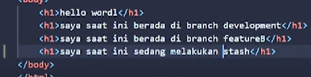

# (03) Basic Version and Branch Management (Git)
## Data Diri
Nomor Urut: 1_011FLB_40

Nama: Fiela Junita Azhari

## Summary
Pada section ini saya belajar tentang Basic Version and Branch Management (Git).
3 poin utama yang saya dapatkan saat pembelajaran pada section ini adalah:
1. pada section ini saya berhasil membuat repository sesuai ketentuan serta menghubungkan (remote) repository pada vscode menggunakan git remote add origin https://github.com/fielaazhari/flutter_Fiela-Junita-Azhari.git
2. pada section ini saya berhasil menjalankan perintah branch dan merge menggunakan git branch, git branch [branch-name], git checkout, git merge [branch]. selain itu saya berhasil menjalankan perintah push and pull menggunakan git push dan git pull, selain itu saya juga berhasil menjalankan perintah stash menggunakan git stash.
3. pada section ini saya belajar bahwa pada tiap perubahan pada kodingan setelahnya harus koding diterminal menggunakan git add . lalu git commit -m "text" dan langkah terakhir adalah git push origin master agar terupload pada github.

## Task

### Task 01
Pada task 01 saya membuat sebuah repository di Github dengan nama flutter_Fiela Junita Azhari.
Gambar dibawah ini adalah Ilustrasi dari halaman pembuatan repository Github tersebut.

### Task 02
Pada task 02 saya membuat branch master, development, featureA, dan feature B. Gambar dibawah ini adalah bukti screenshotnya:
1. Screenshot branch master

2. Screenshot branch development

3. Screenshot branch featureA dan branch featureB

### Task 03
Pada task 03 saya melakukan perintah stash dan pull. Gambar dibawah ini adalah bukti screenshotnya:
1. perintah stash

pertama-tama saya menambahkan kodingan di index.html seperti pada screenshot dibawah ini:

setelah itu pada terminal koding dengan git stash dan penambahan yang baru terjadi akan tidak terlihat. seperti pada screenshot dibawah:

lalu untuk mengembalikkan stash supaya terlihat, pada terminal koding dengan git stash apply, seperti pada screenshot dibawah ini:

2. perintah pull

pertama-tama pada Github saya melakukan new file dengan nama fiela.txt seperti pada screenshot dibawah ini:

selanjutnya new file tersebut belum ada di vscode karena belum melakukan tahap pull seperti gambar dibawah ini:

agar pada vscode dan Github sama, gunakan perintah pull dengan mengkodingkan pada terminal yaitu git pull origin master. setelah proses pull selesai maka vscode dan Github akan sama didalamnya ada new file yaitu fiela.txt

### Task 04
Pada task 04 saya melakukan percobaan conflict dan melakukan penanganannya.
1. pertama-tama saya merge pada featureA dan featureB dan akan muncul conflict seperti pada gambar dibawah ini:

2. selanjutnya pada index.html saya menghapus salah satunya, seperti pada gambar dibawah ini:

3. selanjutnya git add lalu git commit dan dilanjut git push dan pada graph akan berubah seperti pada gambar dibawah ini:

4. penanganan conflict telah selesai dilakukan.

### Task 05
Pada task 05 saya melakukan merge fastforward dengan menggunakan git merge --no-ff dan akan menjadi seperti ini:

### Task 06
Pada task 06 saya melakukan push atau mengupload ke repository. seperti pada gambar dibawah ini:

Git graph terakhir akan menjadi seperti ini:

