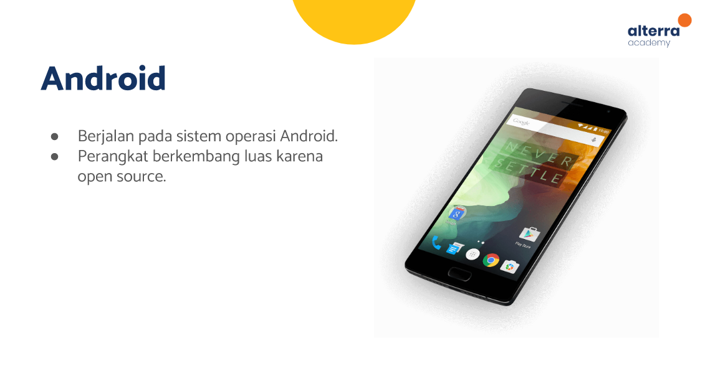

# (04) Introduction Mobile App Development
## Data Diri
Nomor Urut: 1_011FLB_40

Nama: Fiela Junita Azhari

## Summary
Pada section ini saya belajar tentang Introduction Mobile App Development.
3 poin yang saya dapatkan saat pembelajaran pada section ini adalah:
1. software terdiri dari 3 jenis yaitu web, desktop dan mobile. seperti pada gambar dibawah ini:

2. bahasa pemrograman ada dua jenis yaitu compiler dan interpreter. seperti pada gambar dibawah ini:

3. mobile app development terdiri dari 2 jenis yaitu iOS dan Android. seperti pada gambar dibawah ini:

