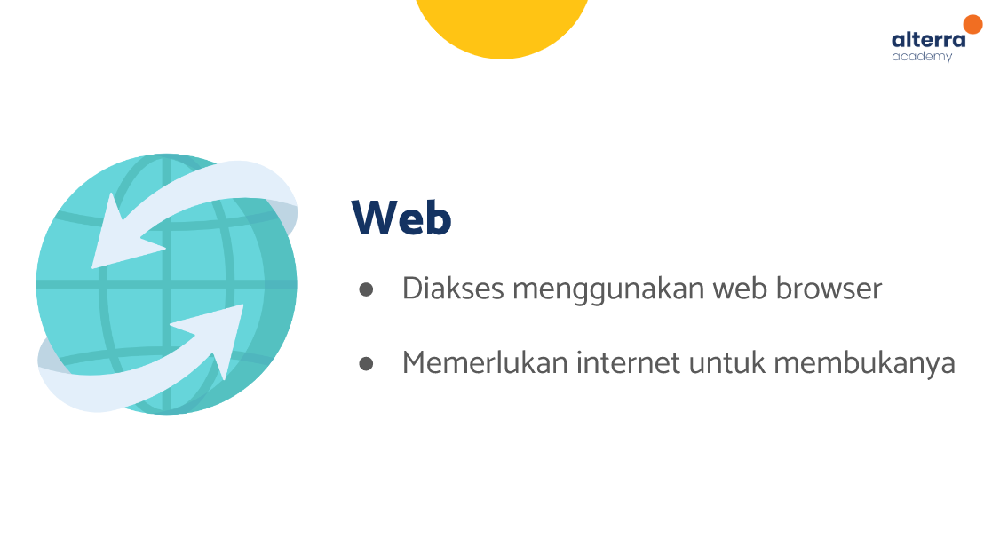
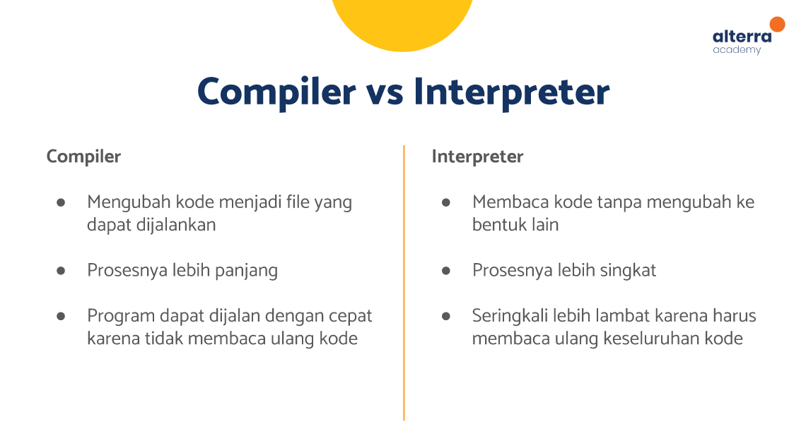

# (04) Introduction Mobile App Development
## Data Diri
Nomor Urut: 1_011FLB_40

Nama: Fiela Junita Azhari

## Summary
Pada section ini saya belajar tentang Introduction Mobile App Development.
3 poin yang saya dapatkan saat pembelajaran pada section ini adalah:
1. software terdiri dari 3 jenis yaitu web, desktop dan mobile. seperti pada gambar dibawah ini:

2. bahasa pemrograman ada dua jenis yaitu compiler dan interpreter. seperti pada gambar dibawah ini:

3. mobile app development terdiri dari 2 jenis yaitu iOS dan Android. seperti pada gambar dibawah ini:

## Soal Latihan
1. Kumpulkan 5 bahasa pemrograman untuk membuat aplikasi mobile! Sertakan platform dari aplikasi yang dihasilkan (contoh pada desktop: C# untuk Windows)!

Jawab:

1. Java (Android)

Java adalah bahasa pemrograman yang paling dasar dalam pembuatan aplikasi Android. Bahasa yang digunakan Java juga dapat dibilang paling sederhana sehingga java menjadi yang paling populer  di antara lainnya.
Java berbasis object-oriented programming (OOP). Fungsinya, setiap code yang dibuat dapat dipakai di code yang lain. Java memiliki sistem yang disebut memory management. Sebagaimana Java akan menghapus secara otomatis program yang lama tidak dipakai.

2. Kotlin (Android)

Kotlin memiliki struktur penulisan kode yang hampir sama dengan java. Tetapi, dapat dikatakan bahwa Kotlin lebih unggul dari java dalam penulisan kode program yang lebih rapi dan mudah dipahami. Kotlin telah mendapat dukungan dari Google sebagai bahasa pemrograman baru terpopuler. 
IDE yang dapat anda gunakan adalah Intellij IDE, Android Studio, dan Eclipse. Keunggulan lain dari kotlin sendiri adalah dapat menggunakan library dari Java sendiri. Jika anda telah menguasai java dengan baik, maka untuk mempelajari Kotlin akan sangat lebih mudah.

3. C# (Android)

Menurut Agus (2012) “C# merupakan salah satu bahasa pemrograman komputer yang diciptakan oleh Microsoft (dikembangkan dibawah kepemimpinan Anders He jlsberg yang notabene juga telah menciptakan berbagai macam bahasa pemrograman termasuk Borland Turbo C++ dan Borland Delphi)”. Bahasa C# juga telah di standarisasi secara internasional oleh ECMA. Seperti halnya 2 bahasa pemrograman yang lain, C# bisa digunakan untuk membangun berbagai macam jenis aplikasi, seperti aplikasi console, aplikasi berbasis windows (Windows Form), aplikasi ASP.NET, aplikasi Web Services XML dan aplikasi berbasis Windows Services.

4. Swift (iOS)

Swift adalah bahasa pemrograman objek fungsional untuk pengembangan iOS dan OS X yang dibuat oleh Apple. Didesain untuk berdampingan dengan Objective-C dan menghindari program dari kode yang salah. Swift diperkenalkan oleh Apple pada acara tahunan WWDC 2014.

5. Objective – C (iOS)

Objective – C merupakan bahasa populer yang sering digunakan oleh para IOS developer untuk mengembangkan aplikasi mobile. Namun, penggunaan saat ini sudah banyak diganti oleh Swift. Akan tetapi, beberapa fitur masih banyak membutuhkan dukungan dari bahasa Objective – C.
Bahasa ini menggunakan paradigma pemrograman OOP. Yang mana, akan sangat memudahkan dalam penyusunan kode program. Selain itu, juga menambahkan pesan gaya small-talk bagi pemrograman C dimana masih banyak menggunakan kode program yang panjang.

2. Kumpulkan 3 aplikasi yang dapat berjalan di iOS tetapi tidak di Android, juga 3 aplikasi yang dapat berjalan di Android tetapi tidak di iOS!

Jawab:

1. 3 aplikasi yang dapat berjalan di iOS tetapi tidak di Android

Apple Store
https://apps.apple.com/id/app/apple-store/id375380948?l=id

Find My
https://apps.apple.com/id/app/find-my/id1514844621

Dazz Cam - Vintage Camera by haiyan wang
https://apps.apple.com/id/app/dazz-cam-vintage-camera/id1422471180

2. 3 aplikasi yang dapat berjalan di Android tetapi tidak di iOS

Google Play Store
https://play.google.com/

Google Find My Device
https://play.google.com/store/apps/details?id=com.google.android.apps.adm

Google Lens
https://play.google.com/store/apps/details?id=com.google.ar.lens

atau tugas soal latihan ini bisa di akses pada link gdocs:
https://docs.google.com/document/d/1C87Wb3YZYDEzknOe-j93mz3b_HyqBVcFjkh_7xZUqvY/edit?usp=sharing
