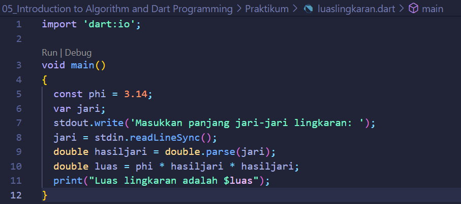
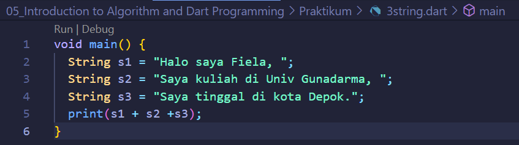

# (05) Introduction to Algorithm and Dart Programming
## Data Diri
Nomor Urut: 1_011FLB_40

Nama: Fiela Junita Azhari

## Task
### Task 01
Implementasikan rumus luas lingkaran pada program Dart!

Berikut adalah penjelasan source code programnya:

Baris 5: mendeklarasikan konstanta phi dengan nilai 3.14

Baris 6-7: mendeklarasikan variable jari serta memasukkan nilai jari-jari lingkaran yang didapat dari user.

Baris 9: mendeklarasikan variable hasiljari dimana nilai variable tersebut didapat dari perhitungan nilai variable jari.

Baris 10: mendeklarasikan variable luas dimana nilai variable tersebut didapat dari perhitungan nilai variable phi dikali nilai variable hasiljari lalu dikali dengan variable hasiljari dan hasilnya akan dimasukkan kedalam variable luas.

Baris 11: menampilkan nilai dari variable luas.

### Task 02
Buatlah 3 buah variabel yang berisi string, lalu sambungkan seluruh string tersebut, dan tampilkan pada layar!

Berikut adalah penjelasan source code programnya:

Baris 2: mendeklarasikan string pertama

Baris 3: mendeklarasikan string kedua

Baris 4: mendeklarasikan string ketiga

Baris 5: menampilkan hasil penggabungan ketiga string.