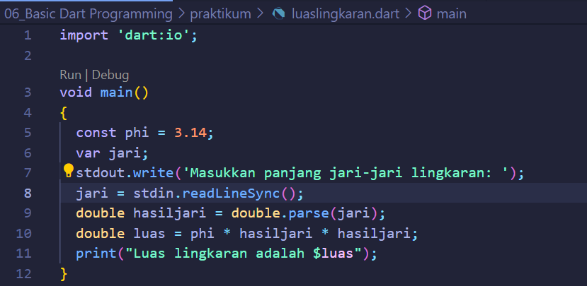
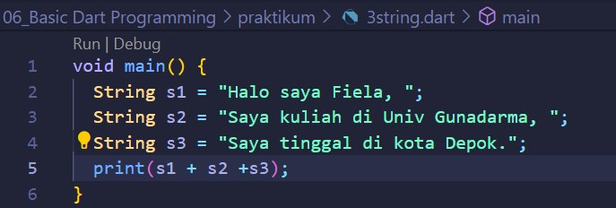

# (06) Basic Dart Programming
## Data Diri
Nomor Urut: 1_011FLB_40

Nama: Fiela Junita Azhari

## Summary
Pada section ini saya belajar tentang Introduction to Algorithm and Dart Programming.
3 poin yang saya dapatkan saat pembelajaran pada section ini adalah:
1. Dart adalah bahasa pemorgraman yang dirancang untuk membuat aplikasi agar dapat berjalan dengan cepat. Dart adalah aplikasi yang berjalan disisi client (frontend), sperti web (javascript) atau desktop (dart) dan mobile (dart). Dart memiliki 4 kelebihan yaitu type safe, null safety, rich standart library, multiplatfrom.
2. Program Dart Sederhana.

Fungsi Main
- Bagian yang dijalankan pertama kali
- Dapat memiliki tipe data void atau int
- Memiliki nama main

    Perintah print digunakan untuk menampilkan data ke layar

        void main() {
            print ('halo nama saya fiela');
        }
Tipe data memiliki 4 jenis yaitu int, double, bool, string. Operator memiliki 4 jenis yaitu arithmetic, assignment, comparison, logical.

3. Anonymous Function
- tidak memiliki nama
- fungsi sebagai data 

        () {
            // perintah yang dijalankan saat fungsi dipanggil
        }

    Async-Await 
- menjalankan beberapa proses tanpa perlu menunggu
- proses ditulis dalam bentuk fungsi
- await akan menunggu hingga proses async selesai

    Collection
-kumpulan data pada suatu tempat

## Soal Latihan
1. Implementasikan rumus luas lingkaran pada program Dart!

Berikut adalah penjelasan source code programnya:

Baris 5: mendeklarasikan konstanta phi dengan nilai 3.14

Baris 6-7: mendeklarasikan variable jari serta memasukkan nilai jari-jari lingkaran yang didapat dari user.

Baris 9: mendeklarasikan variable hasiljari dimana nilai variable tersebut didapat dari perhitungan nilai variable jari.

Baris 10: mendeklarasikan variable luas dimana nilai variable tersebut didapat dari perhitungan nilai variable phi dikali nilai variable hasiljari lalu dikali dengan variable hasiljari dan hasilnya akan dimasukkan kedalam variable luas.

Baris 11: menampilkan nilai dari variable luas.

2. Buatlah 3 buah variabel yang berisi string, lalu sambungkan seluruh string tersebut, dan tampilkan pada layar!

Berikut adalah penjelasan source code programnya:

Baris 2: mendeklarasikan string pertama

Baris 3: mendeklarasikan string kedua

Baris 4: mendeklarasikan string ketiga

Baris 5: menampilkan hasil penggabungan ketiga string.
