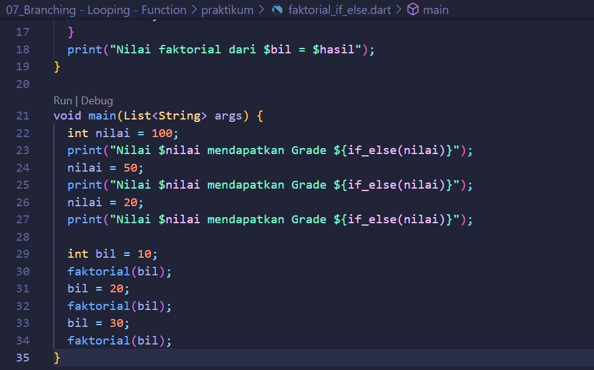

# (07) Branching - Looping - Function
## Data Diri
Nomor Urut: 1_011FLB_40

Nama: Fiela Junita Azhari

## Task

### Jawab
#### Input
        String if_else(int nilai) {
            if (nilai > 70) {
                return "A";
            } else if (nilai > 40) {
                return "B";
            } else if (nilai > 0) {
                return "C";
            } else {
                return "";
            }
        }

        void faktorial(bil) {
          double hasil = 1;
          for (int i = 1; i <= bil; i += 1) {
            hasil *= i;
        }
            print("Nilai faktorial dari $bil = $hasil");
        }

        void main(List<String> args) {
            int nilai = 100;
            print("Nilai $nilai mendapatkan Grade ${if_else(nilai)}");
            nilai = 50;
            print("Nilai $nilai mendapatkan Grade ${if_else(nilai)}");
            nilai = 20;
            print("Nilai $nilai mendapatkan Grade ${if_else(nilai)}");

            int bil = 10;
            faktorial(bil);
            bil = 20;
            faktorial(bil);
            bil = 30;
            faktorial(bil);
        }

#### Output
    Nilai 100 mendapatkan Grade A
    Nilai 50 mendapatkan Grade B
    Nilai 20 mendapatkan Grade C
    Nilai faktorial dari 10 = 3628800.0
    Nilai faktorial dari 20 = 2432902008176640000.0
    Nilai faktorial dari 30 = 2.6525285981219103e+32
