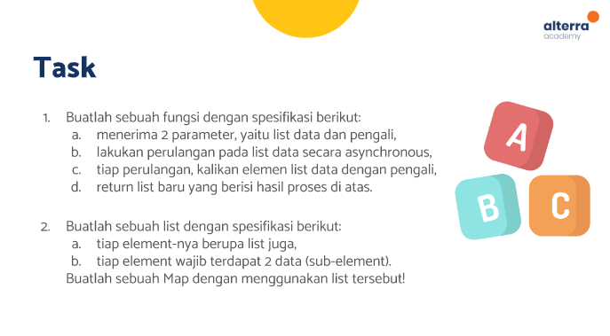
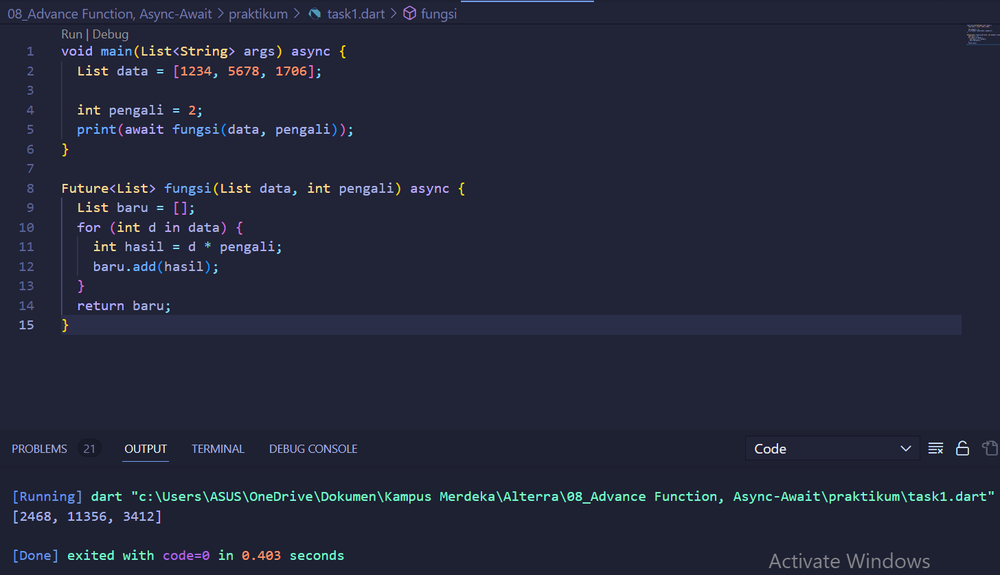
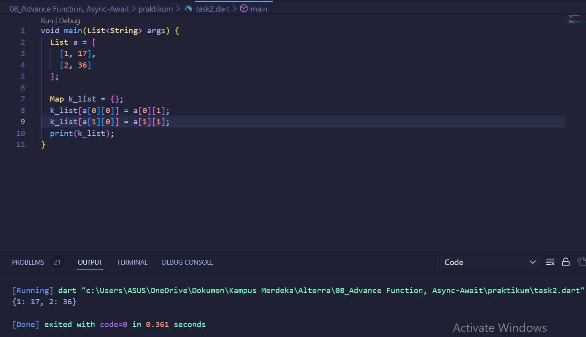

# (08) Advance Function, Async-Await
## Data Diri
Nomor Urut: 1_011FLB_40

Nama: Fiela Junita Azhari

## Summary
Pada section ini saya belajar tentang Advance Function, Async-Await.
3 poin yang saya dapatkan saat pembelajaran pada section ini adalah:
1. Fungsi Lanjutan terdiri dari Anonymous Function, Arrow Function.

Anonymous Function tidak memiliki nama dan berfungsi sebagai data.

Arrow Function dapat memiliki nama ataupun tidak, berisi 1 data dari proses maupun data statis, dan nilai return fungsi diambil dari data tersebut.

2. Async-Await, dengan menjalankan async-await kita dapat menjalankan beberapa proses tanpa perlu menunggu, proses tersebut dapat ditulis dalam bentuk fungsi, lalu await akan menunggu sampai proses async selesai.

3. Collection, kumpulan data pada suatu tempat. contoh collection adalah List dan Map.

## Task

### Task 01
#### input
    void main(List<String> args) async {
    List data = [1234, 5678, 1706];

    int pengali = 2;
    print(await fungsi(data, pengali));
    }

    Future<List> fungsi(List data, int pengali) async {
    List baru = [];
    for (int d in data) {
        int hasil = d * pengali;
        baru.add(hasil);
    }
    return baru;
    }
#### output

### Task 02
#### input
    void main(List<String> args) {
    List a = [
        [1, 17],
        [2, 36]
    ];

    Map k_list = {};
    k_list[a[0][0]] = a[0][1];
    k_list[a[1][0]] = a[1][1];
    print(k_list);
    }
#### output
