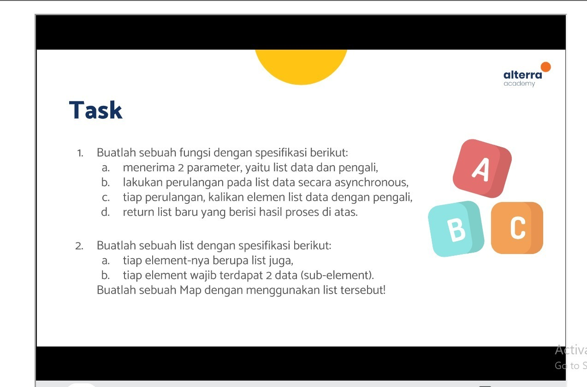
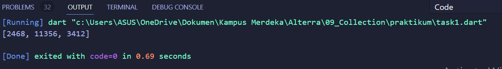
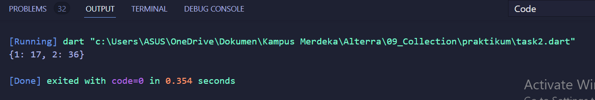

# (09) Collection
Nomor Urut: 1_011FLB_40

Nama: Fiela Junita Azhari

## Task

### Task 01
#### input
    void main(List<String> args) async {
    List data = [1234, 5678, 1706];

    int pengali = 2;
    print(await fungsi(data, pengali));
    }

    Future<List> fungsi(List data, int pengali) async {
    List baru = [];
    for (int d in data) {
        int hasil = d * pengali;
        baru.add(hasil);
    }
    return baru;
    }
#### output

### Task 02
#### input
    void main(List<String> args) {
    List a = [
        [1, 17],
        [2, 36]
    ];

    Map k_list = {};
    k_list[a[0][0]] = a[0][1];
    k_list[a[1][0]] = a[1][1];
    print(k_list);
    }
#### output
