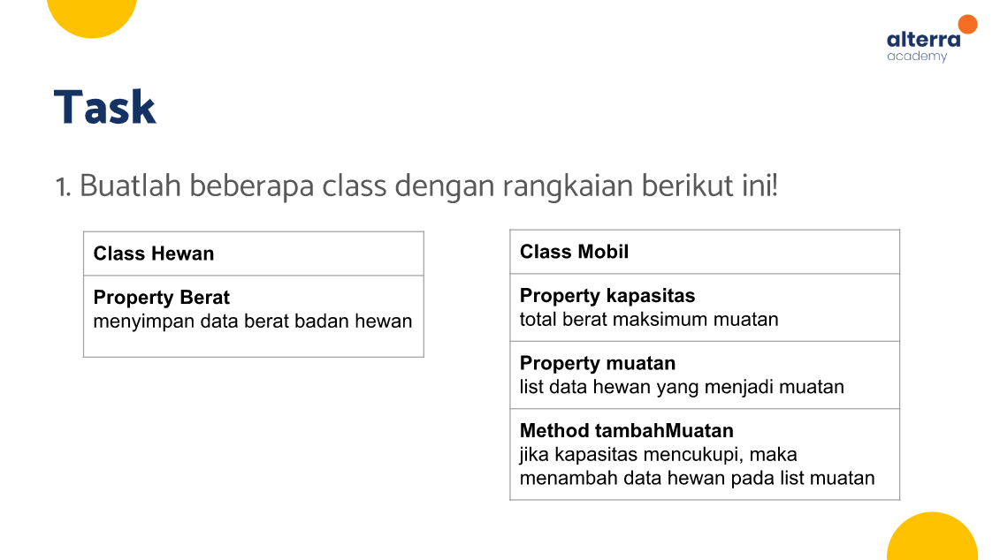
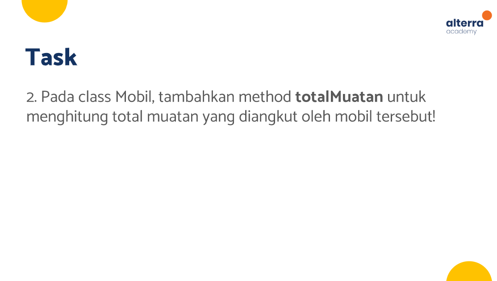
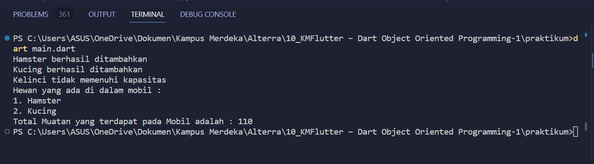

# (10) Dart Object Oriented Programming 1
Nomor Urut: 1_011FLB_40

Nama: Fiela Junita Azhari

## Task

### input 
### animal.dart
    class Animal{
    var name;
    var weight  = 0;
    
    }

### car.dart
    import 'animal.dart';

    class car {
    var capacity = 0;
    List<Animal> load = [];

    void addLoad (Animal add){
        if (capacity >= add.weight) {
        load.add(add);
        capacity -= add.weight;
        print('${add.name} berhasil ditambahkan');
        } else {
        print('${add.name} tidak memenuhi kapasitas');
        }
    }

    // task 2
    int totalLoad(){
        var result = 0;
        for (var i in load){
        result += i.weight;
        }
        return result;
    }
    }

### main.dart
    import 'animal.dart';
    import 'car.dart';

    void main() {
    var hamster = new Animal();
    hamster.name = 'Hamster';
    hamster.weight = 40;

    var kucing = new Animal();
    kucing.name = 'Kucing';
    kucing.weight = 70;

    var kelinci = new Animal();
    kelinci.name = 'Kelinci';
    kelinci.weight = 40;

    var truk = car();
    truk.capacity = 110;
    truk.addLoad(hamster);
    truk.addLoad(kucing);
    truk.addLoad(kelinci);

    print('Hewan yang ada di dalam mobil : ');
    var nomer = 1;
    for (var i in truk.load) {
        print('$nomer. ${i.name}');
        nomer++;
    }

    // Task 2
    print('Total Muatan yang terdapat pada Mobil adalah : ${truk.totalLoad()}');
    }

### output
