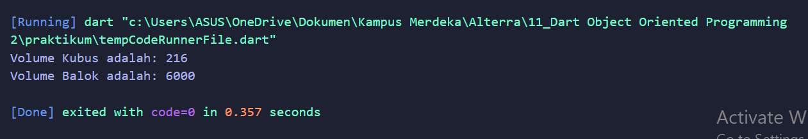
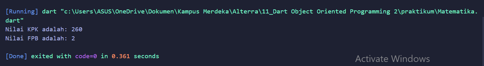

# (11) Dart Object Oriented Programming 2
Nomor Urut: 1_011FLB_40

Nama: Fiela Junita Azhari

## Task
### Task 01 & Task 02
#### Input:
    class BangunRuang {
    var panjang;
    var lebar;
    var tinggi;
    volume () {}
    }

    class Kubus extends BangunRuang {
    var sisi;
    @override
    volume() {
        sisi = 6;
        return sisi*sisi*sisi;
    }
    }

    class Balok extends BangunRuang {
    @override
    volume() {
        panjang = 10;
        lebar = 20;
        tinggi = 30;
        return panjang*lebar*tinggi;
    }
    }

    void main(List<String> args) {
    var a = Kubus();
    print("Volume Kubus adalah: ${a.volume()}");

    var b = Balok();
    print("Volume Balok adalah: ${b.volume()}");

    }

#### Output:

### Task 03 & Task 04
#### Input:
    class Matematika {
    hasil () {}
    }

    class KPK implements Matematika {
    var x;
    var y;
    @override
    hasil() {
        x = 20;
        y = 26;
        return (x * y / x.gcd(y)).toInt();
    }
    }

    class FPB implements Matematika {
    @override
    var x;
    var y;
    @override
    hasil() {
        x = 10;
        y = 16;
        return (x.gcd(y));
    }
    }

    void main(List<String> args) {
    var a = KPK();
    print("Nilai KPK adalah: ${a.hasil()}");

    var b = FPB();
    print("Nilai FPB adalah: ${b.hasil()}");

    }

#### Output:
