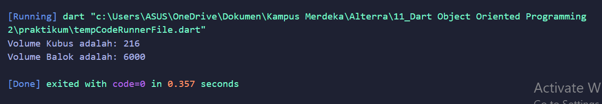

# (11) Dart Object Oriented Programming 2
Nomor Urut: 1_011FLB_40

Nama: Fiela Junita Azhari

## Summary
Pada section ini saya belajar tentang Dart Object Oriented Programming 2.
3 poin yang saya dapatkan saat pembelajaran pada section ini adalah:
1. constructor merupakan method yang dijalankan saat pembuatan object, dapat menerima parameter, tidak memeiliki return dan nama sama dengan nama class. Inheritance merupakan membuat class baru dengan memanfaatkan class yang sudah ada yang bertujuan agar kemampuan class yang sudah ada dapat dimiliki oleh class baru. Method Overriding merupakan menulis ulang method yang ada pada super-class yang bertujuan agar class memiliki method yang sama dengan proses yang berbeda.

2. Interface berupa class yang menunjukkan method apa saja yang ada pada suatu class, seluruh method wajib di-override, digunakan dengan menggunakan implement. Abstract Class berupa class abstrak yang menunjukkan method apa saja yang ada pada suatu class, digunakan dengan menggunakan extend, tidak dapat dibuat object dan tidak semua method harus di override.

3. Polymorphism merupakan kemampuan data berubah menjadi bentuk lain, tipe data yang dapat digunakan adalah super class, dan dapat dilakukan pada class dengan extend atau implement. Generics dapat digunakan pada class atau fungsi, memberi kemampuan agar dapat menerima data dengan tipe yang berbeda, tipe data yang diinginkan ditentukan saat membuat class atau menjalankan fungsi.

## Task
### Task 01 & Task 02
#### Input:
    class BangunRuang {
    var panjang;
    var lebar;
    var tinggi;
    volume () {}
    }

    class Kubus extends BangunRuang {
    var sisi;
    @override
    volume() {
        sisi = 6;
        return sisi*sisi*sisi;
    }
    }

    class Balok extends BangunRuang {
    @override
    volume() {
        panjang = 10;
        lebar = 20;
        tinggi = 30;
        return panjang*lebar*tinggi;
    }
    }

    void main(List<String> args) {
    var a = Kubus();
    print("Volume Kubus adalah: ${a.volume()}");

    var b = Balok();
    print("Volume Balok adalah: ${b.volume()}");

    }

#### Output:

### Task 03 & Task 04
#### Input:
    class Matematika {
    hasil () {}
    }

    class KPK implements Matematika {
    var x;
    var y;
    @override
    hasil() {
        x = 20;
        y = 26;
        return (x * y / x.gcd(y)).toInt();
    }
    }

    class FPB implements Matematika {
    @override
    var x;
    var y;
    @override
    hasil() {
        x = 10;
        y = 16;
        return (x.gcd(y));
    }
    }

    void main(List<String> args) {
    var a = KPK();
    print("Nilai KPK adalah: ${a.hasil()}");

    var b = FPB();
    print("Nilai FPB adalah: ${b.hasil()}");

    }

#### Output:
