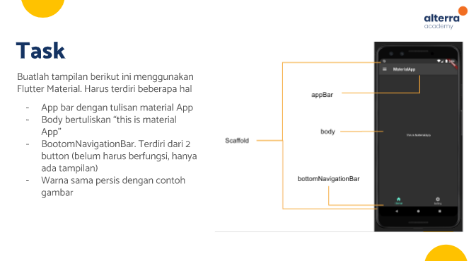
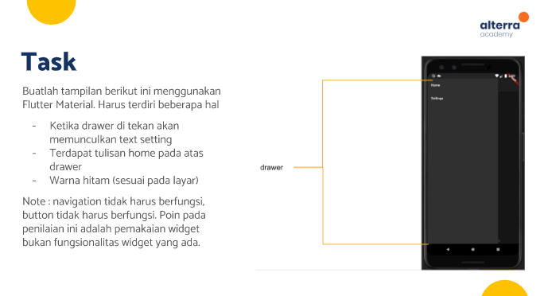
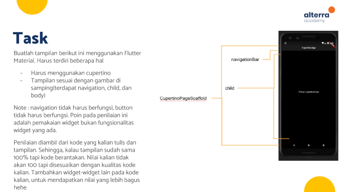

# (13) Platform Widget
Nomor Urut: 1_011FLB_40

Nama: Fiela Junita Azhari

## Task

### Input
#### cupertino (cupertino_home.dart)
    import 'package:flutter/cupertino.dart';
    import 'package:task/cupertino/cupertino_page.dart';

    class CupertinoHome extends StatelessWidget {
    const CupertinoHome({Key? key}) : super(key: key);

    @override
    Widget build(BuildContext context) {
        return CupertinoTabScaffold(
        tabBar: CupertinoTabBar(items: const [
            BottomNavigationBarItem(
                icon: Icon(CupertinoIcons.person_circle_fill), label: "Contacs"),
            BottomNavigationBarItem(
                icon: Icon(CupertinoIcons.phone_fill), label: "Calls"),
            BottomNavigationBarItem(
                icon: Icon(CupertinoIcons.chat_bubble_2_fill), label: "Chats"),
            BottomNavigationBarItem(
                icon: Icon(CupertinoIcons.settings), label: "Settings"),
        ]),
        tabBuilder: (context, index) {
            switch (index) {
            default:
                return const Cupertino();
            }
        },
        );
    }
    }

#### cupertino (cupertino_page.dart)
    import 'package:badges/badges.dart';
    import 'package:flutter/cupertino.dart';
    import 'package:flutter/material.dart';
    import 'package:flutter/src/foundation/key.dart';
    import 'package:telegram/json/chat_json.dart';
    import 'package:telegram/widgets/drawer.dart';

    import '../json/chat_json.dart';

    class Cupertino extends StatefulWidget {
    const Cupertino({Key? key}) : super(key: key);

    @override
    State<Cupertino> createState() => _CupertinoState();
    }

    class _CupertinoState extends State<Cupertino> {
    String? _currentText;

    @override
    Widget build(BuildContext context) {
        var size = MediaQuery.of(context).size;
        return CupertinoPageScaffold(
        child: CustomScrollView(
            slivers: [
            CupertinoSliverNavigationBar(
                previousPageTitle: "asdsad",
                leading: CupertinoButton(
                    padding: EdgeInsets.zero,
                    child: const Text("Edit"),
                    onPressed: () {}),
                middle: const Text("Chats"),
                largeTitle: Column(
                children: [
                    Padding(
                    padding: const EdgeInsets.only(right: 15.0),
                    child: CupertinoSearchTextField(
                        prefixIcon: const Padding(
                        padding: EdgeInsets.only(left: 130),
                        child: Icon(
                            CupertinoIcons.search,
                            size: 20,
                        ),
                        ),
                        controller: TextEditingController(text: ''),
                        placeholder: 'Search',
                    ),
                    ),
                ],
                ),
                trailing: const Icon(CupertinoIcons.add),
            ),
            SliverPadding(
                padding: const EdgeInsets.all(0),
                sliver: SliverList(
                    delegate: SliverChildBuilderDelegate(childCount: 1,
                        (context, index) {
                    return CupertinoSegmentedControl(
                    borderColor: Colors.white,
                    // groupValue: groupValue,
                    pressedColor: Colors.blue,
                    children: {
                        'All Chats': buildSegment("All Chats"),
                        'Work': buildSegment("Work"),
                        'Unread': buildSegment("Unread"),
                        'Personal': buildSegment("Personal")
                    },
                    onValueChanged: (String value) {
                        setState(() {
                        _currentText = value;
                        });
                    },
                    );
                }))),
            SliverPadding(
                padding: const EdgeInsets.all(16),
                sliver: SliverList(
                delegate: SliverChildBuilderDelegate(
                    childCount: chat_data.length,
                    (context, index) {
                    return Container(
                        child: Row(
                        children: [
                            Container(
                            width: 60,
                            height: 60,
                            decoration: BoxDecoration(
                                shape: BoxShape.circle,
                                image: DecorationImage(
                                    image: AssetImage(chat_data[index]['img']),
                                    fit: BoxFit.cover),
                            ),
                            ),
                            const SizedBox(
                            width: 12,
                            ),
                            Expanded(
                            child: Container(
                                height: 70,
                                child: Column(
                                mainAxisAlignment: MainAxisAlignment.spaceEvenly,
                                children: [
                                    Row(
                                    mainAxisAlignment:
                                        MainAxisAlignment.spaceBetween,
                                    children: [
                                        Container(
                                        width: (size.width - 40) * 0.6,
                                        child: Text(
                                            chat_data[index]['name'],
                                            style: const TextStyle(
                                                fontSize: 16,
                                                fontWeight: FontWeight.w600),
                                        ),
                                        ),
                                        Text(
                                        chat_data[index]['date'],
                                        style: TextStyle(
                                            color: Colors.black.withOpacity(0.4),
                                            fontSize: 14,
                                        ),
                                        )
                                    ],
                                    ),
                                    const SizedBox(
                                    height: 4,
                                    ),
                                    Container(
                                    width: (size.width - 40) * 1,
                                    child: Row(
                                        mainAxisAlignment:
                                            MainAxisAlignment.spaceBetween,
                                        children: [
                                        Text(
                                            chat_data[index]['text'],
                                            style: TextStyle(
                                                fontSize: 14,
                                                height: 1.3,
                                                color:
                                                    Colors.black.withOpacity(0.3)),
                                        ),
                                        chat_data[index]['badge'] > 0
                                            ? Badge(
                                                badgeColor: Colors.green,
                                                badgeContent: Padding(
                                                    padding:
                                                        const EdgeInsets.all(1),
                                                    child: Text(
                                                    chat_data[index]['badge']
                                                        .toString(),
                                                    style: const TextStyle(
                                                        color: Colors.white),
                                                    ),
                                                ),
                                                )
                                            : Container()
                                        ],
                                    ),
                                    ),
                                    Divider(
                                    height: 10,
                                    )
                                ],
                                ),
                            ),
                            )
                        ],
                        ),
                    );
                    },
                ),
                ),
            ),
            ],
        ),
        );
    }

    Widget buildSegment(String text) => Container(
            padding: const EdgeInsets.all(12),
            color:
                _currentText == text ? Colors.blue.withOpacity(0.2) : Colors.white,
            child: Text(
            text,
            style: const TextStyle(fontSize: 16),
            ),
        );
    }

#### json (chat_json.dart)
    List chat_data = [
    {
        "img": "assets/images/profile.png",
        "name": "Fiela",
        "text": "Saya Fiela",
        "date": "5:23 PM",
        "badge": 0,
        "isGroup": false
    },
    {
        "img": "assets/images/jokowi.png",
        "name": "Jokowi",
        "text": "Kamu besok ke istana ya",
        "date": "3:28 PM",
        "badge": 3,
        "isGroup": false
    },
    {
        "img": "assets/images/nadiem.png",
        "name": "Nadiem Makarim",
        "text": "Bagaimana MSIB Fiela?",
        "date": "2:49 PM",
        "badge": 1,
        "isGroup": false
    },
    {
        "img": "assets/images/deddy.jpg",
        "name": "Deddy Corbuzier",
        "text": "Bro besok dateng ke podcast gua ya",
        "date": "1:04 PM",
        "badge": 1,
        "isGroup": false
    },
    {
        "img": "assets/images/messi.jpg",
        "name": "Lionel Messi",
        "text": "Thanks for the Support",
        "date": "Sat",
        "badge": 1,
        "isGroup": false
    },
    {
        "img": "assets/images/pep.jpg",
        "name": "Pep Guardiola",
        "text": "Would you like to join Supporter?",
        "date": "Fri",
        "badge": 0,
        "isGroup": false
    },
    {
        "img": "assets/images/jindan.png",
        "name": "Jindan",
        "text": "Ente kadang-kadang ente",
        "date": "Thu",
        "badge": 3,
        "isGroup": false
    }
    ];

#### widgets (drawer.dart)
    import 'package:flutter/material.dart';

    class MyDrawer extends StatelessWidget {
    const MyDrawer({Key? key}) : super(key: key);

    @override
    Widget build(BuildContext context) {
        return Drawer(
            child: ListView(
        padding: const EdgeInsets.only(top: 0),
        children: [
            UserAccountsDrawerHeader(
            accountName: const Text(
                "Rayhan Naufal",
                style: TextStyle(fontSize: 18, fontWeight: FontWeight.w600),
            ),
            accountEmail: const Text("+62 82299982018"),
            currentAccountPicture: GestureDetector(
                onTap: () {},
                child: const CircleAvatar(
                backgroundImage: AssetImage("assets/images/profile.png"),
                ),
            ),
            ),
            ListTile(
            leading: const Icon(Icons.group),
            title: const Text("New Group"),
            onTap: () {},
            ),
            ListTile(
            leading: const Icon(Icons.lock),
            title: const Text("New Secret Chat"),
            onTap: () {},
            ),
            ListTile(
            leading: const Icon(Icons.create_new_folder),
            title: const Text("New Channel"),
            onTap: () {},
            ),
            const Divider(
            height: 18,
            color: Colors.black45,
            ),
            ListTile(
            leading: const Icon(Icons.contacts),
            title: const Text("Contacts"),
            onTap: () {},
            ),
            ListTile(
            leading: const Icon(Icons.person_add),
            title: const Text("Invite Friends"),
            onTap: () {},
            ),
            ListTile(
            leading: const Icon(Icons.settings),
            title: const Text("Settings"),
            onTap: () {},
            ),
            ListTile(
            leading: const Icon(Icons.help_outline),
            title: const Text("Telegram FAQ"),
            onTap: () {},
            ),
        ],
        ));
    }
    }

#### home.dart
    import 'package:badges/badges.dart';
    import 'package:flutter/cupertino.dart';
    import 'package:flutter/material.dart';
    import 'package:flutter/src/foundation/key.dart';
    import 'package:flutter/src/widgets/framework.dart';
    import 'package:task/widgets/drawer.dart';

    import 'json/chat_json.dart';

    class Home extends StatefulWidget {
    const Home({Key? key}) : super(key: key);

    @override
    State<Home> createState() => _HomeState();
    }

    class _HomeState extends State<Home> {
    @override
    Widget build(BuildContext context) {
        return MaterialApp(
        home: Scaffold(
            drawer: MyDrawer(),
            appBar: AppBar(
            title: const Text("Telegram"),
            centerTitle: false,
            actions: [
                IconButton(
                onPressed: () {},
                icon: const Icon(Icons.search),
                ),
            ],
            ),
            body: getListChats(),
        ),
        );
    }

    Widget getListChats() {
        var size = MediaQuery.of(context).size;
        return Column(
            children: List.generate(
        chat_data.length,
        (index) {
            return Padding(
            padding: const EdgeInsets.only(left: 8, right: 8, top: 8),
            child: Row(
                children: [
                Container(
                    width: 60,
                    height: 60,
                    decoration: BoxDecoration(
                    shape: BoxShape.circle,
                    image: DecorationImage(
                        image: AssetImage(chat_data[index]['img']),
                        fit: BoxFit.cover),
                    ),
                ),
                const SizedBox(
                    width: 12,
                ),
                Expanded(
                    child: Container(
                    height: 70,
                    child: Column(
                    mainAxisAlignment: MainAxisAlignment.spaceEvenly,
                    children: [
                        Row(
                        mainAxisAlignment: MainAxisAlignment.spaceBetween,
                        children: [
                            Container(
                            width: (size.width - 40) * 0.6,
                            child: Text(
                                chat_data[index]['name'],
                                style: const TextStyle(
                                    fontSize: 16, fontWeight: FontWeight.w600),
                            ),
                            ),
                            Text(
                            chat_data[index]['date'],
                            style: TextStyle(
                                color: Colors.black.withOpacity(0.4),
                                fontSize: 14,
                            ),
                            )
                        ],
                        ),
                        const SizedBox(
                        height: 4,
                        ),
                        Container(
                        width: (size.width - 40) * 1,
                        child: Row(
                            mainAxisAlignment: MainAxisAlignment.spaceBetween,
                            children: [
                            Text(
                                chat_data[index]['text'],
                                style: TextStyle(
                                    fontSize: 14,
                                    height: 1.3,
                                    color: Colors.black.withOpacity(0.3)),
                            ),
                            chat_data[index]['badge'] > 0
                                ? Badge(
                                    badgeColor: Colors.green,
                                    badgeContent: Padding(
                                        padding: const EdgeInsets.all(1),
                                        child: Text(
                                        chat_data[index]['badge'].toString(),
                                        style:
                                            const TextStyle(color: Colors.white),
                                        ),
                                    ),
                                    )
                                : Container()
                            ],
                        ),
                        ),
                        Divider(
                        height: 10,
                        )
                    ],
                    ),
                ))
                ],
            ),
            );
        },
        ));
    }
    }

#### main.dart
    import 'dart:io';

    import 'package:flutter/cupertino.dart';
    import 'package:flutter/material.dart';
    import 'package:task/cupertino/cupertino_home.dart';
    import 'package:task/home.dart';

    void main() {
    runApp(const CupertinoApp(
        home: MyApp(),
    ));
    }

    class MyApp extends StatelessWidget {
    const MyApp({Key? key}) : super(key: key);

    @override
    Widget build(BuildContext context) {
        if (Platform.isIOS) {
        return const CupertinoHome();
        } else {
        return const Home();
        }
    }
    }

### Output
