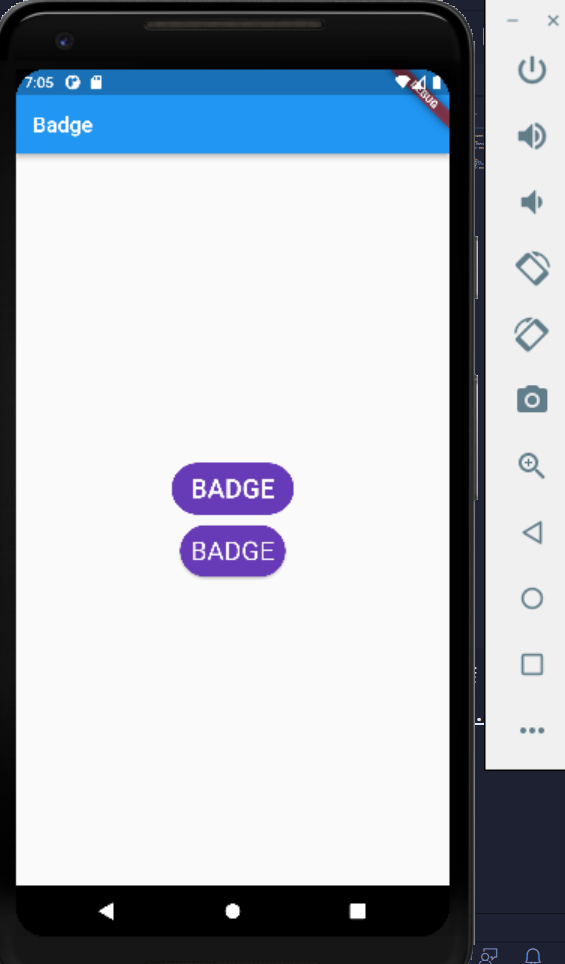
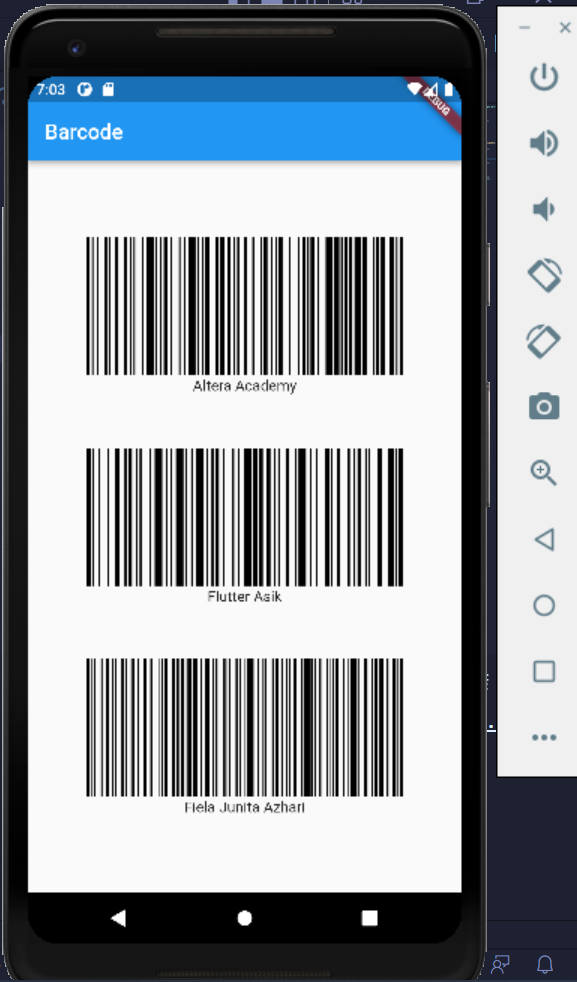

# (14) Flutter Command Line Interface (CLI) and Flutter package management
Nomor Urut: 1_011FLB_40

Nama: Fiela Junita Azhari

## Task

### Task 1
#### Input
    import 'package:flutter/material.dart';
    import 'package:badges/badges.dart';

    void main() {
    runApp(const MyApp());
    }

    class MyApp extends StatelessWidget {
    const MyApp({Key? key}) : super(key: key);

    @override
    Widget build(BuildContext context) {
        return MaterialApp(
        home: Scaffold(
            appBar: AppBar(
                title: Text("Badge"),
            ),
            body: Center(
                child: Column(
                mainAxisAlignment: MainAxisAlignment.center,
                children: <Widget>[
                    Chip(
                    padding: EdgeInsets.all(10),
                    backgroundColor: Colors.deepPurple,
                    label: Text('BADGE',
                        style: TextStyle(color: Colors.white, fontSize: 25)),
                    ),
                    SizedBox(height: 10),
                    Badge(
                    toAnimate: false,
                    shape: BadgeShape.square,
                    padding: EdgeInsets.all(10),
                    badgeColor: Colors.deepPurple,
                    borderRadius: BorderRadius.circular(30),
                    badgeContent: Text('BADGE',
                        style: TextStyle(color: Colors.white, fontSize: 25)),
                    ),
                ],
                ),
            )),
        );
    }
    }
#### Output

### Task 2
#### Input
    import 'package:flutter/material.dart';
    import 'package:barcode_widget/barcode_widget.dart';

    void main() {
    runApp(const MyApp());
    }

    class MyApp extends StatelessWidget {
    const MyApp({Key? key}) : super(key: key);

    @override
    Widget build(BuildContext context) {
        return MaterialApp(
        home: Scaffold(
            appBar: AppBar(
                title: Text("Barcode"),
            ),
            body: Center(
                child: Column(
                mainAxisAlignment: MainAxisAlignment.center,
                children: <Widget>[
                    BarcodeWidget(
                    barcode: Barcode.code128(),
                    data: 'Altera Academy',
                    width: 300,
                    height: 150,
                    ),
                    SizedBox(height: 50),
                    BarcodeWidget(
                    barcode: Barcode.code128(),
                    data: 'Flutter Asik',
                    width: 300,
                    height: 150,
                    ),
                    SizedBox(height: 50),
                    BarcodeWidget(
                    barcode: Barcode.code128(),
                    data: 'Fiela Junita Azhari',
                    width: 300,
                    height: 150,
                    )
                ],
                ),
            )),
        );
    }
    }

#### Output
