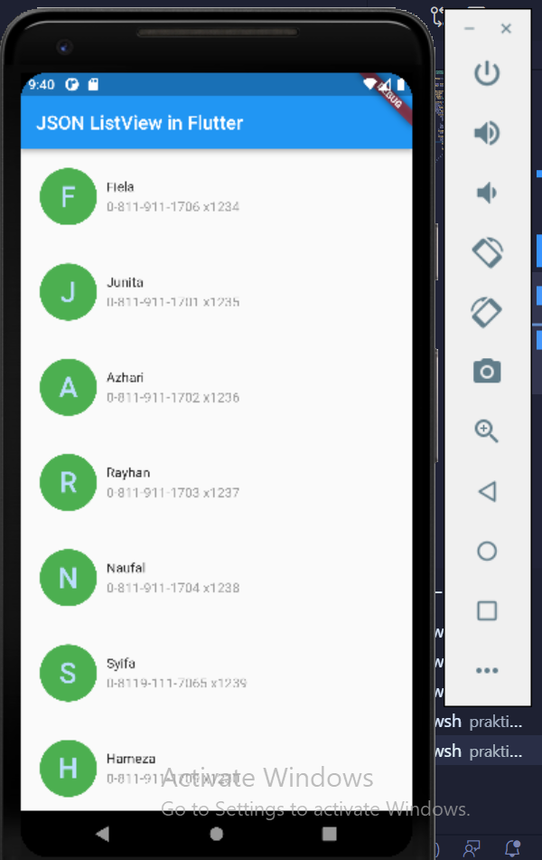
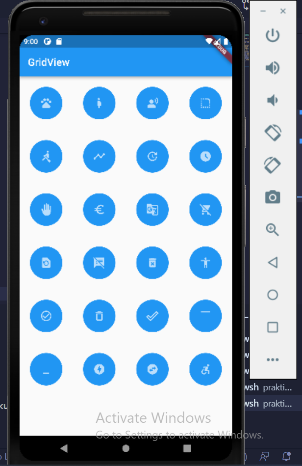

# (15) Flutter Layout 1 
Nomor Urut: 1_011FLB_40

Nama: Fiela Junita Azhari

## Summary
Pada section ini saya belajar tentang Flutter Layout 1.
3 poin yang saya dapatkan saat pembelajaran pada section ini adalah:
1. Layout berfungsi untuk mengatur tata letak, layout berbentuk widget yang mengatur widget didalamnya. Layout terdiri dari 2 macam yaitu Single-Child Layout dan Multi-Child Layout.
2. Single-Child Layout terdiri dari beberapa macam yaitu container dan center serta sized box. container berfungsi membuat sebuah box, membungkus widget lain, box memiliki margin, padding dan border. sementara center berfungsi membuat sebuah box, membungkus widget lain, memenuhi lebar dan tinggi ruang di luarnya, meletakkan widget berada di bagian tengah. sized box berfungsi membuat sebuah box, membungkus widget lain, box dapat diatur lebar dan tingginya, lebih sederhana dari container.
3. Multi-Child Layout terdiri dari beberapa macam yaitu column, row, listview, gridview. column berfungsi mengatur widgets secara vertikal, row berfungsi mengatur widgets secara horizontal, listview berfungsi mengatur widgets dalam bentuk list dan memiliki kemampuan scroll, gridview berfungsi mengatur widgets dalam bentuk galeri.

## Task 1
### main.dart
    import 'package:flutter/material.dart';
    import 'package:section15/user.dart';

    void main() {
    runApp(const MyApp());
    }

    class MyApp extends StatelessWidget {
    const MyApp({Key? key}) : super(key: key);

    @override
    Widget build(BuildContext context) {
        return MaterialApp(
        home: Scaffold(
            appBar: AppBar(
            title: Text("JSON ListView in Flutter"),
            ),
            body: ListView.builder(
            itemCount: 7,
            itemBuilder: (context, index) {
                return Padding(
                padding: const EdgeInsets.all(20),
                child: Row(
                    children: [
                    CircleAvatar(
                        child: Text(
                        user[index]["name"][0],
                        style:
                            TextStyle(fontSize: 30, fontWeight: FontWeight.w500),
                        ),
                        radius: 30,
                        backgroundColor: Colors.green,
                    ),
                    SizedBox(
                        width: 10,
                    ),
                    Column(
                        crossAxisAlignment: CrossAxisAlignment.start,
                        children: [
                        Text(user[index]["name"]),
                        SizedBox(
                            height: 5,
                        ),
                        Text(
                            (user[index]["phone"]),
                            style: TextStyle(color: Colors.black.withOpacity(0.4)),
                        )
                        ],
                    )
                    ],
                ),
                );
            },
            ),
        ),
        );
    }
    }

### user.dart
    List user = [
    {"name": "Fiela", "phone": "0-811-911-1706 x1234"},
    {"name": "Junita", "phone": "0-811-911-1701 x1235"},
    {"name": "Azhari", "phone": "0-811-911-1702 x1236"},
    {"name": "Rayhan", "phone": "0-811-911-1703 x1237"},
    {"name": "Naufal", "phone": "0-811-911-1704 x1238"},
    {"name": "Syifa", "phone": "0-8119-111-7065 x1239"},
    {"name": "Hameza", "phone": "0-811-911-1709 x1230"},
    ];

### output

## Task 2
### main.dart
    import 'package:flutter/material.dart';
    import 'package:task2/icon.dart';

    void main() {
    runApp(const MyApp());
    }

    class MyApp extends StatelessWidget {
    const MyApp({Key? key}) : super(key: key);

    @override
    Widget build(BuildContext context) {
        return MaterialApp(
        home: Scaffold(
            appBar: AppBar(
            title: Text("GridView"),
            ),
            body: GridView.count(
            crossAxisCount: 4,
            children: List.generate(IconApp.length, (index) {
                return Padding(
                padding: EdgeInsets.all(20),
                child: CircleAvatar(
                    radius: 10,
                    backgroundColor: Colors.blue,
                    child: Icon(
                    IconApp[index],
                    ),
                ),
                );
            }),
            ),
        ),
        );
    }
    }

### icon.dart
    import 'package:flutter/material.dart';

    class ListIcon {
    final IconData icon;
    ListIcon({required this.icon});
    }

    List IconApp = [
    Icons.pets,
    Icons.pregnant_woman,
    Icons.spatial_audio_off,
    Icons.rounded_corner,
    Icons.rowing,
    Icons.timeline,
    Icons.update,
    Icons.access_time_filled,
    Icons.back_hand,
    Icons.euro,
    Icons.g_translate,
    Icons.remove_shopping_cart,
    Icons.restore_page,
    Icons.speaker_notes_off,
    Icons.delete_forever,
    Icons.accessibility,
    Icons.check_circle_outline,
    Icons.delete_outline,
    Icons.done_outline,
    Icons.maximize,
    Icons.minimize,
    Icons.offline_bolt_rounded,
    Icons.swap_horizontal_circle,
    Icons.accessible_forward,
    ];

### output
