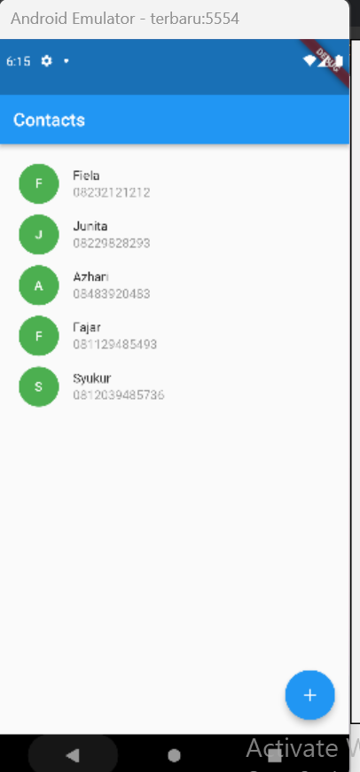
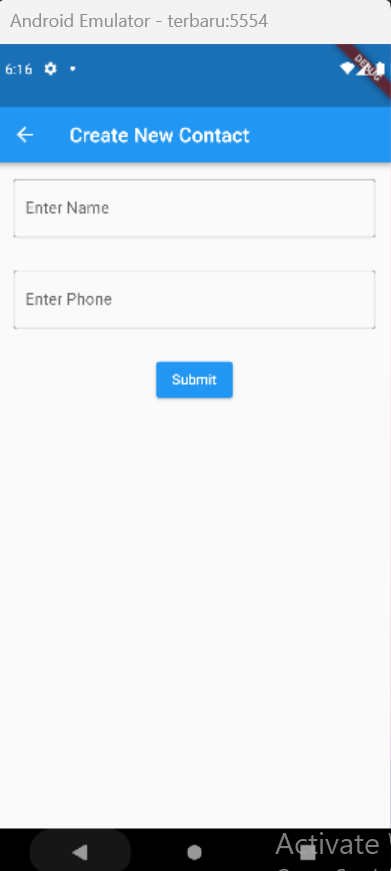
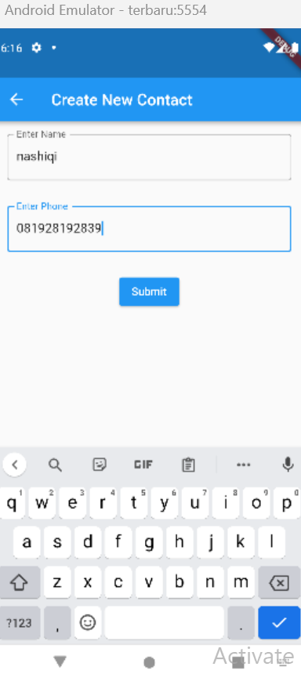
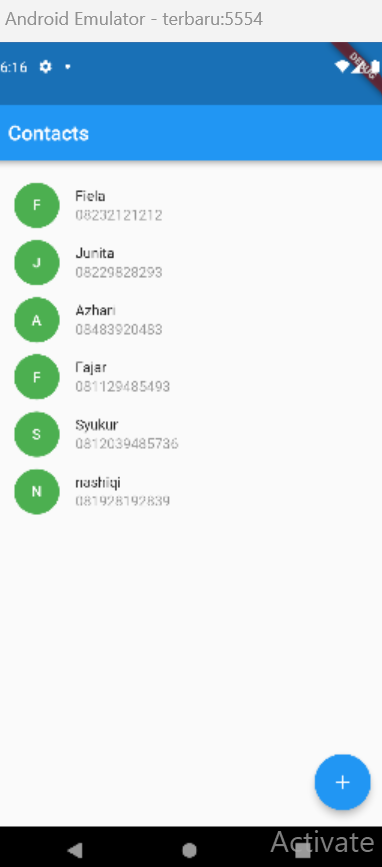

# (17) Form Input Button
Nomor Urut: 1_011FLB_40

Nama: Fiela Junita Azhari

## Task

### Input
#### main.dart
    import 'package:flutter/material.dart';
    import 'package:form_input/contacts_page.dart';

    void main() {
    runApp(const MyApp());
    }

    class MyApp extends StatelessWidget {
    const MyApp({super.key});

    @override
    Widget build(BuildContext context) {
        return MaterialApp(
        title: 'Contacts',
        theme: ThemeData(primarySwatch: Colors.blue),
        home: const ContactsPage()
        );
    }
    }
#### add_user.dart
    import 'package:flutter/material.dart';
    import 'package:form_input/models/user.dart';

    class AddUser extends StatefulWidget {
    final Function(User) addContact;
    const AddUser(this.addContact);

    @override
    State<AddUser> createState() => _AddUserState();
    }

    class _AddUserState extends State<AddUser> {
    final TextEditingController _name = TextEditingController();

    final TextEditingController _phone = TextEditingController();

    @override
    Widget build(BuildContext context) {
        return Scaffold(
        appBar: AppBar(
            title: const Text('Create New Contact'),
        ),
        body: Column(
            children: [
            Container(
                margin: const EdgeInsets.all(16),
                child: TextField(
                controller: _name,
                decoration: const InputDecoration(
                    border: OutlineInputBorder(),
                    label: Text('Enter Name'),
                ),
                ),
            ),
            Container(
                margin: const EdgeInsets.all(16),
                child: TextField(
                controller: _phone,
                decoration: const InputDecoration(
                    border: OutlineInputBorder(),
                    label: Text('Enter Phone'),
                ),
                ),
            ),
            const SizedBox(
                height: 10,
            ),
            ElevatedButton(
                onPressed: () {
                final user = User(_name.text, _phone.text);

                widget.addContact(user);
                Navigator.of(context).pop();
                },
                child: const Text('Submit'),
            )
            ],
        ),
        );
    }
    }
#### contacts_page.dart
    import 'package:flutter/material.dart';
    import 'package:form_input/add_user.dart';
    import 'models/user.dart';

    class ContactsPage extends StatefulWidget {
    const ContactsPage({super.key});

    @override
    State<ContactsPage> createState() => _ContactsPageState();
    }

    class _ContactsPageState extends State<ContactsPage> {
    List<User> userList = [
        User('Fiela', '08232121212'),
        User('Junita', '08229828293'),
        User('Azhari', '08483920483'),
        User('Fajar', '081129485493'),
        User('Syukur', '0812039485736'),
    ];

    
    
    
    
    
    
    
    
    
    
    
    

    
    
    
    
    
    
    

    void addContact(User user) {
        setState(() {
        userList.add(user);
        });
    }

    @override
    Widget build(BuildContext context) {
        return Scaffold(
        appBar: AppBar(
            title: const Text('Contacts'),
        ),
        body: ListView.builder(
            padding: const EdgeInsets.all(16),
            itemCount: userList.length,
            itemBuilder: ((context, index) {
            return Container(
                margin: const EdgeInsets.all(6),
                child: Row(
                children: [
                    Container(
                    height: 45,
                    width: 45,
                    decoration: const BoxDecoration(
                        shape: BoxShape.circle, color: Colors.green),
                    child: Center(
                        child: Text(
                        userList[index].name[0].toUpperCase(),
                        style: const TextStyle(
                            color: Colors.white, fontWeight: FontWeight.w500),
                        ),
                    ),
                    ),
                    const SizedBox(
                    width: 16,
                    ),
                    Expanded(
                    child: Column(
                        crossAxisAlignment: CrossAxisAlignment.start,
                        children: [
                        Text(userList[index].name),
                        const SizedBox(height: 3),
                        Text(
                            userList[index].phone,
                            style: TextStyle(color: Colors.black.withOpacity(0.4)),
                        )
                        ],
                    ),
                    )
                ],
                ),
            );
            }),
        ),
        
        
        
        
        floatingActionButton: FloatingActionButton(
            onPressed: (() {
            Navigator.of(context).push(
                MaterialPageRoute(builder: (context) => AddUser(addContact)));
            
            }),
            child: const Icon(Icons.add),
        ),
        );
    }
    }
### Output

