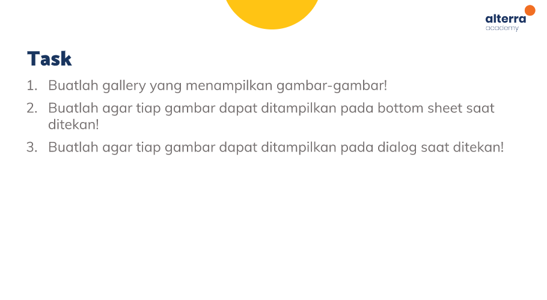
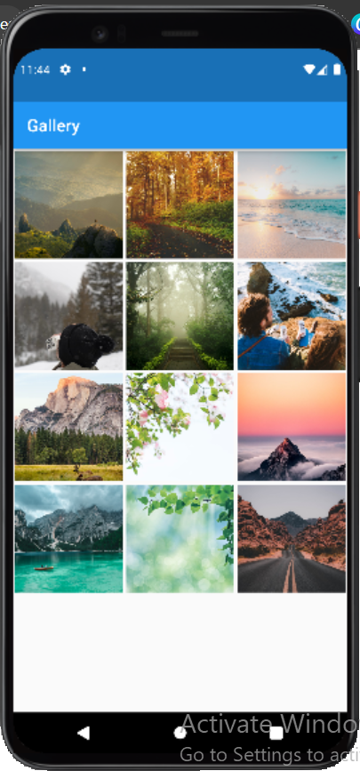
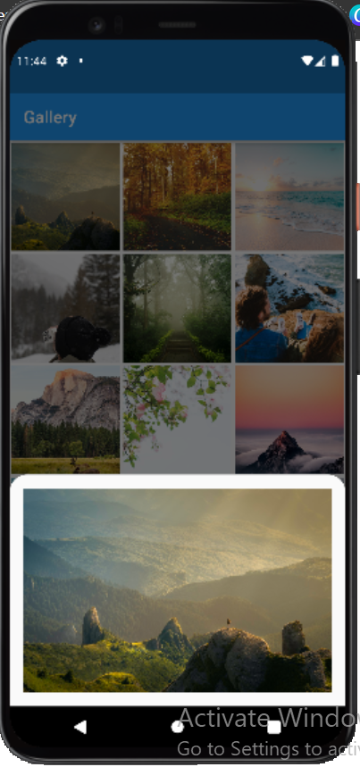
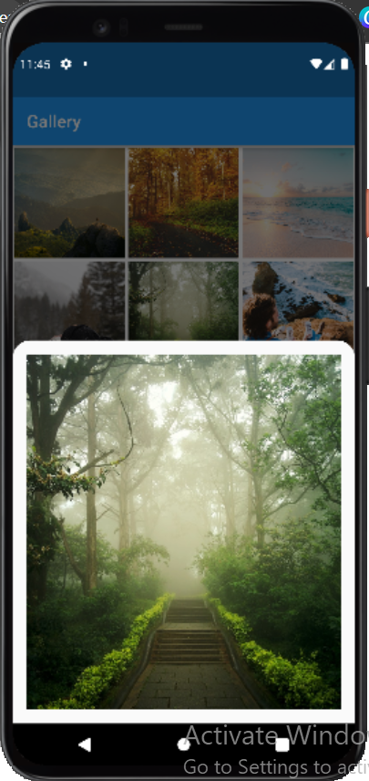
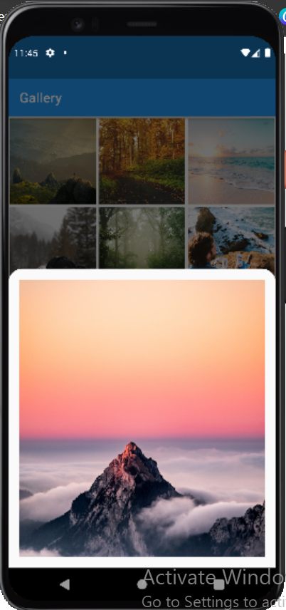
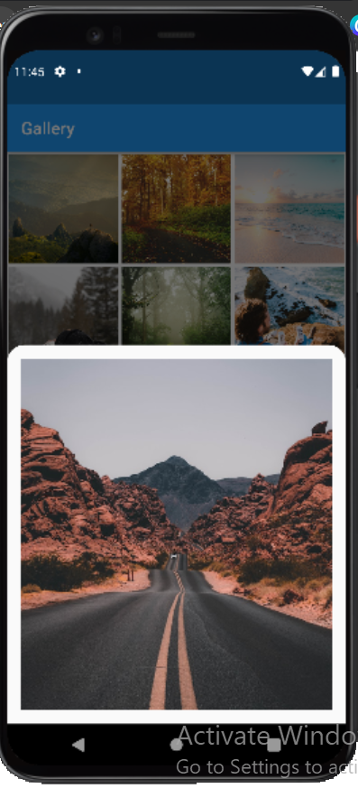
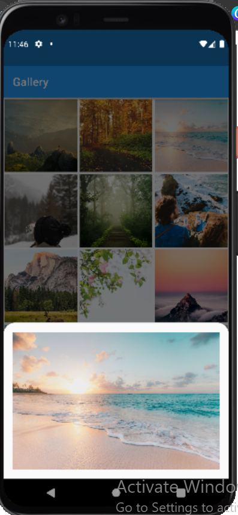

# (19) Dialog Bottom Sheet
Nomor Urut: 1_011FLB_40

Nama: Fiela Junita Azhari

## Task

### Input
#### main.dart
    import 'package:dialog_bottom/page/gallery_page.dart';
    import 'package:flutter/material.dart';

    void main() {
    runApp(const MyApp());
    }

    class MyApp extends StatelessWidget {
    const MyApp({super.key});

    // This widget is the root of your application.
    @override
    Widget build(BuildContext context) {
        return MaterialApp(
        debugShowCheckedModeBanner: false,
        title: 'Flutter Demo',
        theme: ThemeData(
            primarySwatch: Colors.blue,
        ),
        home: const GalleryPage(),
        );
    }
    }

#### components (image_sheet.dart)
    import 'package:flutter/material.dart';

    class ImageSheet extends StatelessWidget {
    final imgList;
    const ImageSheet({super.key, required this.imgList});

    @override
    Widget build(BuildContext context) {
        return Padding(
        padding: const EdgeInsets.all(16),
        child: Image.network(
            imgList,
            fit: BoxFit.cover,
        ),
        );
    }
    }

#### json (image_json_.dart)
    List images = [
    'https://images.unsplash.com/photo-1469474968028-56623f02e42e?ixlib=rb-1.2.1&ixid=MnwxMjA3fDB8MHxwaG90by1wYWdlfHx8fGVufDB8fHx8&auto=format&fit=crop&w=1474&q=80',
    'https://images.unsplash.com/photo-1446329813274-7c9036bd9a1f?ixlib=rb-1.2.1&ixid=MnwxMjA3fDB8MHxwaG90by1wYWdlfHx8fGVufDB8fHx8&auto=format&fit=crop&w=1470&q=80',
    'https://images.unsplash.com/photo-1507525428034-b723cf961d3e?ixlib=rb-1.2.1&ixid=MnwxMjA3fDB8MHxwaG90by1wYWdlfHx8fGVufDB8fHx8&auto=format&fit=crop&w=1473&q=80',
    'https://images.unsplash.com/photo-1579710758949-3ab36db30f1b?ixlib=rb-1.2.1&ixid=MnwxMjA3fDF8MHxwaG90by1wYWdlfHx8fGVufDB8fHx8&auto=format&fit=crop&w=687&q=80',
    'https://images.unsplash.com/photo-1541675154750-0444c7d51e8e?ixlib=rb-1.2.1&ixid=MnwxMjA3fDB8MHxwaG90by1wYWdlfHx8fGVufDB8fHx8&auto=format&fit=crop&w=730&q=80',
    'https://images.unsplash.com/photo-1587502537104-aac10f5fb6f7?ixlib=rb-1.2.1&ixid=MnwxMjA3fDB8MHxwaG90by1wYWdlfHx8fGVufDB8fHx8&auto=format&fit=crop&w=687&q=80',
    'https://images.unsplash.com/photo-1472396961693-142e6e269027?ixlib=rb-1.2.1&ixid=MnwxMjA3fDB8MHxwaG90by1wYWdlfHx8fGVufDB8fHx8&auto=format&fit=crop&w=652&q=80',
    'https://images.unsplash.com/photo-1523528283115-9bf9b1699245?ixlib=rb-1.2.1&ixid=MnwxMjA3fDB8MHxwaG90by1wYWdlfHx8fGVufDB8fHx8&auto=format&fit=crop&w=687&q=80',
    'https://images.unsplash.com/photo-1540979388789-6cee28a1cdc9?ixlib=rb-1.2.1&ixid=MnwxMjA3fDB8MHxwaG90by1wYWdlfHx8fGVufDB8fHx8&auto=format&fit=crop&w=687&q=80',
    'https://images.unsplash.com/photo-1542856391-010fb87dcfed?ixlib=rb-1.2.1&ixid=MnwxMjA3fDB8MHxwaG90by1wYWdlfHx8fGVufDB8fHx8&auto=format&fit=crop&w=1470&q=80',
    'https://images.unsplash.com/photo-1533119408463-b0f487583ff6?ixlib=rb-1.2.1&ixid=MnwxMjA3fDB8MHxwaG90by1wYWdlfHx8fGVufDB8fHx8&auto=format&fit=crop&w=1160&q=80',
    'https://images.unsplash.com/photo-1500530855697-b586d89ba3ee?ixlib=rb-1.2.1&ixid=MnwxMjA3fDB8MHxwaG90by1wYWdlfHx8fGVufDB8fHx8&auto=format&fit=crop&w=687&q=80'
    ];

#### page (gallery_page_.dart)
    import 'package:dialog_bottom/components/image_sheet.dart';
    import 'package:dialog_bottom/json/image_json.dart';
    import 'package:flutter/material.dart';

    class GalleryPage extends StatelessWidget {
    const GalleryPage({super.key});

    @override
    Widget build(BuildContext context) {
        return Scaffold(
        appBar: AppBar(
            title: const Text('Gallery'),
        ),
        body: GridView.builder(
            itemCount: images.length,
            gridDelegate:
                const SliverGridDelegateWithFixedCrossAxisCount(crossAxisCount: 3),
            itemBuilder: (context, index) {
            return Padding(
                padding: const EdgeInsets.all(2),
                child: InkWell(
                onLongPress: () {
                    showDialog(
                    context: context,
                    builder: (context) => AlertDialog(
                        content: ImageSheet(
                        imgList: images[index],
                    )),
                    );
                },
                onTap: () {
                    showModalBottomSheet(
                        shape: const RoundedRectangleBorder(
                            borderRadius:
                                BorderRadius.vertical(top: Radius.circular(20))),
                        context: context,
                        builder: (context) => ImageSheet(
                            imgList: images[index],
                            ));
                },
                child: Image.network(
                    images[index],
                    fit: BoxFit.cover,
                ),
                ),
            );
            },
        ),
        );
    }
    }

#### Output

