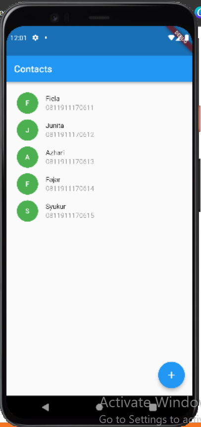

# (20) Flutter Navigation
Nomor Urut: 1_011FLB_40

Nama: Fiela Junita Azhari

## Task

### Input
#### models (user.dart)
    // ignore_for_file: public_member_api_docs, sort_constructors_first
    // import 'package:flutter/material.dart';

    class User {
    final String name;
    final String phone;
    User(
        this.name,
        this.phone,
    );
    }

#### page (add_user_pushnamed.dart)
    import 'package:contact/models/user.dart';
    import 'package:flutter/material.dart';

    class AddUserPushnamed extends StatelessWidget {
    AddUserPushnamed({super.key});

    final TextEditingController _name = TextEditingController();
    final TextEditingController _phone = TextEditingController();

    @override
    Widget build(BuildContext context) {
        final addContact =
            ModalRoute.of(context)!.settings.arguments as Function(User);

        return Scaffold(
        appBar: AppBar(
            title: const Text('Create New Contact'),
        ),
        body: Column(
            children: [
            Container(
                margin: const EdgeInsets.all(16),
                child: TextField(
                controller: _name,
                decoration: const InputDecoration(
                    border: OutlineInputBorder(),
                    label: Text('Enter Name'),
                ),
                ),
            ),
            Container(
                margin: const EdgeInsets.all(16),
                child: TextField(
                controller: _phone,
                decoration: const InputDecoration(
                    border: OutlineInputBorder(),
                    label: Text('Enter Phone'),
                ),
                ),
            ),
            const SizedBox(
                height: 10,
            ),
            ElevatedButton(
                onPressed: () {
                final user = User(_name.text, _phone.text);

                addContact(user);
                Navigator.of(context).pop();
                },
                child: const Text('Submit'),
            )
            ],
        ),
        );
    }
    }

#### page (add_user.dart)
    import 'package:contact/models/user.dart';
    import 'package:flutter/material.dart';

    class AddUser extends StatefulWidget {
    final Function(User) addContact;
    const AddUser(this.addContact);

    @override
    State<AddUser> createState() => _AddUserState();
    }

    class _AddUserState extends State<AddUser> {
    final TextEditingController _name = TextEditingController();
    final TextEditingController _phone = TextEditingController();

    @override
    Widget build(BuildContext context) {
        return Scaffold(
        appBar: AppBar(
            title: const Text('Create New Contact'),
        ),
        body: Column(
            children: [
            Container(
                margin: const EdgeInsets.all(16),
                child: TextField(
                controller: _name,
                decoration: const InputDecoration(
                    border: OutlineInputBorder(),
                    label: Text('Enter Name'),
                ),
                ),
            ),
            Container(
                margin: const EdgeInsets.all(16),
                child: TextField(
                controller: _phone,
                decoration: const InputDecoration(
                    border: OutlineInputBorder(),
                    label: Text('Enter Phone'),
                ),
                ),
            ),
            const SizedBox(
                height: 10,
            ),
            ElevatedButton(
                onPressed: () {
                final user = User(_name.text, _phone.text);

                widget.addContact(user);
                Navigator.of(context).pop();
                },
                child: const Text('Submit'),
            )
            ],
        ),
        );
    }
    }

#### contacts_page
        import 'package:contact/page/add_user.dart';
        import 'package:flutter/material.dart';
        import 'models/user.dart';
        import 'package:flutter_speed_dial/flutter_speed_dial.dart';

        class ContactsPage extends StatefulWidget {
        const ContactsPage({super.key});

        @override
        State<ContactsPage> createState() => _ContactsPageState();
        }

        class _ContactsPageState extends State<ContactsPage> {
        List<User> userList = [
            User('Fiela', '0811911170611'),
            User('Junita', '0811911170612'),
            User('Azhari', '0811911170613'),
            User('Fajar', '0811911170614'),
            User('Syukur', '0811911170615'),
        ];

        // void showUserDialog() {
        //   showDialog(
        //       context: context,
        //       builder: (_) {
        //         return AlertDialog(
        //           content: AddContact(addContact),
        //           shape: RoundedRectangleBorder(
        //             borderRadius: BorderRadius.circular(10),
        //           ),
        //         );
        //       });
        // }

        // void showUsers() {
        //   showDialog(
        //       context: context,
        //       builder: (_) {
        //         return AddUser(addContact);
        //       });
        // }

        void addContact(User user) {
            setState(() {
            userList.add(user);
            });
        }

        @override
        Widget build(BuildContext context) {
            return Scaffold(
                appBar: AppBar(
                title: const Text('Contacts'),
                ),
                body: ListView.builder(
                padding: const EdgeInsets.all(16),
                itemCount: userList.length,
                itemBuilder: ((context, index) {
                    return Container(
                    margin: const EdgeInsets.all(6),
                    child: Row(
                        children: [
                        Container(
                            height: 45,
                            width: 45,
                            decoration: const BoxDecoration(
                                shape: BoxShape.circle, color: Colors.green),
                            child: Center(
                            child: Text(
                                userList[index].name[0].toUpperCase(),
                                style: const TextStyle(
                                    color: Colors.white, fontWeight: FontWeight.w500),
                            ),
                            ),
                        ),
                        const SizedBox(
                            width: 16,
                        ),
                        Expanded(
                            child: Column(
                            crossAxisAlignment: CrossAxisAlignment.start,
                            children: [
                                Text(userList[index].name),
                                const SizedBox(height: 3),
                                Text(
                                userList[index].phone,
                                style:
                                    TextStyle(color: Colors.black.withOpacity(0.4)),
                                )
                            ],
                            ),
                        )
                        ],
                    ),
                    );
                }),
                ),
                // floatingActionButton: FloatingActionButton(
                //   onPressed: showUserDialog,
                //   child: const Icon(Icons.add),
                // ),
                floatingActionButton: SpeedDial(
                icon: Icons.add,
                children: [
                    SpeedDialChild(
                    child: const Icon(Icons.add),
                    label: 'Navigation Push',
                    onTap: () {
                        Navigator.of(context).push(MaterialPageRoute(
                            builder: (context) => AddUser(addContact)));
                    },
                    ),
                    SpeedDialChild(
                    child: const Icon(Icons.add),
                    label: 'Navigation Pushnamed',
                    onTap: () {
                        Navigator.of(context)
                            .pushNamed('/adduser', arguments: addContact);
                    },
                    ),
                ],
                ));
        }
        }

    #### main.dart
    import 'package:contact/contacts_page.dart';
    import 'package:contact/page/add_user_pushnamed.dart';
    import 'package:flutter/material.dart';

    void main() {
    runApp(const MyApp());
    }

    class MyApp extends StatelessWidget {
    const MyApp({super.key});

    @override
    Widget build(BuildContext context) {
        return MaterialApp(
        initialRoute: '/',
        routes: {
            '/': (_) => const ContactsPage(),
            '/adduser': (_) => AddUserPushnamed()
        },
        title: 'Contacts',
        theme: ThemeData(primarySwatch: Colors.blue),
        );
    }
    }

### Output

