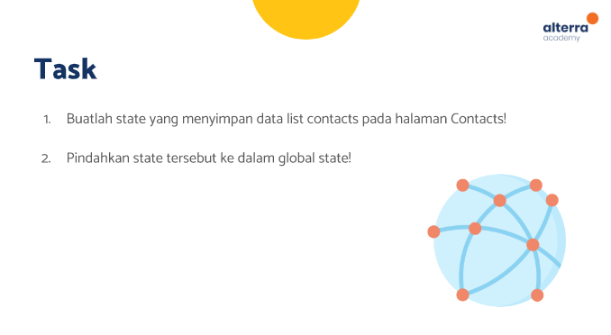

# (21) Flutter State Management (Provider)
Nomor Urut: 1_011FLB_40

Nama: Fiela Junita Azhari

## Task

### Input task1_setstate
#### models (m_contacts.dart)
    class ContactModel {
    String name;
    String phone;
    ContactModel({
        required this.name,
        required this.phone,
    });

    Map<String, dynamic> toMap() {
        return {'name': name, 'phone': phone};
    }
    }

#### pages (add_contact_page.dart)
    import 'package:contacts/models/m_contacts.dart';
    import 'package:flutter/material.dart';

    class AddContactPage extends StatefulWidget {
    final Function(ContactModel) addContact;
    const AddContactPage({
        Key? key,
        required this.addContact,
    }) : super(key: key);

    @override
    State<AddContactPage> createState() => _AddContactPageState();
    }

    class _AddContactPageState extends State<AddContactPage> {
    final formKey = GlobalKey<FormState>();
    final nameController = TextEditingController();
    final phoneController = TextEditingController();
    final Map<String, dynamic> contact = {};

    @override
    Widget build(BuildContext context) {
        return Scaffold(
        appBar: AppBar(
            title: const Text('Create Contact'),
        ),
        body: Form(
            child: Padding(
            padding: const EdgeInsets.all(16),
            child: Column(
            mainAxisAlignment: MainAxisAlignment.center,
            children: [
                TextFormField(
                controller: nameController,
                decoration: InputDecoration(
                    fillColor: Colors.grey.withOpacity(0.2),
                    labelText: 'Name',
                    border: const UnderlineInputBorder(),
                    filled: true,
                ),
                validator: (value) {
                    if (value!.isEmpty) {
                    return 'Add Name Properly';
                    }
                    return null;
                },
                ),
                const SizedBox(
                height: 16,
                ),
                TextFormField(
                controller: phoneController,
                decoration: InputDecoration(
                    fillColor: Colors.grey.withOpacity(0.2),
                    labelText: 'Phone Number',
                    border: const UnderlineInputBorder(),
                    filled: true,
                ),
                validator: (value) {
                    if (value!.isEmpty) {
                    return 'Add Phone Number Properly';
                    }
                    return null;
                },
                ),
                const SizedBox(
                height: 16,
                ),
                ElevatedButton(
                    style: ElevatedButton.styleFrom(
                        minimumSize: const Size.fromHeight(40)),
                    onPressed: () {
                    contact.addAll({
                        'name': nameController.text,
                        'phone': phoneController.text
                    });
                    final contacts = ContactModel(
                        name: contact['name'], phone: contact['phone']);
                    widget.addContact(contacts);

                    Navigator.pop(context);
                    },
                    child: const Text('CREATE CONTACT'))
            ],
            ),
        )),
        );
    }
    }

#### pages (contacts_page.dart)
    // ignore_for_file: public_member_api_docs, sort_constructors_first
    import 'package:flutter/material.dart';

    class ContactsPage extends StatefulWidget {
    final contacts;
    final deleteContact;
    const ContactsPage(
        {Key? key, required this.contacts, required this.deleteContact})
        : super(key: key);

    @override
    State<ContactsPage> createState() => _ContactsPageState();
    }

    class _ContactsPageState extends State<ContactsPage> {
    @override
    Widget build(BuildContext context) {
        return ListView.separated(
        itemCount: widget.contacts.length,
        itemBuilder: (context, index) {
            return buildContactItem(context, index);
        },
        separatorBuilder: (context, index) {
            return const SizedBox(
            height: 16,
            );
        },
        );
    }

    Widget buildContactItem(BuildContext context, int index) {
        return Container(
        height: 70,
        decoration: BoxDecoration(
            color: Colors.green[100],
            borderRadius: BorderRadius.circular(10),
        ),
        child: Row(
            children: [
            Container(
                margin: const EdgeInsets.only(left: 16, right: 16),
                decoration: const BoxDecoration(
                shape: BoxShape.circle,
                ),
                child: Icon(
                Icons.person_pin,
                size: 40,
                color: Colors.grey[600],
                ),
            ),
            Expanded(
                child: Column(
                mainAxisAlignment: MainAxisAlignment.center,
                crossAxisAlignment: CrossAxisAlignment.start,
                children: [
                    Text(
                    widget.contacts[index].name,
                    style: const TextStyle(
                        fontSize: 14, fontWeight: FontWeight.w600),
                    ),
                    Text(
                    widget.contacts[index].phone,
                    style: TextStyle(
                        fontSize: 14, color: Colors.black.withOpacity(0.6)),
                    ),
                ],
                ),
            ),
            IconButton(
                onPressed: () {
                    widget.deleteContact(index);
                },
                icon: Icon(
                    Icons.delete,
                    color: Colors.grey[600],
                ))
            ],
        ),
        );
    }
    }

#### pages (empty_page.dart)
    import 'package:flutter/material.dart';

    class EmptyPage extends StatelessWidget {
    const EmptyPage({super.key});

    @override
    Widget build(BuildContext context) {
        return Center(
        child: Column(
            mainAxisAlignment: MainAxisAlignment.center,
            children: const [Icon(Icons.people), Text('Your contact is empty')],
        ),
        );
    }
    }

#### pages (home_page.dart)
    import 'package:contacts/models/m_contacts.dart';
    import 'package:contacts/pages/add_contact_page.dart';
    import 'package:contacts/pages/contacts_page.dart';
    import 'package:contacts/pages/empty_page.dart';
    import 'package:flutter/material.dart';

    class HomePage extends StatefulWidget {
    const HomePage({super.key});

    @override
    State<HomePage> createState() => _HomePageState();
    }

    class _HomePageState extends State<HomePage> {
    List<ContactModel> contacts = [];

    void addContact(ContactModel contact) {
        setState(() {
        contacts.add(contact);
        });
    }

    void deleteContact(int index) {
        setState(() {
        contacts.removeAt(index);
        });
    }

    @override
    Widget build(BuildContext context) {
        return Scaffold(
        appBar: AppBar(
            centerTitle: false,
            title: const Text('Contact State Management'),
        ),
        floatingActionButton: FloatingActionButton(
            child: const Icon(Icons.add),
            onPressed: () {
            Navigator.of(context).push(
                MaterialPageRoute(
                builder: (context) => AddContactPage(addContact: addContact),
                ),
            );
            },
        ),
        body: Padding(
            padding: const EdgeInsets.all(16.0),
            child: contacts.isNotEmpty
                ? ContactsPage(
                    contacts: contacts,
                    deleteContact: deleteContact,
                )
                : const EmptyPage(),
        ),
        );
    }
    }

#### main.dart
    import 'package:contacts/pages/home_page.dart';
    import 'package:flutter/material.dart';

    void main() {
    runApp(const MyApp());
    }

    class MyApp extends StatelessWidget {
    const MyApp({super.key});

    @override
    Widget build(BuildContext context) {
        return const MaterialApp(
        debugShowCheckedModeBanner: false,
        home: HomePage(),
        );
    }
    }

### Input task2_provider
#### models (contacts.dart)
    import 'package:contacts/models/m_contacts.dart';
    import 'package:flutter/material.dart';

    class Contact with ChangeNotifier {
    final List<ContactModel> _contacts = [];
    List<ContactModel> get contacts => _contacts;

    void addContact(ContactModel contact) {
        _contacts.add(contact);
        notifyListeners();
    }

    void deleteContact(int index) {
        _contacts.removeAt(index);
        notifyListeners();
    }
    }

#### models (m_contacts.dart)
    class ContactModel {
    final String id;
    final String name;
    final String phone;
    ContactModel({
        required this.id,
        required this.name,
        required this.phone,
    });
    }

#### pages (add_contact_page.dart)
    import 'package:contacts/models/contacs.dart';
    import 'package:contacts/models/m_contacts.dart';
    import 'package:flutter/material.dart';
    import 'package:provider/provider.dart';
    import 'package:uuid/uuid.dart';

    class AddContactPage extends StatefulWidget {
    const AddContactPage({
        Key? key,
        // required this.onCreate,
    }) : super(key: key);

    @override
    State<AddContactPage> createState() => _AddContactPageState();
    }

    class _AddContactPageState extends State<AddContactPage> {
    // final Function(ContactModel) onCreate;
    final formKey = GlobalKey<FormState>();
    final nameController = TextEditingController();
    final phoneController = TextEditingController();

    @override
    Widget build(BuildContext context) {
        final contactProvider = Provider.of<Contact>(context);

        return Scaffold(
        appBar: AppBar(
            title: const Text('Create Contact'),
        ),
        body: Form(
            key: formKey,
            child: Padding(
                padding: const EdgeInsets.all(16.0),
                child: Column(
                mainAxisAlignment: MainAxisAlignment.center,
                children: [
                    TextFormField(
                    controller: nameController,
                    decoration: InputDecoration(
                        fillColor: Colors.grey.withOpacity(0.2),
                        labelText: 'Name',
                        border: const UnderlineInputBorder(),
                        filled: true,
                    ),
                    validator: (value) {
                        if (value!.isEmpty) {
                        return 'Add Name Properly';
                        }
                        return null;
                    },
                    ),
                    const SizedBox(
                    height: 16,
                    ),
                    TextFormField(
                    controller: phoneController,
                    decoration: InputDecoration(
                        fillColor: Colors.grey.withOpacity(0.2),
                        labelText: 'Phone Number',
                        border: const UnderlineInputBorder(),
                        filled: true,
                    ),
                    validator: (value) {
                        if (value!.isEmpty) {
                        return 'Add Phone Number Properly';
                        }
                        return null;
                    },
                    ),
                    const SizedBox(
                    height: 16,
                    ),
                    ElevatedButton(
                        style: ElevatedButton.styleFrom(
                            minimumSize: const Size.fromHeight(40)),
                        onPressed: () {
                        setState(() {
                            formKey.currentState!.validate();
                        });
                        if (nameController.text.isEmpty ||
                            phoneController.text.isEmpty) {
                            return;
                        }
                        final contactItem = ContactModel(
                            id: const Uuid().v1(),
                            name: nameController.text,
                            phone: phoneController.text,
                        );
                        contactProvider.addContact(contactItem);
                        Navigator.pop(context);
                        },
                        child: const Text('CREATE CONTACT'))
                ],
                ),
            )),
        );
    }
    }

#### pages (contacts_page.dart)
    import 'package:contacts/models/m_contacts.dart';
    import 'package:flutter/material.dart';
    import 'package:contacts/models/contacs.dart';

    class ContactPage extends StatelessWidget {
    const ContactPage({
        Key? key,
        required this.contact,
    }) : super(key: key);
    final Contact contact;

    @override
    Widget build(BuildContext context) {
        final contactItems = contact.contacts;
        return Padding(
        padding: const EdgeInsets.all(16.0),
        child: ListView.separated(
            itemCount: contactItems.length,
            itemBuilder: (context, index) {
            ContactModel item = contactItems[index];
            return buildContactItem(context, item, index);
            },
            separatorBuilder: (context, index) {
            return const SizedBox(
                height: 16,
            );
            },
        ),
        );
    }

    Widget buildContactItem(BuildContext context, ContactModel item, int index) {
        return Container(
        height: 70,
        decoration: BoxDecoration(
            color: Colors.green[100],
            borderRadius: BorderRadius.circular(10),
        ),
        child: Row(
            children: [
            Container(
                margin: const EdgeInsets.only(left: 16, right: 16),
                decoration: const BoxDecoration(
                shape: BoxShape.circle,
                ),
                child: Icon(
                Icons.person_pin,
                size: 40,
                color: Colors.grey[600],
                ),
            ),
            Expanded(
                child: Column(
                mainAxisAlignment: MainAxisAlignment.center,
                crossAxisAlignment: CrossAxisAlignment.start,
                children: [
                    Text(
                    item.name,
                    style: const TextStyle(
                        fontSize: 14, fontWeight: FontWeight.w600),
                    ),
                    Text(
                    item.phone,
                    style: TextStyle(
                        fontSize: 14, color: Colors.black.withOpacity(0.6)),
                    ),
                ],
                ),
            ),
            IconButton(
                onPressed: () {
                    contact.deleteContact(
                    index,
                    );
                },
                icon: Icon(
                    Icons.delete,
                    color: Colors.grey[600],
                ))
            ],
        ),
        );
    }
    }

#### pages (empty_page.dart)
    import 'package:flutter/material.dart';

    class EmptyPage extends StatelessWidget {
    const EmptyPage({super.key});

    @override
    Widget build(BuildContext context) {
        return Center(
        child: Column(
            mainAxisAlignment: MainAxisAlignment.center,
            children: const [Icon(Icons.people), Text('Your contact is empty')],
        ),
        );
    }
    }

#### pages (home_page.dart)
    import 'package:contacts/models/contacs.dart';
    import 'package:contacts/pages/add_contact_page.dart';
    import 'package:contacts/pages/contact_page.dart';
    import 'package:contacts/pages/empty_page.dart';
    import 'package:flutter/material.dart';
    import 'package:provider/provider.dart';

    class HomePage extends StatelessWidget {
    const HomePage({super.key});

    @override
    Widget build(BuildContext context) {
        return Scaffold(
        appBar: AppBar(
            centerTitle: false,
            title: const Text('Home'),
        ),
        body: buildHomePage(),
        floatingActionButton: FloatingActionButton(
            onPressed: () {
            // final contactProvider = Provider.of<Contact>(context, listen: false);
            Navigator.of(context).push(MaterialPageRoute(
                builder: (context) {
                return const AddContactPage(
                    // onCreate: (task) {
                    //   contactProvider.addContact(task);
                    //   Navigator.pop(context);
                    // },
                    );
                },
            ));
            },
            child: const Icon(Icons.add),
        ),
        );
    }

    Widget buildHomePage() {
        return Consumer<Contact>(
        builder: (context, contact, child) {
            if (contact.contacts.isNotEmpty) {
            return ContactPage(contact: contact);
            } else {
            return const EmptyPage();
            }
        },
        );
    }
    }

#### main.dart
    import 'package:contacts/models/contacs.dart';
    import 'package:contacts/pages/home_page.dart';
    import 'package:flutter/material.dart';
    import 'package:provider/provider.dart';

    void main() {
    runApp(const MyApp());
    }

    class MyApp extends StatelessWidget {
    const MyApp({super.key});

    @override
    Widget build(BuildContext context) {
        return ChangeNotifierProvider(
        create: (context) => Contact(),
        child: const MaterialApp(
            debugShowCheckedModeBanner: false,
            home: HomePage(),
        ),
        );
    }
    }

### Output task1_setstate

### Output task2_provider

