# (23) Flutter Animation
Nomor Urut: 1_011FLB_40

Nama: Fiela Junita Azhari

## Task
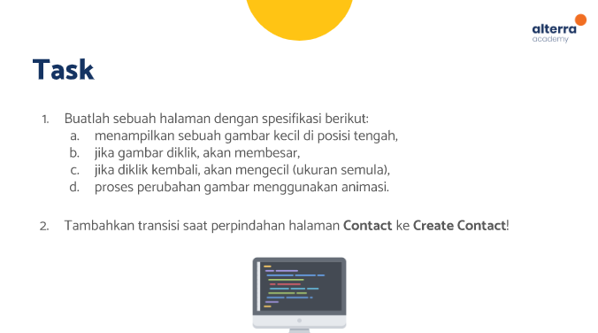
### Input Task1
#### main.dart
    import 'package:flutter/material.dart';

    void main() {
    runApp(const MyApp());
    }

    class MyApp extends StatelessWidget {
    const MyApp({super.key});

    @override
    Widget build(BuildContext context) {
        return MaterialApp(
        title: 'Flutter Demo',
        theme: ThemeData(
            primarySwatch: Colors.blue,
        ),
        home: const MyHomePage(title: 'Animation'),
        );
    }
    }

    class MyHomePage extends StatefulWidget {
    const MyHomePage({super.key, required this.title});

    final String title;

    @override
    State<MyHomePage> createState() => _MyHomePageState();
    }

    class _MyHomePageState extends State<MyHomePage> {
    bool isBig = false;

    @override
    Widget build(BuildContext context) {
        return Scaffold(
        appBar: AppBar(
            title: Text(widget.title),
        ),
        body: Center(
            child: InkWell(
            onTap: () {
                isBig = !isBig;
                setState(() {});
            },
            child: AnimatedContainer(
                height: isBig ? 300 : 200,
                width: isBig ? 300 : 200,
                duration: const Duration(milliseconds: 200),
                child: Image.asset(
                'assets/kucing.jpg',
                fit: BoxFit.cover,
                ),
            ),
            ),
        ),
        );
    }
    }

### Input Task2
#### moduls (contacts_model.dart)
    class ContactsModel {
    final String name;
    final String phonenumber;

    ContactsModel({required this.name, required this.phonenumber});
    }

    List<ContactsModel> contacts = [];

#### screens (add_contact_screen.dart)
    import 'package:flutter/material.dart';
    import 'package:flutter/services.dart';
    import 'package:task2/moduls/contacts_model.dart';

    class AddContactScreen extends StatefulWidget {
    const AddContactScreen({super.key});

    @override
    State<AddContactScreen> createState() => _AddContactScreenState();
    }

    class _AddContactScreenState extends State<AddContactScreen> {
    final _formKey = GlobalKey<FormState>();
    final TextEditingController nameController = TextEditingController();
    final TextEditingController phonenumberController = TextEditingController();

    @override
    Widget build(BuildContext context) {
        return Scaffold(
        appBar: AppBar(
            title: const Text('Create New Contact'),
        ),
        body: Form(
            key: _formKey,
            child: Padding(
            padding: const EdgeInsets.symmetric(horizontal: 10),
            child: Column(
                crossAxisAlignment: CrossAxisAlignment.stretch,
                mainAxisAlignment: MainAxisAlignment.center,
                children: [
                TextFormField(
                    controller: nameController,
                    validator: (String? value) =>
                        value == '' ? 'Input contact name!' : null,
                    decoration: InputDecoration(
                    label: const Text('Name'),
                    prefixIcon: const Icon(Icons.person),
                    border: OutlineInputBorder(
                        borderRadius: BorderRadius.circular(10),
                    ),
                    ),
                ),
                const SizedBox(height: 20),
                TextFormField(
                    controller: phonenumberController,
                    keyboardType: TextInputType.phone,
                    inputFormatters: <TextInputFormatter>[
                    FilteringTextInputFormatter.digitsOnly
                    ],
                    validator: (String? value) =>
                        value == '' ? 'Input phone number!' : null,
                    decoration: InputDecoration(
                    label: const Text('Number'),
                    prefixIcon: const Icon(Icons.call),
                    border: OutlineInputBorder(
                        borderRadius: BorderRadius.circular(10),
                    ),
                    ),
                ),
                const SizedBox(height: 20),
                ElevatedButton(
                    onPressed: () {
                        if (_formKey.currentState!.validate()) {
                        _formKey.currentState!.save();

                        final contacts = ContactsModel(
                            name: nameController.text,
                            phonenumber: phonenumberController.text,
                        );

                        Navigator.pop(context, contacts);
                        }
                    },
                    child: const Text('Add Contact'))
                ],
            ),
            ),
        ),
        );
    }
    }

#### screens (contacts_list_screen.dart)
    import 'package:flutter/material.dart';
    import 'package:task2/moduls/contacts_model.dart';
    import 'package:task2/screens/add_contact_screen.dart';

    class ContactListScreen extends StatefulWidget {
    const ContactListScreen({super.key});

    @override
    State<ContactListScreen> createState() => _ContactListScreenState();
    }

    class _ContactListScreenState extends State<ContactListScreen> {
    @override
    Widget build(BuildContext context) {
        return Scaffold(
        appBar: AppBar(
            title: const Text('Home'),
        ),
        body: Center(
            child: contacts.isEmpty
                ? Column(
                    mainAxisAlignment: MainAxisAlignment.center,
                    children: const [
                    Icon(Icons.group),
                    Text('Your Contact Is Empty'),
                    ],
                )
                : ListView.builder(
                    itemCount: contacts.length,
                    itemBuilder: (context, index) => Padding(
                    padding: const EdgeInsets.only(right: 10, top: 10, left: 10),
                    child: Card(
                        elevation: 5,
                        color: Colors.blue[100],
                        child: ListTile(
                        title: Text(contacts[index].name),
                        subtitle: Text(contacts[index].phonenumber),
                        leading: const CircleAvatar(
                            backgroundColor: Colors.blue,
                            child: Icon(Icons.person),
                        ),
                        trailing: IconButton(
                            icon: const Icon(Icons.delete),
                            onPressed: () {
                            contacts.removeAt(index);
                            setState(() {});
                            },
                        ),
                        ),
                    ),
                    ),
                ),
        ),
        floatingActionButton: FloatingActionButton(
            onPressed: () async {
            final result = await Navigator.of(context).push(
                PageRouteBuilder(
                pageBuilder: (context, animation, secondaryAnimation) {
                    return const AddContactScreen();
                },
                transitionsBuilder:
                    (context, animation, secondaryAnimation, child) {
                    final tween =
                        Tween(begin: const Offset(0, .5), end: Offset.zero);
                    return SlideTransition(
                    position: animation.drive(tween),
                    child: child,
                    );
                },
                ),
            );
            contacts.add(result);
            setState(() {});
            },
            child: const Icon(Icons.person_add_alt_1),
        ),
        );
    }
    }

#### main.dart
    import 'package:flutter/material.dart';
    import 'package:task2/screens/contacts_list_screen.dart';

    void main() {
    runApp(const MyApp());
    }

    class MyApp extends StatelessWidget {
    const MyApp({super.key});

    @override
    Widget build(BuildContext context) {
        return MaterialApp(
        title: 'Flutter Demo',
        theme: ThemeData(
            primarySwatch: Colors.blue,
        ),
        home: const ContactListScreen(),
        );
    }
    }

### Output Task1
[video](../screenshots/task1output.mp4)
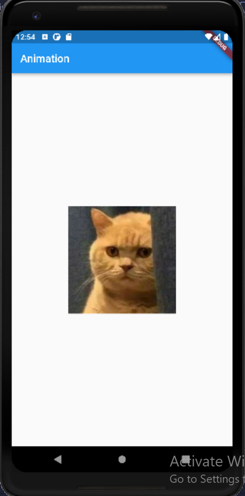
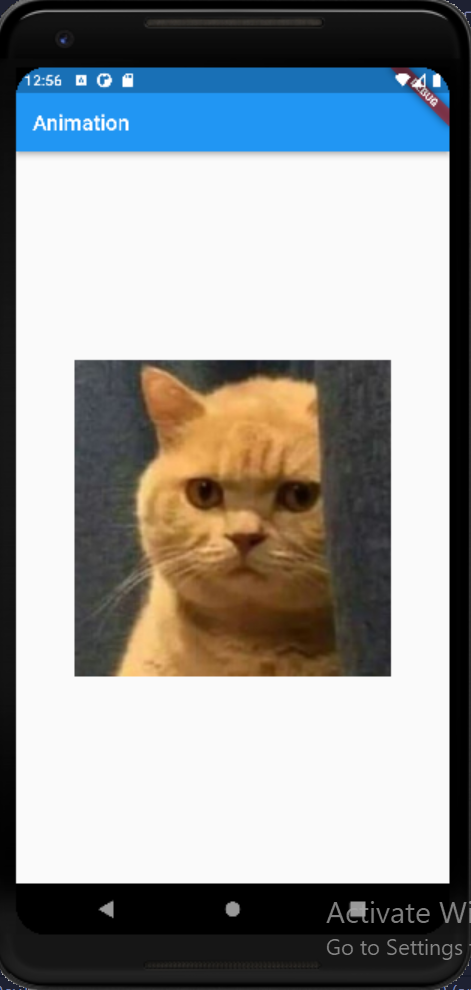
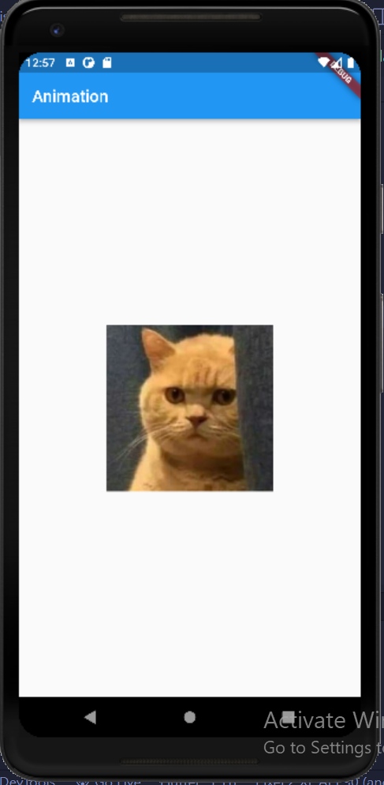
### Output Task2
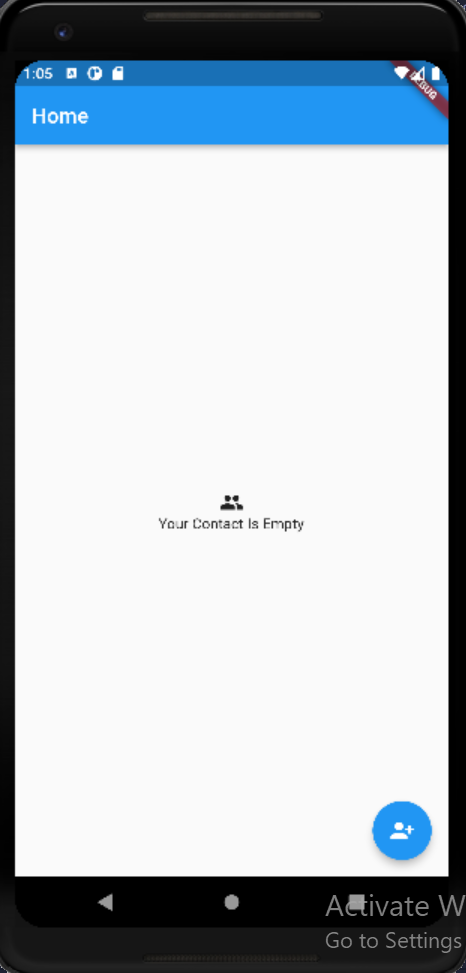
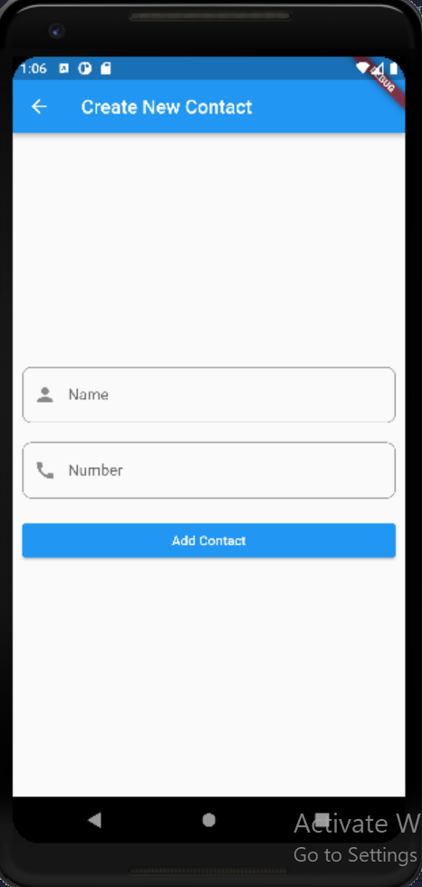
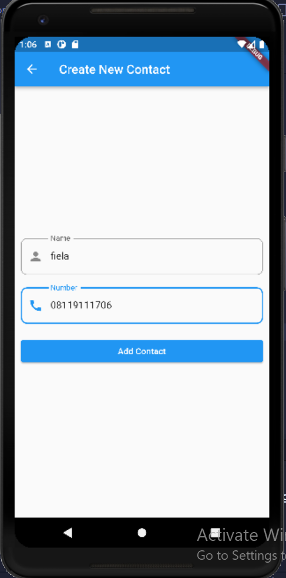
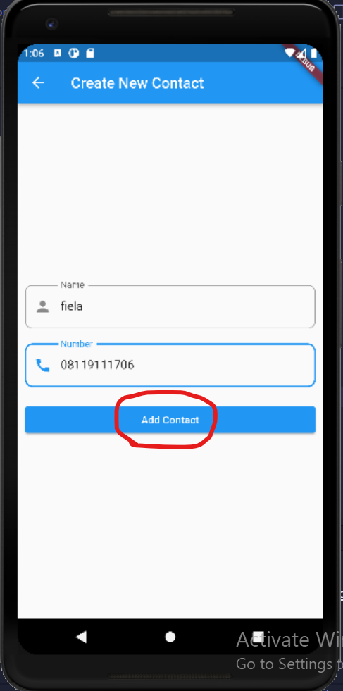
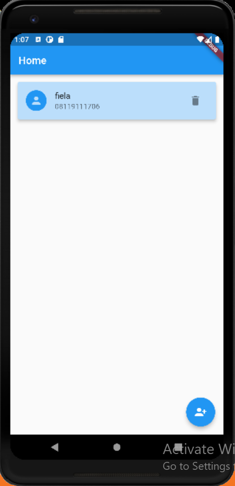
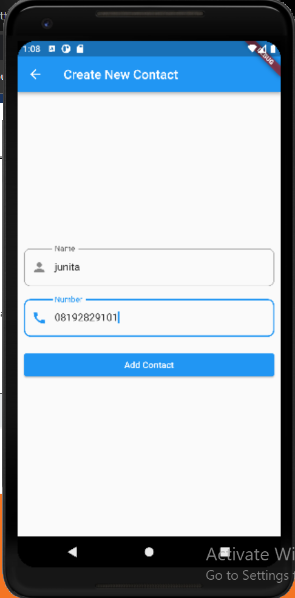
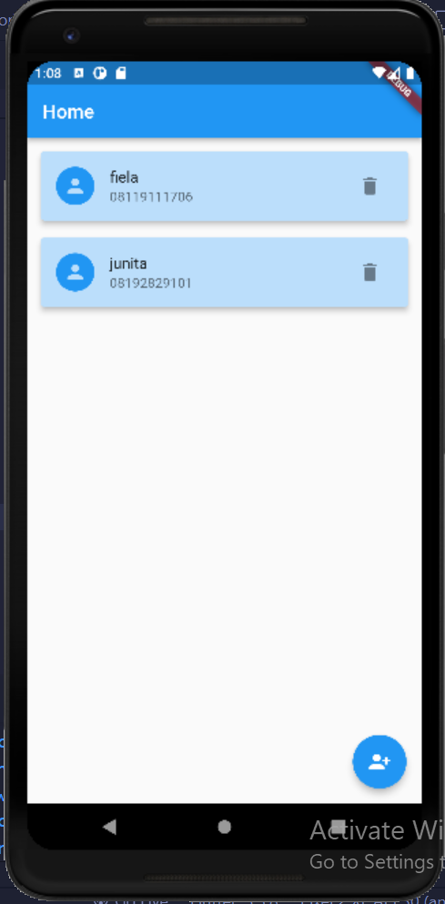
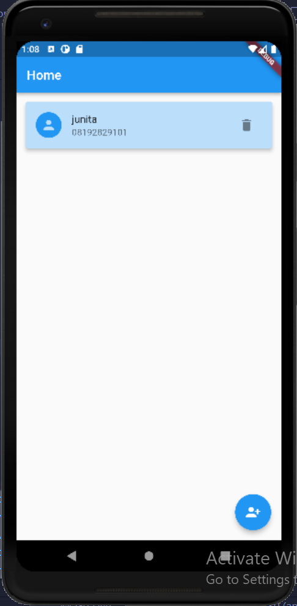