# (24) Storage
Nomor Urut: 1_011FLB_40

Nama: Fiela Junita Azhari

## Task
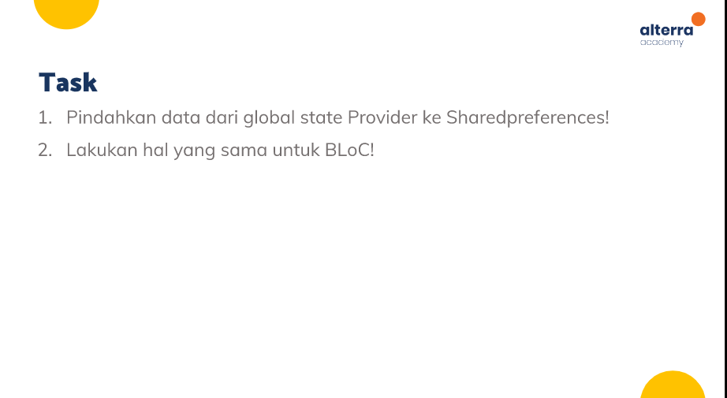
### Input Task1-Provider
#### pages (home_page.dart)
    import 'package:flutter/material.dart';
    import 'package:provider/provider.dart';
    import 'package:provider_shared_preference/pages/register_page.dart';
    import 'package:provider_shared_preference/providers/user_provider.dart';
    import 'package:shared_preferences/shared_preferences.dart';

    class HomePage extends StatelessWidget {
    HomePage({super.key});
    late SharedPreferences registerdata;
    String username = '';
    String email = '';

    @override
    Widget build(BuildContext context) {
        final userProvider = Provider.of<UserProvider>(context);
        userProvider.initial();

        return Scaffold(
        appBar: AppBar(
            title: const Text('Home '),
            centerTitle: false,
        ),
        body: Center(
            child: Column(
            mainAxisAlignment: MainAxisAlignment.center,
            children: [
                Consumer<UserProvider>(
                builder: (BuildContext context, value, Widget? child) {
                    return Text(
                    overflow: TextOverflow.ellipsis,
                    'Hello, ${value.username}',
                    style: const TextStyle(fontSize: 30),
                    );
                },
                ),
                Consumer<UserProvider>(
                builder: (BuildContext context, value, Widget? child) {
                    return Text(
                    overflow: TextOverflow.ellipsis,
                    value.email,
                    style: const TextStyle(fontSize: 30),
                    );
                },
                ),
                ElevatedButton(
                    onPressed: () {
                    userProvider.addBool(true);
                    userProvider.deleteName(username);
                    userProvider.deleteEmail(email);
                    Navigator.pushReplacement(
                        context,
                        MaterialPageRoute(
                        builder: (context) => const RegisterPage(),
                        ),
                    );
                    },
                    child: const Text('Sign Out'))
            ],
            ),
        ),
        );
    }
    }

#### pages (register_page.dart)
    import 'package:email_validator/email_validator.dart';
    import 'package:flutter/material.dart';
    import 'package:provider/provider.dart';
    import 'package:provider_shared_preference/pages/home_page.dart';
    import 'package:provider_shared_preference/providers/user_provider.dart';

    class RegisterPage extends StatefulWidget {
    const RegisterPage({super.key});

    @override
    State<RegisterPage> createState() => _RegisterPageState();
    }

    class _RegisterPageState extends State<RegisterPage> {
    final formKey = GlobalKey<FormState>();

    final _nameController = TextEditingController();
    final _emailController = TextEditingController();
    final _phoneNumberController = TextEditingController();
    final _passwordController = TextEditingController();

    @override
    void dispose() {
        _nameController.dispose();
        _emailController.dispose();
        _phoneNumberController.dispose();
        _passwordController.dispose();
        super.dispose();
    }

    @override
    Widget build(BuildContext context) {
        final userProvider = Provider.of<UserProvider>(context, listen: false);
        userProvider.checkRegister(context);
        return Scaffold(
        body: Padding(
            padding: const EdgeInsets.only(left: 40, right: 40),
            child: Center(
            child: Form(
                key: formKey,
                child: ListView(
                shrinkWrap: true,
                children: [
                    const Text('Name'),
                    const SizedBox(
                    height: 10,
                    ),
                    TextFormField(
                    controller: _nameController,
                    decoration: InputDecoration(
                        hintText: 'Name',
                        hintStyle: TextStyle(color: Colors.black.withOpacity(0.3)),
                        border: const UnderlineInputBorder(),
                    ),
                    validator: (name) {
                        if (name != null && name.length < 4) {
                        return 'Enter at least 4 characters';
                        }
                        return null;
                    },
                    ),
                    const SizedBox(
                    height: 10,
                    ),
                    const Text('Email'),
                    const SizedBox(
                    height: 10,
                    ),
                    TextFormField(
                    controller: _emailController,
                    decoration: InputDecoration(
                        hintText: 'Email',
                        hintStyle: TextStyle(color: Colors.black.withOpacity(0.3)),
                        border: const UnderlineInputBorder(),
                    ),
                    validator: (email) {
                        if (email != null && !EmailValidator.validate(email)) {
                        return 'Enter a valid email';
                        }
                        return null;
                    },
                    ),
                    const SizedBox(
                    height: 10,
                    ),
                    const Text('Phone Number'),
                    const SizedBox(
                    height: 10,
                    ),
                    TextFormField(
                    controller: _phoneNumberController,
                    decoration: InputDecoration(
                        hintText: 'Phone Number',
                        hintStyle: TextStyle(color: Colors.black.withOpacity(0.3)),
                        border: const UnderlineInputBorder(),
                    ),
                    validator: (phoneNumber) {
                        final regExp = RegExp(r'(^(?:[+0]9)?[0-9]{10,12}$)');

                        if (phoneNumber!.isEmpty) {
                        return 'Please enter mobile number';
                        } else if (!regExp.hasMatch(phoneNumber)) {
                        return 'Please enter valid phone number';
                        }
                        return null;
                    },
                    ),
                    const SizedBox(
                    height: 10,
                    ),
                    const Text('Password'),
                    const SizedBox(
                    height: 10,
                    ),
                    Consumer<UserProvider>(
                    builder: (context, value, child) {
                        return TextFormField(
                        controller: _passwordController,
                        obscureText: value.toogle,
                        decoration: InputDecoration(
                            suffixIcon: IconButton(
                            onPressed: () {
                                value.toogleTheme();
                            },
                            icon: Icon(value.toogle
                                ? Icons.visibility_off
                                : Icons.visibility),
                            ),
                            hintText: 'Password',
                            hintStyle:
                                TextStyle(color: Colors.black.withOpacity(0.3)),
                            border: const UnderlineInputBorder(),
                        ),
                        validator: (password) {
                            if (password != null && password.length < 5) {
                            return 'Enter min. 5 characters';
                            }
                            return null;
                        },
                        );
                    },
                    ),
                    const SizedBox(
                    height: 10,
                    ),
                    ElevatedButton(
                    onPressed: () {
                        final isValidForm = formKey.currentState!.validate();
                        String username = _nameController.text;
                        String email = _emailController.text;

                        if (isValidForm) {
                        userProvider.addBool(false);
                        userProvider.setName(username);
                        userProvider.setEmail(email);
                        Navigator.pushAndRemoveUntil(
                            context,
                            MaterialPageRoute(
                            builder: (context) => HomePage(),
                            ),
                            (route) => false,
                        );
                        }
                    },
                    child: const Text('Register'),
                    )
                ],
                ),
            ),
            ),
        ),
        );
    }
    }

#### provider (user_provider.dart)
    import 'package:flutter/material.dart';
    import 'package:shared_preferences/shared_preferences.dart';

    import '../pages/home_page.dart';

    class UserProvider extends ChangeNotifier {
    late SharedPreferences registerdata;
    bool _newUser = false;
    bool _toogle = true;
    String _username = '';
    String _email = '';

    bool get toogle => _toogle;
    bool get newUser => _newUser;
    String get username => _username;
    String get email => _email;

    Future<void> checkRegister(BuildContext context) async {
        registerdata = await SharedPreferences.getInstance();
        _newUser = registerdata.getBool('register') ?? true;
        if (newUser == false) {
        Navigator.pushAndRemoveUntil(
            context,
            MaterialPageRoute(
                builder: (context) => HomePage(),
            ),
            (route) => false);
        }
        notifyListeners();
    }

    Future<void> addBool(bool a) async {
        registerdata = await SharedPreferences.getInstance();
        registerdata.setBool('register', a);
        notifyListeners();
    }

    Future<void> setName(String username) async {
        registerdata = await SharedPreferences.getInstance();
        registerdata.setString('username', username);
        notifyListeners();
    }

    Future<void> setEmail(String email) async {
        registerdata = await SharedPreferences.getInstance();
        registerdata.setString('email', email);
        notifyListeners();
    }

    Future<void> initial() async {
        registerdata = await SharedPreferences.getInstance();
        _username = registerdata.getString('username').toString();
        _email = registerdata.getString('email').toString();
        notifyListeners();
    }

    Future<void> deleteName(String username) async {
        registerdata = await SharedPreferences.getInstance();
        registerdata.remove('username');
        notifyListeners();
    }

    Future<void> deleteEmail(String email) async {
        registerdata = await SharedPreferences.getInstance();
        registerdata.remove('email');
        notifyListeners();
    }

    toogleTheme() {
        _toogle = !_toogle;
        notifyListeners();
    }
    }

#### generated_plugin_registrant.dart
    //
    // Generated file. Do not edit.
    //

    // ignore_for_file: directives_ordering
    // ignore_for_file: lines_longer_than_80_chars
    // ignore_for_file: depend_on_referenced_packages

    import 'package:shared_preferences_web/shared_preferences_web.dart';

    import 'package:flutter_web_plugins/flutter_web_plugins.dart';

    // ignore: public_member_api_docs
    void registerPlugins(Registrar registrar) {
    SharedPreferencesPlugin.registerWith(registrar);
    registrar.registerMessageHandler();
    }

#### main.dart
    import 'package:flutter/material.dart';
    import 'package:provider/provider.dart';
    import 'package:provider_shared_preference/pages/home_page.dart';
    import 'package:provider_shared_preference/pages/register_page.dart';
    import 'package:provider_shared_preference/providers/user_provider.dart';

    void main() {
    runApp(const MyApp());
    }

    class MyApp extends StatelessWidget {
    const MyApp({super.key});

    @override
    Widget build(BuildContext context) {
        return ChangeNotifierProvider(
        create: (context) => UserProvider(),
        child: MaterialApp(
            debugShowCheckedModeBanner: false,
            // home: HomePage(),
            routes: {
            '/': (context) => const RegisterPage(),
            '/homepage': (context) => HomePage(),
            },
        ),
        );
    }
    }

### Input Task2-BLoc
#### bloc (user_bloc.dart)
    import 'package:bloc/bloc.dart';
    import 'package:bloc_shared_preferennce/pages/home_page.dart';
    import 'package:equatable/equatable.dart';
    import 'package:flutter/material.dart';
    import 'package:shared_preferences/shared_preferences.dart';

    part 'user_event.dart';
    part 'user_state.dart';

    class UserBloc extends Bloc<UserEvent, UserState> {
    UserBloc() : super(UserChanged()) {
        late SharedPreferences registerdata;
        late bool newUser;
        bool toogle = true;
        String username = '';
        String email = '';

        on<CheckUser>(
        (event, emit) async {
            if (state is UserChanged) {
            // final state = this.state as UserChanged;
            registerdata = await SharedPreferences.getInstance();
            newUser = registerdata.getBool('register') ?? true;
            if (newUser == false) {
                Navigator.pushAndRemoveUntil(
                    event.context!,
                    MaterialPageRoute(
                    builder: (context) => HomePage(),
                    ),
                    (route) => false);
            }
            // print('Check User');
            }
        },
        );

        on<Initial>(
        (event, emit) async {
            if (state is UserChanged) {
            registerdata = await SharedPreferences.getInstance();
            username = registerdata.getString('username').toString();
            email = registerdata.getString('email').toString();
            emit(UserChanged(username: username, email: email));
            }
        },
        );

        on<AddBool>(
        (event, emit) async {
            if (state is UserChanged) {
            registerdata = await SharedPreferences.getInstance();
            registerdata.setBool('register', event.newUser);
            }
        },
        );

        on<AddName>(
        (event, emit) async {
            if (state is UserChanged) {
            registerdata = await SharedPreferences.getInstance();
            registerdata.setString('username', event.username);
            print('Name Changed ${event.username}');
            }
        },
        );

        on<AddEmail>(
        (event, emit) async {
            if (state is UserChanged) {
            registerdata = await SharedPreferences.getInstance();
            registerdata.setString('email', event.email);
            print('Email Changed ${event.email}');
            }
        },
        );

        on<RemoveName>(
        (event, emit) async {
            if (state is UserChanged) {
            registerdata = await SharedPreferences.getInstance();
            registerdata.remove('username');
            print('Name Deleted');
            }
        },
        );

        on<RemoveEmail>(
        (event, emit) async {
            if (state is UserChanged) {
            registerdata = await SharedPreferences.getInstance();
            registerdata.remove('email');
            print('Email Deleted');
            }
        },
        );

        on<ChangeUser>(
        (event, emit) {
            if (state is UserChanged) {
            final state = this.state as UserChanged;
            emit(UserChanged(toogle: toogle = !toogle));
            }
        },
        );
    }
    }

#### bloc (user_event.dart)
    // ignore_for_file: public_member_api_docs, sort_constructors_first
    part of 'user_bloc.dart';

    abstract class UserEvent extends Equatable {
    const UserEvent();

    @override
    List<Object> get props => [];
    }

    class CheckUser extends UserEvent {
    BuildContext? context;
    CheckUser({
        this.context,
    });
    }

    class Initial extends UserEvent {}

    class AddBool extends UserEvent {
    bool newUser;
    AddBool({
        required this.newUser,
    });
    }

    class AddName extends UserEvent {
    String username;
    AddName({
        required this.username,
    });
    }

    class AddEmail extends UserEvent {
    String email;
    AddEmail({
        required this.email,
    });
    }

    // class Remove extends UserEvent {
    //   String user;
    //   Remove({
    //     required this.user,
    //   });
    // }

    class RemoveName extends UserEvent {}

    class RemoveEmail extends UserEvent {
    // String email;
    // RemoveEmail({
    //   required this.email,
    // });
    }

    class ChangeUser extends UserEvent {}

#### bloc (user_state.dart)
    // ignore_for_file: public_member_api_docs, sort_constructors_first
    part of 'user_bloc.dart';

    abstract class UserState extends Equatable {
    const UserState();

    @override
    List<Object> get props => [];
    }

    class UserChanged extends UserState {
    String username;
    String email;
    bool toogle;
    UserChanged({
        this.username = '',
        this.email = '',
        this.toogle = true,
    });

    @override
    List<Object> get props => [username, email, toogle];
    }

#### pages (home_page.dart)
    import 'package:bloc_shared_preferennce/bloc/user_bloc.dart';
    import 'package:bloc_shared_preferennce/pages/register_page.dart';
    import 'package:flutter/material.dart';
    import 'package:flutter_bloc/flutter_bloc.dart';
    import 'package:shared_preferences/shared_preferences.dart';

    class HomePage extends StatelessWidget {
    HomePage({super.key});
    late SharedPreferences registerdata;
    String username = '';
    String email = '';

    @override
    Widget build(BuildContext context) {
        final userProvider = BlocProvider.of<UserBloc>(context);
        userProvider.add(Initial());
        return Scaffold(
        appBar: AppBar(
            title: const Text('Home '),
            centerTitle: false,
        ),
        body: Padding(
            padding: const EdgeInsets.all(16.0),
            child: Center(
            child: BlocBuilder<UserBloc, UserState>(
                builder: (context, state) {
                if (state is UserChanged) {
                    return Column(
                    mainAxisAlignment: MainAxisAlignment.center,
                    children: [
                        Text(
                        'Hello, ${state.username}',
                        style: const TextStyle(fontSize: 30),
                        ),
                        Text(
                        overflow: TextOverflow.ellipsis,
                        state.email,
                        style: const TextStyle(fontSize: 30),
                        ),
                        ElevatedButton(
                        onPressed: () {
                            userProvider.add(AddBool(newUser: true));
                            userProvider.add(RemoveName());
                            userProvider.add(RemoveEmail());
                            Navigator.pushReplacement(
                            context,
                            MaterialPageRoute(
                                builder: (context) => const RegisterPage(),
                            ),
                            );
                        },
                        child: const Text('Sign Out'),
                        )
                    ],
                    );
                }
                return const Text('Something when wrong');
                },
            ),
            ),
        ),
        );
    }
    }

#### pages (register_page.dart)
    import 'package:bloc_shared_preferennce/bloc/user_bloc.dart';
    import 'package:bloc_shared_preferennce/pages/home_page.dart';
    import 'package:email_validator/email_validator.dart';
    import 'package:flutter/material.dart';
    import 'package:flutter_bloc/flutter_bloc.dart';

    class RegisterPage extends StatefulWidget {
    const RegisterPage({super.key});

    @override
    State<RegisterPage> createState() => _RegisterPageState();
    }

    class _RegisterPageState extends State<RegisterPage> {
    final formKey = GlobalKey<FormState>();

    final _nameController = TextEditingController();
    final _emailController = TextEditingController();
    final _phoneNumberController = TextEditingController();
    final _passwordController = TextEditingController();

    @override
    void dispose() {
        _nameController.dispose();
        _emailController.dispose();
        _phoneNumberController.dispose();
        _passwordController.dispose();
        super.dispose();
    }

    @override
    Widget build(BuildContext context) {
        final userProvider = BlocProvider.of<UserBloc>(context);
        userProvider.add(
        CheckUser(context: context),
        );
        return Scaffold(
        body: Padding(
            padding: const EdgeInsets.only(left: 40, right: 40),
            child: Center(
            child: Form(
                key: formKey,
                child: ListView(
                shrinkWrap: true,
                children: [
                    const Text(
                    'Register',
                    textAlign: TextAlign.center,
                    style: TextStyle(
                        fontSize: 50,
                    ),
                    ),
                    const SizedBox(
                    height: 100,
                    ),
                    const Text('Name'),
                    const SizedBox(
                    height: 10,
                    ),
                    TextFormField(
                    controller: _nameController,
                    decoration: InputDecoration(
                        hintText: 'Name',
                        hintStyle: TextStyle(color: Colors.white.withOpacity(0.3)),
                        border: const UnderlineInputBorder(),
                    ),
                    validator: (name) {
                        if (name != null && name.length < 4) {
                        return 'Enter at least 4 characters';
                        }
                        return null;
                    },
                    ),
                    const SizedBox(
                    height: 10,
                    ),
                    const Text('Email'),
                    const SizedBox(
                    height: 10,
                    ),
                    TextFormField(
                    controller: _emailController,
                    decoration: InputDecoration(
                        hintText: 'Email',
                        hintStyle: TextStyle(color: Colors.white.withOpacity(0.3)),
                        border: const UnderlineInputBorder(),
                    ),
                    validator: (email) {
                        if (email != null && !EmailValidator.validate(email)) {
                        return 'Enter a valid email';
                        }
                        return null;
                    },
                    ),
                    const SizedBox(
                    height: 10,
                    ),
                    const Text('Phone Number'),
                    const SizedBox(
                    height: 10,
                    ),
                    TextFormField(
                    controller: _phoneNumberController,
                    decoration: InputDecoration(
                        hintText: 'Phone Number',
                        hintStyle: TextStyle(color: Colors.white.withOpacity(0.3)),
                        border: const UnderlineInputBorder(),
                    ),
                    validator: (phoneNumber) {
                        final regExp = RegExp(r'(^(?:[+0]9)?[0-9]{10,12}$)');

                        if (phoneNumber!.isEmpty) {
                        return 'Please enter mobile number';
                        } else if (!regExp.hasMatch(phoneNumber)) {
                        return 'Please enter valid phone number';
                        }
                        return null;
                    },
                    ),
                    const SizedBox(
                    height: 10,
                    ),
                    const Text('Password'),
                    const SizedBox(
                    height: 10,
                    ),
                    BlocBuilder<UserBloc, UserState>(
                    builder: (context, state) {
                        if (state is UserChanged) {
                        return TextFormField(
                            controller: _passwordController,
                            obscureText: state.toogle,
                            decoration: InputDecoration(
                            suffixIcon: IconButton(
                                onPressed: () {
                                BlocProvider.of<UserBloc>(context)
                                    .add(ChangeUser());
                                },
                                icon: Icon(state.toogle
                                    ? Icons.visibility_off
                                    : Icons.visibility),
                            ),
                            hintText: 'Password',
                            hintStyle:
                                TextStyle(color: Colors.white.withOpacity(0.3)),
                            border: const UnderlineInputBorder(),
                            ),
                            validator: (password) {
                            if (password != null && password.length < 5) {
                                return 'Enter min. 5 characters';
                            }
                            return null;
                            },
                        );
                        }
                        return const Text('Something went wrong');
                    },
                    ),
                    const SizedBox(
                    height: 10,
                    ),
                    ElevatedButton(
                    onPressed: () {
                        final isValidForm = formKey.currentState!.validate();
                        String username = _nameController.text;
                        String email = _emailController.text;

                        if (isValidForm) {
                        userProvider.add(AddBool(newUser: false));
                        userProvider.add(AddName(username: username));
                        userProvider.add(AddEmail(email: email));
                        Navigator.pushAndRemoveUntil(
                            context,
                            MaterialPageRoute(
                            builder: (context) => HomePage(),
                            ),
                            (route) => false,
                        );
                        }
                    },
                    child: const Text('Register'),
                    ),
                ],
                ),
            ),
            ),
        ),
        );
    }
    }

#### generated_plugin_registrant.dart
    //
    // Generated file. Do not edit.
    //

    // ignore_for_file: directives_ordering
    // ignore_for_file: lines_longer_than_80_chars
    // ignore_for_file: depend_on_referenced_packages

    import 'package:shared_preferences_web/shared_preferences_web.dart';

    import 'package:flutter_web_plugins/flutter_web_plugins.dart';

    // ignore: public_member_api_docs
    void registerPlugins(Registrar registrar) {
    SharedPreferencesPlugin.registerWith(registrar);
    registrar.registerMessageHandler();
    }

#### main.dart
    import 'package:bloc_shared_preferennce/bloc/user_bloc.dart';
    import 'package:bloc_shared_preferennce/pages/register_page.dart';
    import 'package:flutter/material.dart';
    import 'package:flutter_bloc/flutter_bloc.dart';

    void main() {
    runApp(const MyApp());
    }

    class MyApp extends StatelessWidget {
    const MyApp({super.key});

    @override
    Widget build(BuildContext context) {
        return BlocProvider<UserBloc>(
        create: (context) => UserBloc(),
        child: MaterialApp(
            debugShowCheckedModeBanner: false,
            theme: ThemeData.dark(),
            routes: {
            '/': (context) => const RegisterPage(),
            '/homepage': (context) => const RegisterPage(),
            },
        ),
        );
    }
    }

### Output Task1-Provider
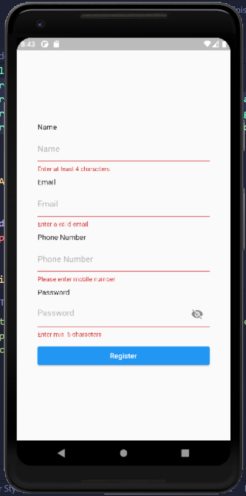
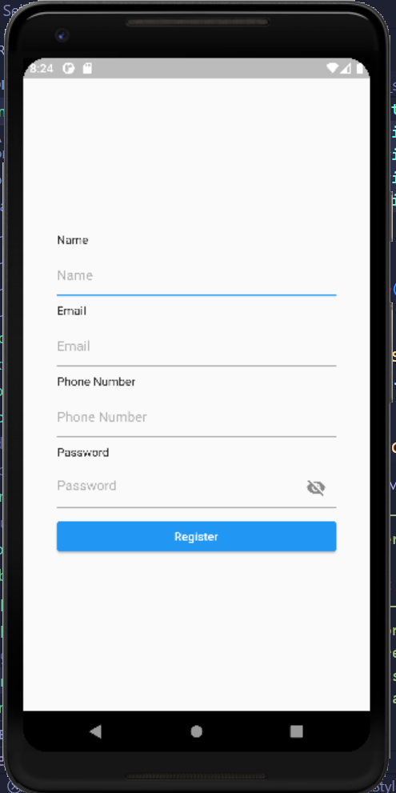
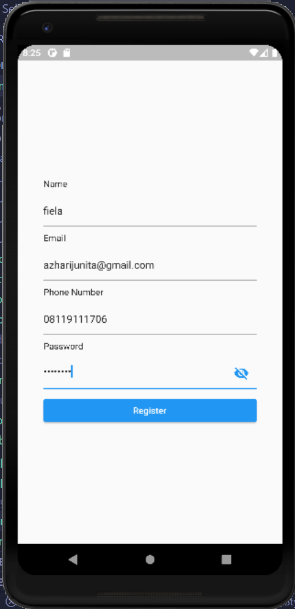
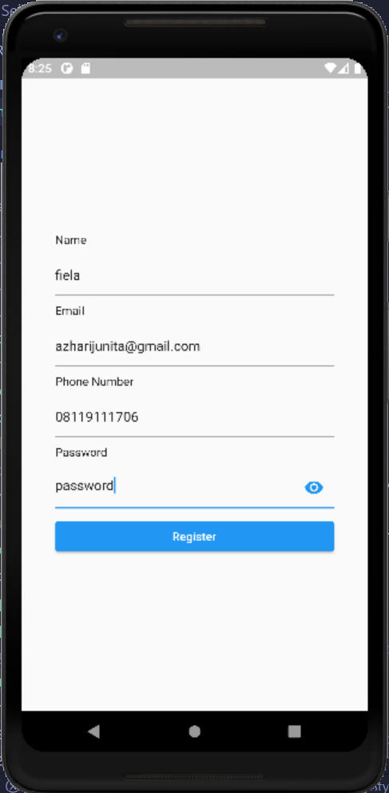
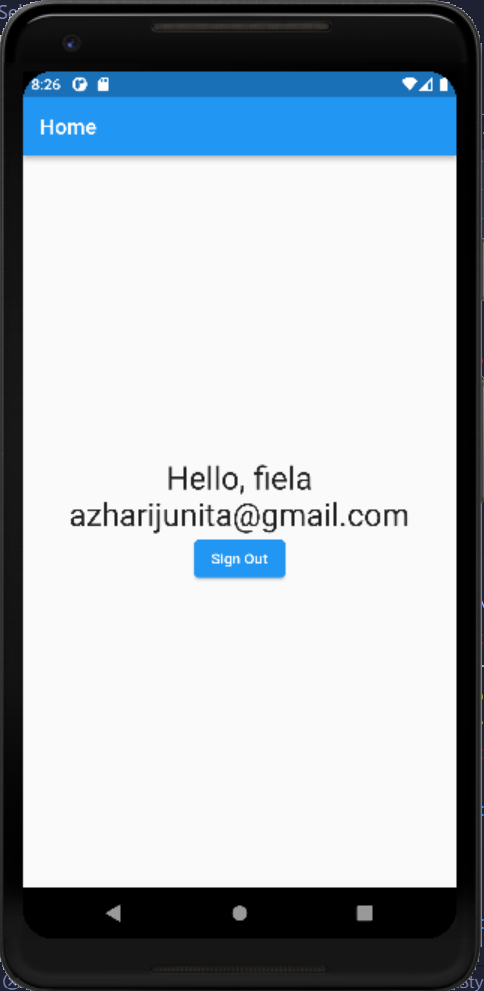
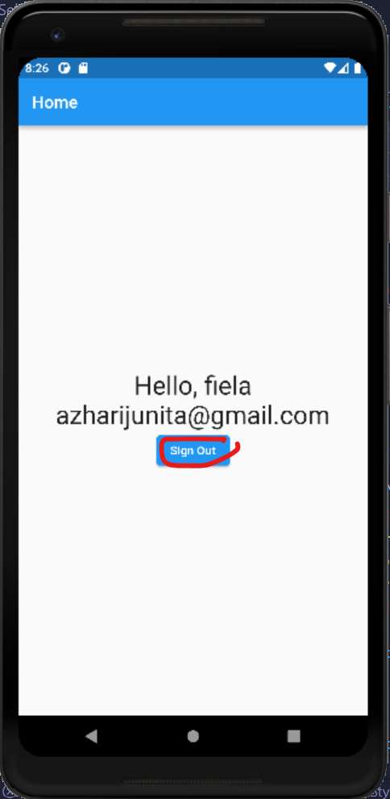
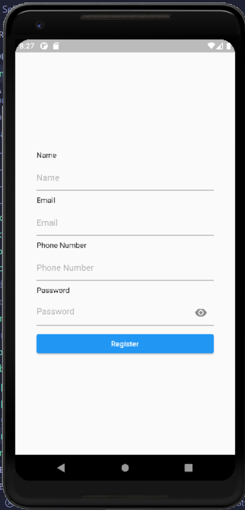
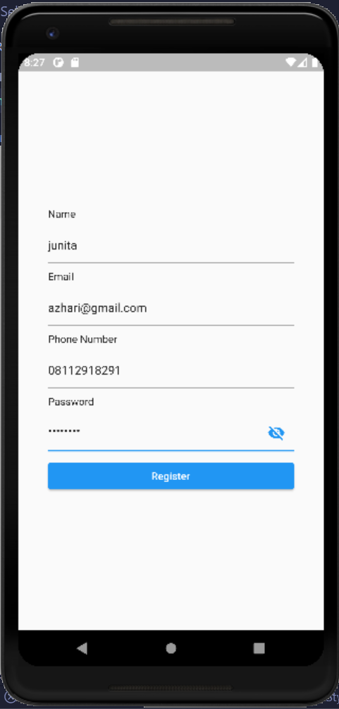
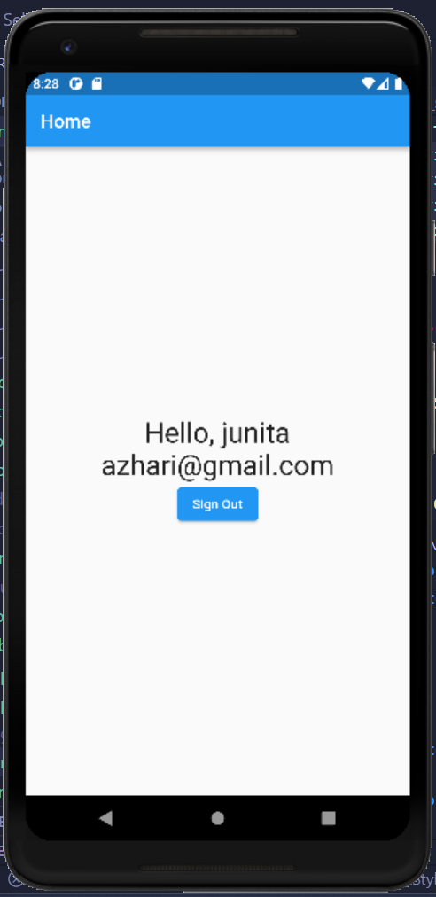

### Output Task2-BLoc
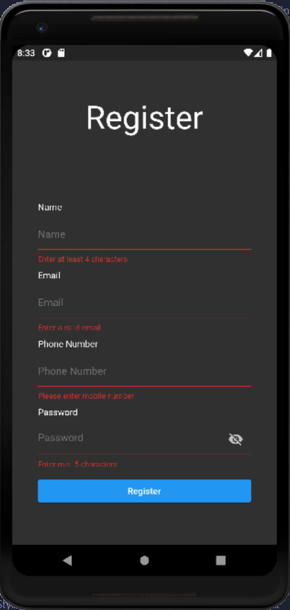
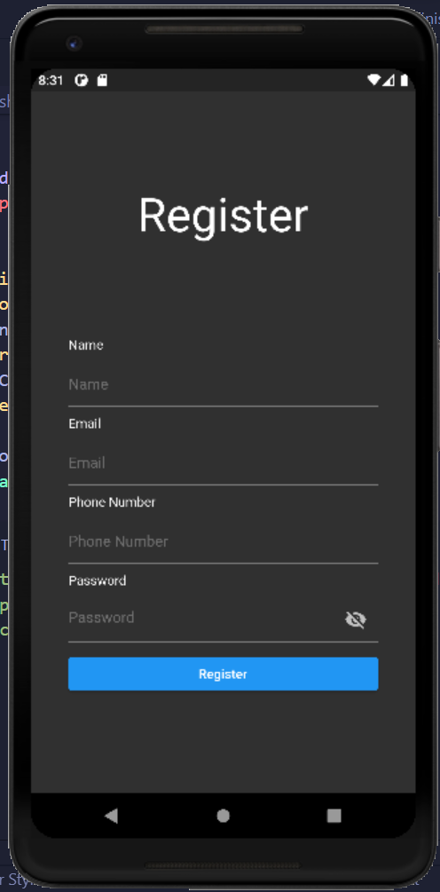
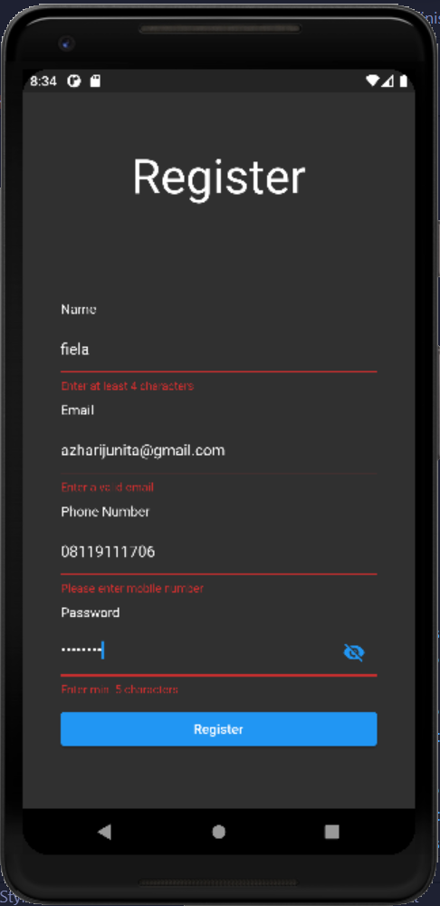
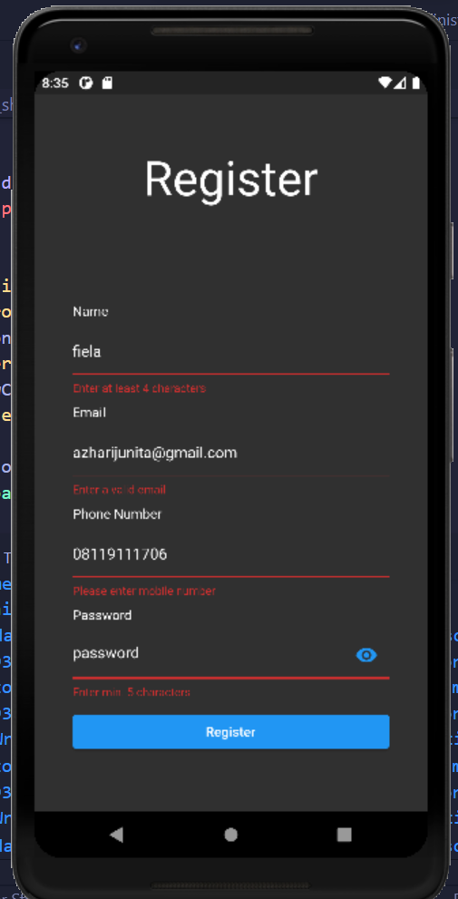
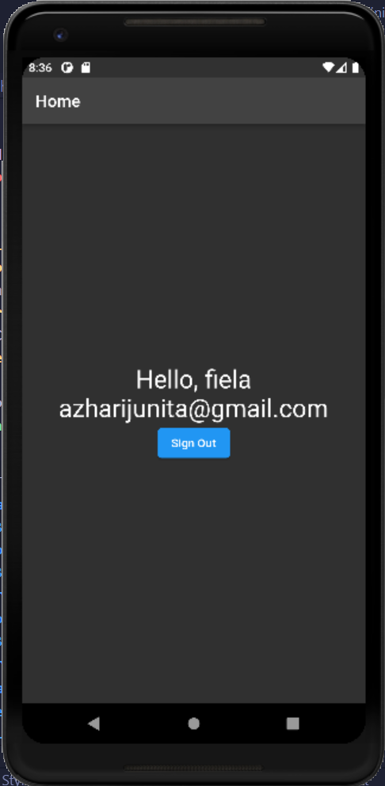
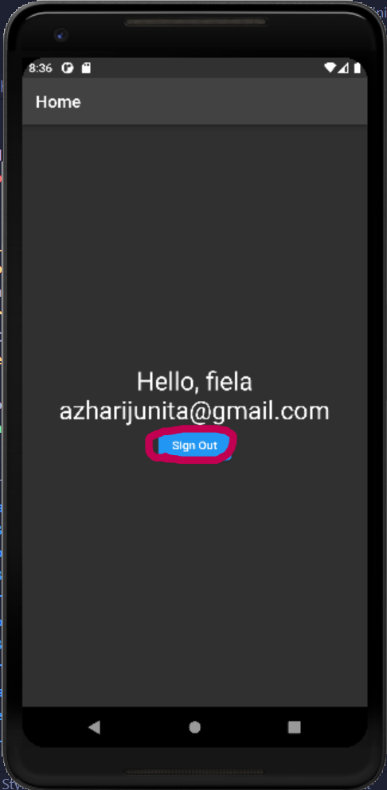
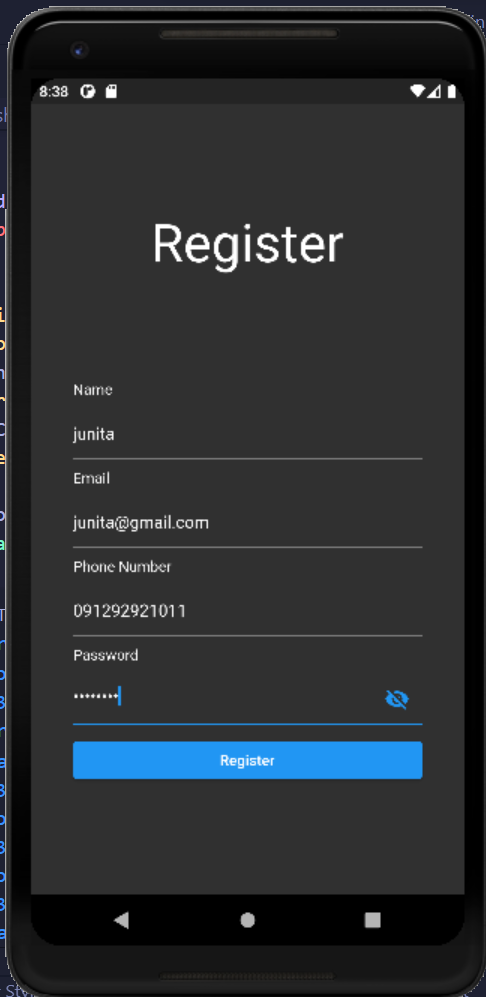
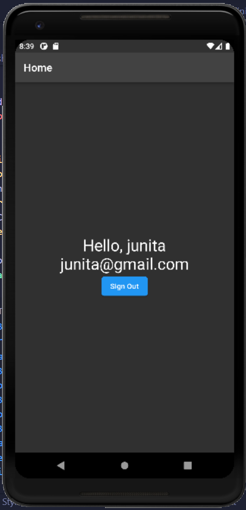