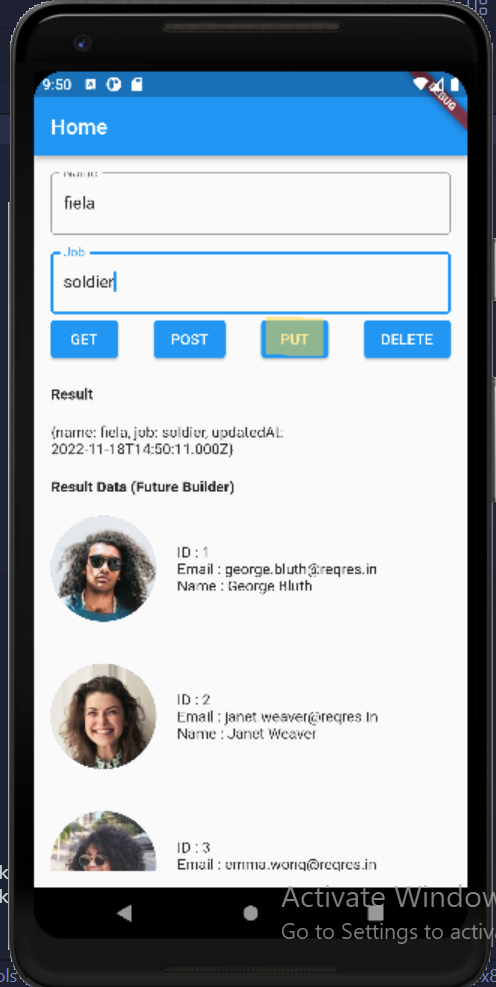

# (25) Introduction REST API – JSON serialization/deserialization
Nomor Urut: 1_011FLB_40

Nama: Fiela Junita Azhari

## Task

### Input Task1
#### pages (home_page.dart)
    import 'package:dio_rest_api/service/services.dart';
    import 'package:flutter/material.dart';

    class HomePage extends StatefulWidget {
    const HomePage({super.key});

    @override
    State<HomePage> createState() => _HomePageState();
    }

    class _HomePageState extends State<HomePage> {
    String resultDio = '';

    final _nameController = TextEditingController();
    final _jobController = TextEditingController();

    @override
    Widget build(BuildContext context) {
        return Scaffold(
        appBar: AppBar(
            title: const Text('Home'),
            centerTitle: false,
        ),
        body: Padding(
            padding: const EdgeInsets.all(16.0),
            child: Column(
            crossAxisAlignment: CrossAxisAlignment.start,
            children: [
                TextFormField(
                controller: _nameController,
                decoration: const InputDecoration(
                    labelText: 'Name',
                    border: OutlineInputBorder(),
                ),
                ),
                const SizedBox(
                height: 16,
                ),
                TextFormField(
                controller: _jobController,
                decoration: const InputDecoration(
                    labelText: 'Job',
                    border: OutlineInputBorder(),
                ),
                ),
                Row(
                mainAxisAlignment: MainAxisAlignment.spaceBetween,
                children: [
                    ElevatedButton(
                    onPressed: () async {
                        final response = await MyService().fetchUser();
                        resultDio = response.toString();
                        setState(() {});
                    },
                    child: const Text('GET'),
                    ),
                    ElevatedButton(
                    onPressed: () async {
                        final response = await MyService().createUser(
                        name: _nameController.text,
                        job: _jobController.text,
                        );
                        resultDio = response.toString();
                        setState(() {});
                    },
                    child: const Text('POST'),
                    ),
                    ElevatedButton(
                    onPressed: () async {
                        final response = await MyService().updateUser(
                        name: _nameController.text,
                        job: _jobController.text,
                        );
                        resultDio = response.toString();
                        setState(() {});
                    },
                    child: const Text('PUT'),
                    ),
                    ElevatedButton(
                    onPressed: () async {
                        final response = await MyService().deleteUser();
                        resultDio = response.toString();
                        setState(() {});
                    },
                    child: const Text('DELETE'),
                    ),
                ],
                ),
                const SizedBox(
                height: 20,
                ),
                const Text(
                'Result',
                style: TextStyle(fontWeight: FontWeight.bold),
                ),
                const SizedBox(
                height: 20,
                ),
                Text(resultDio.toString())
            ],
            ),
        ),
        );
    }
    }

#### service (services.dart)
    import 'package:dio/dio.dart';
    import 'package:flutter/material.dart';

    class MyService {
    final Dio dio = Dio();

    Future fetchUser() async {
        try {
        final Response response = await dio.get('https://reqres.in/api/users');

        debugPrint(response.data.toString());

        return response.data;
        } catch (e) {
        rethrow;
        }
    }

    Future createUser({required String name, required String job}) async {
        try {
        final Response response = await dio.post(
            'https://reqres.in/api/users',
            data: {
            'name': name,
            'job': job,
            },
        );

        debugPrint(response.data.toString());

        return response.data;
        } catch (e) {
        rethrow;
        }
    }

    Future updateUser({required String name, required String job}) async {
        try {
        final Response response = await dio.put(
            'https://reqres.in/api/users/4',
            data: {
            'name': name,
            'job': job,
            },
        );

        debugPrint(response.data.toString());

        return response.data;
        } catch (e) {
        rethrow;
        }
    }

    Future deleteUser() async {
        try {
        final Response response = await dio.delete(
            'https://reqres.in/api/users/4',
        );

        debugPrint(response.data.toString());
        } catch (e) {
        rethrow;
        }
    }
    }

#### main.dart
    import 'package:flutter/material.dart';

    import 'pages/home_page.dart';

    void main() {
    runApp(const MyApp());
    }

    class MyApp extends StatelessWidget {
    const MyApp({super.key});

    // This widget is the root of your application.
    @override
    Widget build(BuildContext context) {
        return MaterialApp(
        title: 'Flutter Demo',
        theme: ThemeData(
            primarySwatch: Colors.blue,
        ),
        home: const HomePage(),
        );
    }
    }

### Input Task2
#### models (user.dart)
    // ignore_for_file: public_member_api_docs, sort_constructors_first
    class UserDio {
    int id;
    String email;
    String first_name;
    String last_name;
    String avatar;
    UserDio({
        required this.id,
        required this.email,
        required this.first_name,
        required this.last_name,
        required this.avatar,
    });

    Map toJson() => {
            id: id,
            email: 'email',
            first_name: 'first_name',
            last_name: 'last_name',
            avatar: 'avatar',
        };

    UserDio.fromJson(Map json)
        : id = json['id'],
            email = json['email'],
            first_name = json['first_name'],
            last_name = json['last_name'],
            avatar = json['avatar'];
    // link = json['avatar'];
    }

#### pages (home_page.dart)
    import 'package:dio_rest_api/models/user.dart';
    import 'package:dio_rest_api/service/services.dart';
    import 'package:flutter/material.dart';

    class HomePage extends StatefulWidget {
    const HomePage({super.key});

    @override
    State<HomePage> createState() => _HomePageState();
    }

    class _HomePageState extends State<HomePage> {
    String resultDio = '';
    List<UserDio> user = [];

    final _nameController = TextEditingController();
    final _jobController = TextEditingController();

    @override
    Widget build(BuildContext context) {
        return Scaffold(
        appBar: AppBar(
            title: const Text('Home'),
            centerTitle: false,
        ),
        body: Padding(
            padding: const EdgeInsets.all(16.0),
            child: ListView(
            // crossAxisAlignment: CrossAxisAlignment.start,
            children: [
                TextFormField(
                controller: _nameController,
                decoration: const InputDecoration(
                    labelText: 'Name',
                    border: OutlineInputBorder(),
                ),
                ),
                const SizedBox(
                height: 16,
                ),
                TextFormField(
                controller: _jobController,
                decoration: const InputDecoration(
                    labelText: 'Job',
                    border: OutlineInputBorder(),
                ),
                ),
                Row(
                mainAxisAlignment: MainAxisAlignment.spaceBetween,
                children: [
                    ElevatedButton(
                    onPressed: () async {
                        final response = await MyService().fetchUser();
                        resultDio = response.toString();

                        List<dynamic> data = response['data'];
                        user = data
                            .map(
                            (e) => UserDio.fromJson(e),
                            )
                            .toList();
                        setState(() {});
                    },
                    child: const Text('GET'),
                    ),
                    ElevatedButton(
                    onPressed: () async {
                        final response = await MyService().createUser(
                        name: _nameController.text,
                        job: _jobController.text,
                        );
                        resultDio = response.toString();
                        setState(() {});
                    },
                    child: const Text('POST'),
                    ),
                    ElevatedButton(
                    onPressed: () async {
                        final response = await MyService().updateUser(
                        name: _nameController.text,
                        job: _jobController.text,
                        );
                        resultDio = response.toString();
                        setState(() {});
                    },
                    child: const Text('PUT'),
                    ),
                    ElevatedButton(
                    onPressed: () async {
                        final response = await MyService().deleteUser();
                        resultDio = response.toString();
                        setState(() {});
                    },
                    child: const Text('DELETE'),
                    ),
                ],
                ),
                const SizedBox(
                height: 20,
                ),
                const Text(
                'Result',
                style: TextStyle(fontWeight: FontWeight.bold),
                ),
                const SizedBox(
                height: 20,
                ),
                Text(
                resultDio.toString(),
                ),
                const SizedBox(
                height: 20,
                ),
                const Text(
                'Result Data (Future Builder)',
                style: TextStyle(fontWeight: FontWeight.bold),
                ),
                FutureBuilder<List<UserDio>>(
                future: MyService().fetchData(),
                builder: (context, snapshot) {
                    if (snapshot.connectionState == ConnectionState.waiting) {
                    return const CircularProgressIndicator();
                    } else {
                    if (snapshot.hasData) {
                        return SizedBox(
                        height: 500,
                        width: 500,
                        child: ListView.builder(
                            itemCount: snapshot.data!.length,
                            itemBuilder: (context, index) {
                            return Column(
                                // mainAxisAlignment: MainAxisAlignment.center,
                                // crossAxisAlignment: CrossAxisAlignment.start,
                                children: [
                                const SizedBox(
                                    height: 20,
                                ),
                                Row(
                                    children: [
                                    CircleAvatar(
                                        radius: 50,
                                        backgroundImage: NetworkImage(
                                            snapshot.data![index].avatar),
                                    ),
                                    const SizedBox(
                                        width: 20,
                                    ),
                                    Expanded(
                                        child: Column(
                                        crossAxisAlignment:
                                            CrossAxisAlignment.start,
                                        children: [
                                            Text(
                                                'ID : ${snapshot.data![index].id}'),
                                            Text(
                                                'Email : ${snapshot.data![index].email}'),
                                            Text(
                                                'Name : ${snapshot.data![index].first_name} ${snapshot.data![index].last_name}'),
                                        ],
                                        ),
                                    )
                                    ],
                                ),
                                const SizedBox(
                                    height: 20,
                                ),
                                ],
                            );
                            },
                        ),
                        );
                    }
                    return const Text('Tidak ada data');
                    }
                },
                ),
            ],
            ),
        ),
        );
    }
    }

#### service (services.dart)
    import 'package:dio/dio.dart';
    import 'package:dio_rest_api/models/user.dart';
    import 'package:flutter/material.dart';

    class MyService {
    final Dio dio = Dio();

    Future fetchUser() async {
        try {
        final Response response = await dio.get('https://reqres.in/api/users');

        debugPrint(response.data.toString());

        List<dynamic> data = response.data['data'];
        data.map((e) => UserDio.fromJson(e)).toList();

        return response.data;
        } catch (e) {
        rethrow;
        }
    }

    Future<List<UserDio>> fetchData() async {
        try {
        final Response response = await dio.get('https://reqres.in/api/users');

        debugPrint(response.data.toString());

        List<dynamic> data = response.data['data'];
        List<UserDio> dataUser = data.map((e) => UserDio.fromJson(e)).toList();

        return dataUser;
        } catch (e) {
        rethrow;
        }
    }

    Future createUser({required String name, required String job}) async {
        try {
        final Response response = await dio.post(
            'https://reqres.in/api/users',
            data: {
            'name': name,
            'job': job,
            },
        );

        debugPrint(response.data.toString());

        return response.data;
        } catch (e) {
        rethrow;
        }
    }

    Future updateUser({required String name, required String job}) async {
        try {
        final Response response = await dio.put(
            'https://reqres.in/api/users/4',
            data: {
            'name': name,
            'job': job,
            },
        );

        debugPrint(response.data.toString());

        return response.data;
        } catch (e) {
        rethrow;
        }
    }

    Future deleteUser() async {
        try {
        final Response response = await dio.delete(
            'https://reqres.in/api/users/4',
        );

        debugPrint(response.data.toString());
        } catch (e) {
        rethrow;
        }
    }
    }

#### main.dart
    import 'package:flutter/material.dart';

    import 'pages/home_page.dart';

    void main() {
    runApp(const MyApp());
    }

    class MyApp extends StatelessWidget {
    const MyApp({super.key});

    // This widget is the root of your application.
    @override
    Widget build(BuildContext context) {
        return MaterialApp(
        title: 'Flutter Demo',
        theme: ThemeData(
            primarySwatch: Colors.blue,
        ),
        home: const HomePage(),
        );
    }
    }

### Output Task1

### Output Task2

