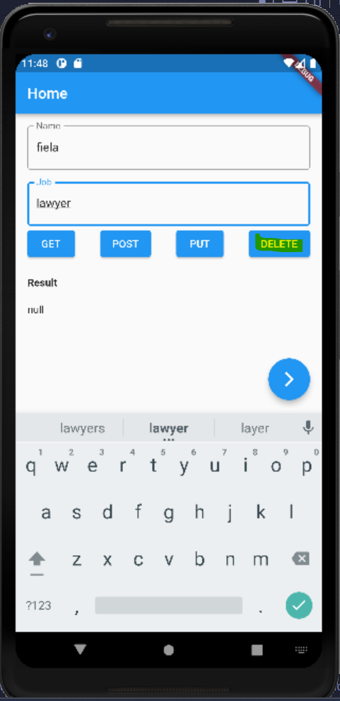

# (26) MVVM Architecture
Nomor Urut: 1_011FLB_40

Nama: Fiela Junita Azhari

## Task

### Input
#### models-api (user_api.dart)
    import 'package:dio/dio.dart';
    import 'package:dio_rest_api/models/user_model.dart';
    import 'package:flutter/material.dart';

    class UserAPI {
    final Dio dio = Dio();

    Future<Map<String, dynamic>> fetchUser() async {
        try {
        final Response response = await dio.get('https://reqres.in/api/users');

        debugPrint(response.data.toString());

        return response.data;
        } catch (e) {
        rethrow;
        }
    }

    Future<List<UserDio>> fetchData() async {
        try {
        final Response response = await dio.get('https://reqres.in/api/users');

        debugPrint(response.data.toString());

        List<UserDio> dataUser = (response.data['data'] as List)
            .map((e) => UserDio.fromJson(e))
            .toList();

        return dataUser;
        } catch (e) {
        rethrow;
        }
    }

    Future createUser({required String name, required String job}) async {
        try {
        final Response response = await dio.post(
            'https://reqres.in/api/users',
            data: {
            'name': name,
            'job': job,
            },
        );

        debugPrint(response.data.toString());

        return response.data;
        } catch (e) {
        rethrow;
        }
    }

    Future updateUser({required String name, required String job}) async {
        try {
        final Response response = await dio.put(
            'https://reqres.in/api/users/4',
            data: {
            'name': name,
            'job': job,
            },
        );

        debugPrint(response.data.toString());

        return response.data;
        } catch (e) {
        rethrow;
        }
    }

    Future deleteUser() async {
        try {
        final Response response = await dio.delete(
            'https://reqres.in/api/users/4',
        );

        debugPrint(response.data.toString());
        } catch (e) {
        rethrow;
        }
    }
    }

#### models (user_model.dart)
        // ignore_for_file: public_member_api_docs, sort_constructors_first
        class UserDio {
        int id;
        String email;
        String first_name;
        String last_name;
        String avatar;
        UserDio({
            required this.id,
            required this.email,
            required this.first_name,
            required this.last_name,
            required this.avatar,
        });

        Map toJson() => {
                id: id,
                email: 'email',
                first_name: 'first_name',
                last_name: 'last_name',
                avatar: 'avatar',
            };

        UserDio.fromJson(Map json)
            : id = json['id'],
                email = json['email'],
                first_name = json['first_name'],
                last_name = json['last_name'],
                avatar = json['avatar'];
        // link = json['avatar'];
        }

    #### pages-home (home_page.dart)
    import 'package:dio_rest_api/models/user_model.dart';
    import 'package:dio_rest_api/pages/home/home_view_model.dart';
    import 'package:dio_rest_api/pages/user/user_page.dart';
    import 'package:flutter/material.dart';
    import 'package:provider/provider.dart';

    class HomePage extends StatefulWidget {
    const HomePage({super.key});

    @override
    State<HomePage> createState() => _HomePageState();
    }

    class _HomePageState extends State<HomePage> {
    String resultDio = '';
    List<UserDio> user = [];

    final _nameController = TextEditingController();
    final _jobController = TextEditingController();

    @override
    Widget build(BuildContext context) {
        final modelView = Provider.of<HomeViewModel>(context);
        return Scaffold(
        floatingActionButton: FloatingActionButton(
            child: const Icon(Icons.arrow_forward_ios),
            onPressed: () {
            Navigator.of(context).push(
                MaterialPageRoute(
                builder: (context) => const UserPage(),
                ),
            );
            },
        ),
        appBar: AppBar(
            title: const Text('Home'),
            centerTitle: false,
        ),
        body: Padding(
            padding: const EdgeInsets.all(16.0),
            child: ListView(
            children: [
                TextFormField(
                controller: _nameController,
                decoration: const InputDecoration(
                    labelText: 'Name',
                    border: OutlineInputBorder(),
                ),
                ),
                const SizedBox(
                height: 16,
                ),
                TextFormField(
                controller: _jobController,
                decoration: const InputDecoration(
                    labelText: 'Job',
                    border: OutlineInputBorder(),
                ),
                ),
                Row(
                mainAxisAlignment: MainAxisAlignment.spaceBetween,
                children: [
                    ElevatedButton(
                    onPressed: () async {
                        Provider.of<HomeViewModel>(context, listen: false)
                            .getAllUsers();
                    },
                    child: const Text('GET'),
                    ),
                    ElevatedButton(
                    onPressed: () async {
                        Provider.of<HomeViewModel>(context, listen: false)
                            .createUser(
                        _nameController.text,
                        _jobController.text,
                        );
                    },
                    child: const Text('POST'),
                    ),
                    ElevatedButton(
                    onPressed: () async {
                        Provider.of<HomeViewModel>(context, listen: false)
                            .updateUser(
                        _nameController.text,
                        _jobController.text,
                        );
                    },
                    child: const Text('PUT'),
                    ),
                    ElevatedButton(
                    onPressed: () async {
                        Provider.of<HomeViewModel>(context, listen: false)
                            .deleteUser();
                    },
                    child: const Text('DELETE'),
                    ),
                ],
                ),
                const SizedBox(
                height: 20,
                ),
                const Text(
                'Result',
                style: TextStyle(fontWeight: FontWeight.bold),
                ),
                const SizedBox(
                height: 20,
                ),
                Text(
                modelView.result.toString(),
                ),
            ],
            ),
        ),
        );
    }
    }

#### pages-home (home_view_model.dart)
    import 'package:dio_rest_api/models/api/user_api.dart';
    import 'package:dio_rest_api/models/user_model.dart';
    import 'package:flutter/material.dart';

    class HomeViewModel with ChangeNotifier {
    List<UserDio> _user = [];
    String _result = '';

    List<UserDio> get user => _user;
    String get result => _result;

    getAllUsers() async {
        final response = await UserAPI().fetchUser();
        _result = response.toString();
        notifyListeners();
    }

    createUser(String name, String job) async {
        final response = await UserAPI().createUser(name: name, job: job);
        _result = response.toString();
        notifyListeners();
    }

    updateUser(String name, String job) async {
        final response = await UserAPI().createUser(name: name, job: job);
        _result = response.toString();
        notifyListeners();
    }

    deleteUser() async {
        final response = await UserAPI().deleteUser();
        _result = response.toString();
        notifyListeners();
    }

    getUsers() async {
        final response = await UserAPI().fetchData();
        _user = response;
        notifyListeners();
    }
    }

#### pages-user(user_page.dart)
    import 'package:dio_rest_api/pages/home/home_view_model.dart';
    import 'package:flutter/material.dart';
    import 'package:provider/provider.dart';

    class UserPage extends StatefulWidget {
    const UserPage({super.key});

    @override
    State<UserPage> createState() => _UserPageState();
    }

    class _UserPageState extends State<UserPage> {
    @override
    void initState() {
        super.initState();
        Provider.of<HomeViewModel>(context, listen: false).getUsers();
    }

    // @override
    // void didChangeDependencies() {
    //   SchedulerBinding.instance.addPostFrameCallback((timeStamp) {
    //     Provider.of<HomeViewModel>(context, listen: false).getUsers();
    //   });
    //   super.didChangeDependencies();
    // }

    @override
    Widget build(BuildContext context) {
        final modelView = Provider.of<HomeViewModel>(context);
        return Scaffold(
        appBar: AppBar(
            title: const Text('User Page'),
        ),
        body: ListView.builder(
            itemCount: modelView.user.length,
            itemBuilder: (context, index) {
            final user = modelView.user[index];
            return Padding(
                padding: const EdgeInsets.all(16.0),
                child: Column(
                children: [
                    Row(
                    children: [
                        CircleAvatar(
                        radius: 50,
                        backgroundImage: NetworkImage(user.avatar),
                        ),
                        const SizedBox(
                        width: 20,
                        ),
                        Expanded(
                        child: Column(
                            crossAxisAlignment: CrossAxisAlignment.start,
                            children: [
                            Text('ID : ${user.id}'),
                            Text('Email : ${user.email}'),
                            Text('Name : ${user.first_name} ${user.last_name}'),
                            ],
                        ),
                        )
                    ],
                    ),
                ],
                ),
            );
            },
        ),
        );
    }
    }

#### main.dart
    import 'package:dio_rest_api/pages/home/home_view_model.dart';
    import 'package:flutter/material.dart';
    import 'package:provider/provider.dart';

    import 'pages/home/home_page.dart';

    void main() {
    runApp(const MyApp());
    }

    class MyApp extends StatelessWidget {
    const MyApp({super.key});

    // This widget is the root of your application.
    @override
    Widget build(BuildContext context) {
        return MultiProvider(
        providers: [
            ChangeNotifierProvider(
            create: (context) => HomeViewModel(),
            ),
        ],
        child: MaterialApp(
            title: 'Flutter Demo',
            theme: ThemeData(
            primarySwatch: Colors.blue,
            ),
            home: const HomePage(),
        ),
        );
    }
    }

### Output

