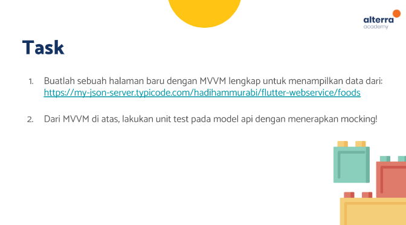
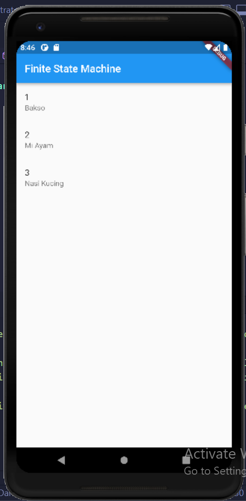

# (27) Finite State Machine
Nomor Urut: 1_011FLB_40

Nama: Fiela Junita Azhari

## Task

#### models (foods.dart)
    class Foods {
    int? id;
    String? name;

    Foods({this.id, this.name});

    Foods.fromJson(Map<String, dynamic> json) {
        id = json['id'];
        name = json['name'];
    }

    Map<String, dynamic> toJson() {
        final Map<String, dynamic> data = <String, dynamic>{};
        data['id'] = id;
        data['name'] = name;
        return data;
    }
    }

#### pages (home_page.dart)
    import 'package:flutter/material.dart';
    import 'package:flutter_testing/pages/home/home_view_model.dart';
    import 'package:provider/provider.dart';

    class HomePage extends StatefulWidget {
    const HomePage({super.key});

    @override
    State<HomePage> createState() => _HomePageState();
    }

    class _HomePageState extends State<HomePage> {
    @override
    void initState() {
        super.initState();
        WidgetsBinding.instance.addPostFrameCallback(
        (timeStamp) {
            Provider.of<HomeViewModel>(context, listen: false).getFoods();
        },
        );
    }

    // @override
    // void didChangeDependencies() {
    //   super.didChangeDependencies();
    //   WidgetsBinding.instance.addPostFrameCallback((timeStamp) {
    //     Provider.of<HomeViewModel>(context, listen: false).getFoods();
    //   });
    // }

    @override
    Widget build(BuildContext context) {
        final modelView = Provider.of<HomeViewModel>(context);
        return Scaffold(
        appBar: AppBar(
            title: const Text('Finite State Machine'),
        ),
        body: body(modelView),
        );
    }

    Widget body(HomeViewModel modelView) {
        final isLoading = modelView.state == HomeViewState.loading;
        final isError = modelView.state == HomeViewState.error;

        if (isLoading) {
        return const Center(
            child: CircularProgressIndicator(),
        );
        }

        if (isError) {
        return const Center(
            child: Text('Gagal menambil data'),
        );
        }

        return listView(modelView);
    }

    Widget listView(HomeViewModel modelView) {
        return ListView.builder(
        itemCount: modelView.foods.length,
        itemBuilder: (context, index) {
            final foods = modelView.foods[index];
            return ListTile(
            title: Text(foods.id!.toString()),
            subtitle: Text(foods.name!),
            );
        },
        );
    }
    }

#### pages (home_view_model.dart)
    import 'package:flutter/material.dart';
    import 'package:flutter_testing/models/foods.dart';
    import 'package:flutter_testing/service/services.dart';

    enum HomeViewState {
    none,
    loading,
    error,
    }

    class HomeViewModel extends ChangeNotifier {
    HomeViewState _state = HomeViewState.none;
    HomeViewState get state => _state;

    List<Foods> _foods = [];
    List<Foods> get foods => _foods;

    changeState(HomeViewState s) {
        _state = s;
        notifyListeners();
    }

    getFoods() async {
        changeState(HomeViewState.loading);

        try {
        FoodService services = FoodService();
        final response = await services.fetchFood();
        _foods = response!;
        notifyListeners();
        changeState(HomeViewState.none);
        } catch (e) {
        changeState(HomeViewState.error);
        }
    }
    }

#### service (services.dart)
    import 'package:dio/dio.dart';
    import 'package:flutter/material.dart';
    import 'package:flutter_testing/models/foods.dart';

    class FoodService {
    final Dio dio = Dio();

    Future<List<Foods>?> fetchFood() async {
        try {
        final Response response = await dio.get(
            'https://my-json-server.typicode.com/hadihammurabi/flutter-webservice/foods');

        debugPrint(response.data.toString());

        List<Foods> foods =
            (response.data as List).map((e) => Foods.fromJson(e)).toList();

        return foods;
        } catch (e) {
        rethrow;
        }
    }
    }

#### main.dart
    import 'package:flutter/material.dart';
    import 'package:flutter_testing/pages/home/home_view_model.dart';
    import 'package:provider/provider.dart';

    import 'pages/home/home_page.dart';

    void main() {
    runApp(const MyApp());
    }

    class MyApp extends StatelessWidget {
    const MyApp({super.key});

    // This widget is the root of your application.
    @override
    Widget build(BuildContext context) {
        return MultiProvider(
        providers: [
            ChangeNotifierProvider(
            create: (context) => HomeViewModel(),
            ),
        ],
        child: MaterialApp(
            title: 'Flutter Demo',
            theme: ThemeData(
            primarySwatch: Colors.blue,
            ),
            home: const HomePage(),
        ),
        );
    }
    }

### Output

