# (28) UI Testings
Nomor Urut: 1_011FLB_40

Nama: Fiela Junita Azhari

## Task
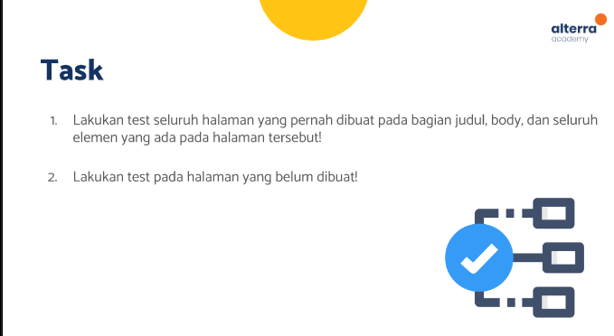
### Input
#### bloc-contact (contact_bloc.dart)
    import 'package:bloc/bloc.dart';
    import 'package:equatable/equatable.dart';
    import 'package:state_management/models/m_contacts.dart';

    part 'contact_event.dart';
    part 'contact_state.dart';

    class ContactBloc extends Bloc<ContactEvent, ContactState> {
    ContactBloc() : super(ContactLoading()) {
        on<LoadContact>((event, emit) async {
        await Future<void>.delayed(const Duration(seconds: 2));
        emit(
            ContactLoaded(
            items: const [ContactModel(name: 'Fiela', phone: '08119111706')],
            ),
        );
        });
        on<AddContact>(
        (event, emit) {
            final state = this.state;
            if (state is ContactLoaded) {
            emit(
                ContactLoaded(items: List.from(state.items)..add(event.contact)));
            }
        },
        );
        on<RemoveContact>(
        (event, emit) {
            if (state is ContactLoaded) {
            final state = this.state as ContactLoaded;
            emit(ContactLoaded(
                items: List.from(state.items)..remove(event.contact)));
            }
        },
        );
        on<CheckContact>(
        (event, emit) {
            if (state is ContactLoaded) {
            final state = this.state as ContactLoaded;

            if (state.items.isEmpty) {
                emit(
                ContactLoaded(isEmpty: true, items: List.from(state.items)),
                );
            } else {
                emit(
                ContactLoaded(isEmpty: false, items: List.from(state.items)),
                );
            }
            }
        },
        );
    }
    }

#### bloc-contact (contact_event.dart)
    // ignore_for_file: public_member_api_docs, sort_constructors_first
    part of 'contact_bloc.dart';

    abstract class ContactEvent extends Equatable {
    const ContactEvent();

    @override
    List<Object> get props => [];
    }

    class LoadContact extends ContactEvent {
    List<ContactModel> items;
    LoadContact({this.items = const <ContactModel>[]});
    @override
    List<Object> get props => [items];
    }

    class AddContact extends ContactEvent {
    ContactModel contact;
    AddContact({
        required this.contact,
    });

    @override
    List<Object> get props => [contact];
    }

    class RemoveContact extends ContactEvent {
    final ContactModel contact;
    const RemoveContact({
        required this.contact,
    });
    }

    class CheckContact extends ContactEvent {
    List<ContactModel> items;
    CheckContact({this.items = const <ContactModel>[]});
    @override
    List<Object> get props => [items];
    }

#### bloc-contact (contact_state.dart)
    // ignore_for_file: public_member_api_docs, sort_constructors_first
    part of 'contact_bloc.dart';

    abstract class ContactState extends Equatable {
    const ContactState();

    @override
    List<Object> get props => [];
    }

    class ContactLoading extends ContactState {}

    class ContactLoaded extends ContactState {
    List<ContactModel> items;
    bool isEmpty;

    ContactLoaded({
        required this.items,
        this.isEmpty = true,
    });
    @override
    List<Object> get props => [items, isEmpty];
    }

#### bloc-theme (theme_bloc.dart)
    import 'package:bloc/bloc.dart';
    import 'package:equatable/equatable.dart';
    import 'package:flutter/material.dart';
    import 'package:state_management/models/m_theme.dart';

    part 'theme_event.dart';
    part 'theme_state.dart';

    class ThemeBloc extends Bloc<ThemeEvent, ThemeState> {
    ThemeBloc() : super(ThemeState(themeData: AppTheme.lightTheme)) {
        // Dijalankan setelah ThemeState
        on<ThemeEvent>((event, emit) {
        if (event is ChangeTheme) {
            emit.call(ThemeState(themeData: event.theme));
        }
        });
    }
    }

#### bloc-theme (theme_event.dart)
    // ignore_for_file: public_member_api_docs, sort_constructors_first
    part of 'theme_bloc.dart';

    abstract class ThemeEvent extends Equatable {
    const ThemeEvent();

    @override
    List<Object> get props => [];
    }

    class ChangeTheme extends ThemeEvent {
    final ThemeData theme;
    const ChangeTheme({
        required this.theme,
    });

    @override
    List<Object> get props => [theme];
    }

#### bloc-theme (theme_state.dart)
    part of 'theme_bloc.dart';

    class ThemeState extends Equatable {
    final ThemeData themeData;
    const ThemeState({required this.themeData});

    @override
    List<Object> get props => [themeData];
    }

#### components (task_item.dart)
    // ignore_for_file: public_member_api_docs, sort_constructors_first
    import 'package:flutter/material.dart';
    import 'package:flutter_bloc/flutter_bloc.dart';
    import 'package:state_management/bloc/contact/contact_bloc.dart';

    class TaskItem extends StatelessWidget {
    const TaskItem({
        Key? key,
        required this.states,
    }) : super(key: key);
    final states;

    @override
    Widget build(BuildContext context) {
        return Container(
        height: 70,
        decoration: BoxDecoration(
            color: Colors.green[100],
            borderRadius: BorderRadius.circular(10),
        ),
        child: Row(
            children: [
            Container(
                margin: const EdgeInsets.only(left: 16, right: 16),
                decoration: const BoxDecoration(
                shape: BoxShape.circle,
                ),
                child: Icon(
                Icons.person_pin,
                size: 40,
                color: Colors.grey[600],
                ),
            ),
            Expanded(
                child: Column(
                mainAxisAlignment: MainAxisAlignment.center,
                crossAxisAlignment: CrossAxisAlignment.start,
                children: [
                    Text(
                    states.name,
                    style: const TextStyle(
                        color: Colors.black87,
                        fontSize: 14,
                        fontWeight: FontWeight.w600),
                    ),
                    Text(
                    states.phone,
                    style: TextStyle(
                        fontSize: 14, color: Colors.black.withOpacity(0.6)),
                    ),
                ],
                ),
            ),
            IconButton(
                onPressed: () {
                    context.read<ContactBloc>().add(RemoveContact(contact: states));
                },
                icon: Icon(
                    Icons.delete,
                    color: Colors.grey[600],
                ))
            ],
        ),
        );
    }
    }

#### models (m_contacts.dart)
    import 'package:equatable/equatable.dart';

    class ContactModel extends Equatable {
    // final String id;
    final String name;
    final String phone;
    const ContactModel({
        // required this.id,
        required this.name,
        required this.phone,
    });

    @override
    // TODO: implement props
    List<Object?> get props => [name, phone];
    }

#### models (m_theme.dart)
    import 'package:flutter/material.dart';

    class AppTheme {
    static final ThemeData lightTheme = ThemeData.light();
    static final ThemeData darkTheme = ThemeData.dark();

    // static final ThemeData lightTheme = ThemeData(
    //     scaffoldBackgroundColor: Colors.white,
    //     primaryColor: Colors.blue[500],
    //     canvasColor: Colors.white,
    //     appBarTheme: AppBarTheme(
    //         color: Colors.blue[500],
    //         iconTheme: const IconThemeData(color: Colors.white)),
    //     iconTheme: IconThemeData(color: Colors.blue[400]),
    //     textTheme: TextTheme(
    //         bodyText1: TextStyle(
    //           color: Colors.grey[800],
    //         ),
    //         bodyText2: TextStyle(color: Colors.grey[800]),
    //         headline4: TextStyle(color: Colors.grey[900])),
    //     unselectedWidgetColor: Colors.blue[400],
    //     buttonTheme: const ButtonThemeData(
    //         buttonColor: Colors.blueAccent, textTheme: ButtonTextTheme.primary));

    // static final ThemeData darkTheme = ThemeData(
    //   scaffoldBackgroundColor: Colors.grey[700],
    //   canvasColor: Colors.grey[800],
    //   toggleableActiveColor: Colors.grey[300],
    //   appBarTheme: AppBarTheme(
    //       color: Colors.grey[900],
    //       iconTheme: IconThemeData(color: Colors.grey[100])),
    //   iconTheme: IconThemeData(color: Colors.grey[300]),
    //   textTheme: TextTheme(
    //       subtitle1: const TextStyle(color: Colors.white),
    //       bodyText1: TextStyle(
    //         color: Colors.grey[100],
    //       ),
    //       bodyText2: const TextStyle(color: Colors.black),
    //       headline4: TextStyle(color: Colors.grey[50])),
    //   unselectedWidgetColor: Colors.grey[300],
    //   dividerColor: Colors.grey[500],
    //   buttonTheme: ButtonThemeData(
    //     buttonColor: Colors.grey[900],
    //     textTheme: ButtonTextTheme.primary,
    //   ),
    //   floatingActionButtonTheme: FloatingActionButtonThemeData(
    //     backgroundColor: Colors.green[100],
    //     foregroundColor: Colors.black,
    //   ),
    //   inputDecorationTheme: const InputDecorationTheme(
    //       labelStyle: TextStyle(color: Colors.white),
    //       focusedBorder: UnderlineInputBorder(
    //         borderSide: BorderSide(style: BorderStyle.solid, color: Colors.white),
    //       )),
    // );
    }

#### pages (add_contact_page.dart)
    // import 'package:contacts/models/m_contacts.dart';
    import 'package:flutter/material.dart';
    import 'package:flutter_bloc/flutter_bloc.dart';
    import 'package:state_management/bloc/contact/contact_bloc.dart';
    import 'package:state_management/models/m_contacts.dart';

    // import 'package:provider/provider.dart';
    // import 'package:uuid/uuid.dart';

    class AddContactPage extends StatefulWidget {
    const AddContactPage({
        Key? key,
        // required this.onCreate,
    }) : super(key: key);

    @override
    State<AddContactPage> createState() => _AddContactPageState();
    }

    class _AddContactPageState extends State<AddContactPage> {
    // final Function(ContactModel) onCreate;
    final formKey = GlobalKey<FormState>();
    final nameController = TextEditingController();
    final phoneController = TextEditingController();

    @override
    Widget build(BuildContext context) {
        // final contactProvider = Provider.of<Contact>(context);

        return Scaffold(
        appBar: AppBar(
            title: const Text('Create Contact'),
        ),
        body: Form(
            key: formKey,
            child: Padding(
                padding: const EdgeInsets.all(16.0),
                child: Column(
                mainAxisAlignment: MainAxisAlignment.center,
                children: [
                    TextFormField(
                    controller: nameController,
                    decoration: InputDecoration(
                        fillColor: Colors.grey.withOpacity(0.2),
                        labelText: 'Name',
                        border: const UnderlineInputBorder(),
                        filled: true,
                    ),
                    validator: (value) {
                        if (value!.isEmpty) {
                        return 'Add Name Properly';
                        }
                        return null;
                    },
                    ),
                    const SizedBox(
                    height: 16,
                    ),
                    TextFormField(
                    controller: phoneController,
                    decoration: InputDecoration(
                        fillColor: Colors.grey.withOpacity(0.2),
                        labelText: 'Phone Number',
                        border: const UnderlineInputBorder(),
                        filled: true,
                    ),
                    validator: (value) {
                        if (value!.isEmpty) {
                        return 'Add Phone Number Properly';
                        }
                        return null;
                    },
                    ),
                    const SizedBox(
                    height: 16,
                    ),
                    ElevatedButton(
                        style: ElevatedButton.styleFrom(
                            minimumSize: const Size.fromHeight(40)),
                        onPressed: () {
                        setState(() {
                            formKey.currentState!.validate();
                        });
                        if (nameController.text.isEmpty ||
                            phoneController.text.isEmpty) {
                            return;
                        }
                        final contactItem = ContactModel(
                            name: nameController.text,
                            phone: phoneController.text,
                        );
                        context
                            .read<ContactBloc>()
                            .add(AddContact(contact: contactItem));

                        Navigator.pop(context);
                        },
                        child: const Text('CREATE CONTACT'))
                ],
                ),
            )),
        );
    }
    }

#### pages (contact_page.dart)
    import 'package:flutter/material.dart';
    import 'package:flutter_bloc/flutter_bloc.dart';
    import 'package:state_management/bloc/contact/contact_bloc.dart';
    import 'package:state_management/components/task_item.dart';

    class ContactPage extends StatelessWidget {
    const ContactPage({
        Key? key,
    }) : super(key: key);

    @override
    Widget build(BuildContext context) {
        // context.read<ContactBloc>().add(LoadContact());

        return Padding(
        padding: const EdgeInsets.all(16.0),
        child: BlocBuilder<ContactBloc, ContactState>(
            builder: (context, state) {
            if (state is ContactLoading) {
                return const CircularProgressIndicator();
            } else if (state is ContactLoaded) {
                return ListView.separated(
                itemCount: state.items.length,
                itemBuilder: (context, index) {
                    return Column(
                    children: [
                        TaskItem(states: state.items[index]),
                    ],
                    );
                },
                separatorBuilder: (context, index) {
                    return const SizedBox(
                    height: 16,
                    );
                },
                );
            }
            return const Text('Something went wrong');
            },
        ),
        );
    }
    }

#### pages (empty_page.dart)
    import 'package:flutter/material.dart';

    class EmptyPage extends StatelessWidget {
    const EmptyPage({super.key});

    @override
    Widget build(BuildContext context) {
        return Center(
        child: Column(
            mainAxisAlignment: MainAxisAlignment.center,
            children: const [Icon(Icons.people), Text('Your contact is empty')],
        ),
        );
    }
    }

#### pages (home_page.dart)
    import 'package:flutter/material.dart';
    import 'package:flutter_bloc/flutter_bloc.dart';
    import 'package:flutter_speed_dial/flutter_speed_dial.dart';
    import 'package:state_management/bloc/contact/contact_bloc.dart';
    import 'package:state_management/bloc/theme/theme_bloc.dart';
    import 'package:state_management/models/m_theme.dart';
    import 'package:state_management/pages/add_contact_page.dart';
    import 'package:state_management/pages/contact_page.dart';
    import 'package:state_management/pages/empty_page.dart';

    class HomePage extends StatelessWidget {
    const HomePage({super.key});

    @override
    Widget build(BuildContext context) {
        ThemeBloc tbloc = BlocProvider.of<ThemeBloc>(context);
        return Scaffold(
        appBar: AppBar(
            centerTitle: false,
            title: const Text('Home'),
        ),
        body: buildHomePage(),
        floatingActionButton: Row(
            mainAxisAlignment: MainAxisAlignment.end,
            children: [
            SpeedDial(
                icon: Icons.add,
                children: [
                SpeedDialChild(
                    child: const Icon(Icons.add),
                    label: 'Add Contacts',
                    onTap: () {
                    Navigator.of(context).push(PageRouteBuilder(
                        pageBuilder: (context, animation, secondaryAnimation) {
                        return const AddContactPage();
                        },
                        transitionsBuilder:
                            (context, animation, secondaryAnimation, child) {
                        final tween = Tween(begin: 0.0, end: 1.0);
                        return FadeTransition(
                            opacity: animation.drive(tween),
                            child: child,
                        );

                        // // Slide Transition
                        // final tween =
                        //     Tween(begin: const Offset(0, .5), end: Offset.zero);
                        // return SlideTransition(
                        //   position: animation.drive(tween),
                        //   child: child,
                        // );

                        // // Fade Transition
                        // final tween = Tween(begin: 0.0, end: 1.0);
                        // return FadeTransition(
                        //   opacity: animation.drive(tween),
                        //   child: child,
                        // );

                        // // Scale Transition
                        // final tween = Tween(begin: 0.0, end: 1.0);
                        // return ScaleTransition(
                        //   scale: animation.drive(tween),
                        //   child: child,
                        // );
                        },
                    ));
                    },
                ),
                SpeedDialChild(
                    child: const Icon(Icons.palette),
                    label: 'Switch Theme Dark',
                    onTap: () {
                    tbloc.add(ChangeTheme(theme: AppTheme.darkTheme));
                    },
                ),
                SpeedDialChild(
                    child: const Icon(Icons.palette),
                    label: 'Switch Theme Light',
                    onTap: () {
                    tbloc.add(ChangeTheme(theme: AppTheme.lightTheme));
                    },
                ),
                ],
            )
            ],
        ),
        );
    }

    Widget buildHomePage() {
        return BlocBuilder<ContactBloc, ContactState>(
        builder: (context, state) {
            BlocProvider.of<ContactBloc>(context).add(CheckContact());
            if (state is ContactLoading) {
            return const CircularProgressIndicator();
            } else if (state is ContactLoaded) {
            return state.isEmpty ? const EmptyPage() : const ContactPage();
            }
            return const Text('Something went wrong');
        },
        );
    }
    }

#### main.dart
    import 'package:flutter/material.dart';
    import 'package:flutter_bloc/flutter_bloc.dart';
    import 'package:state_management/bloc/contact/contact_bloc.dart';
    import 'package:state_management/bloc/theme/theme_bloc.dart';
    import 'package:state_management/pages/home_page.dart';

    void main() {
    runApp(
        MultiBlocProvider(
        providers: [
            BlocProvider(
            create: (context) => ContactBloc()..add(LoadContact()),
            ),
            BlocProvider(
            create: (context) => ThemeBloc(),
            )
        ],
        child: MyApp(),
        ),
    );
    }

    class MyApp extends StatelessWidget {
    MyApp({super.key});

    final ThemeData dark = ThemeData.dark();
    final ThemeData light = ThemeData.light();

    @override
    Widget build(BuildContext context) {
        return BlocBuilder<ThemeBloc, ThemeState>(
        builder: (context, state) => MaterialApp(
            theme: state.themeData,
            debugShowCheckedModeBanner: false,
            home: HomePage(),
        ),
        );
    }
    }

### Output
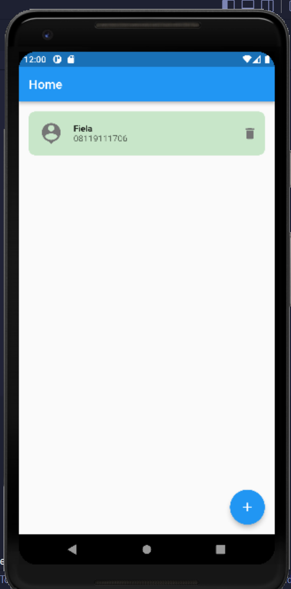
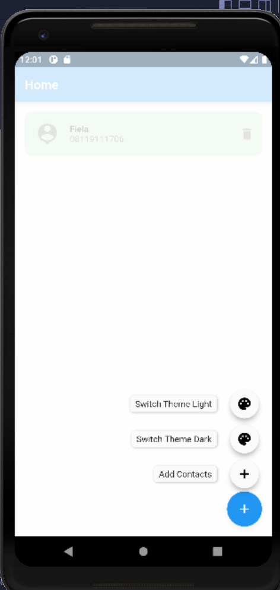
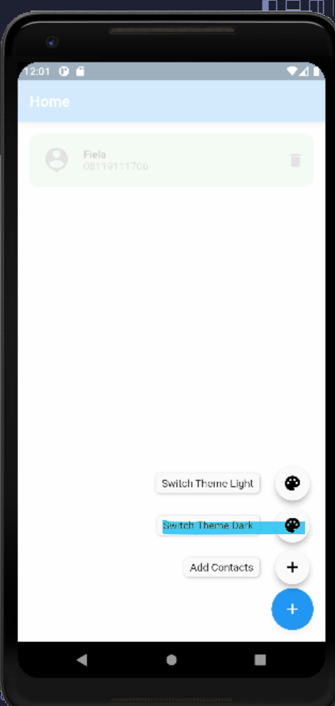
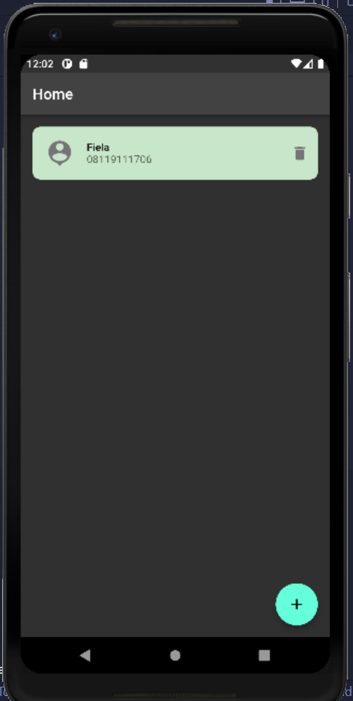
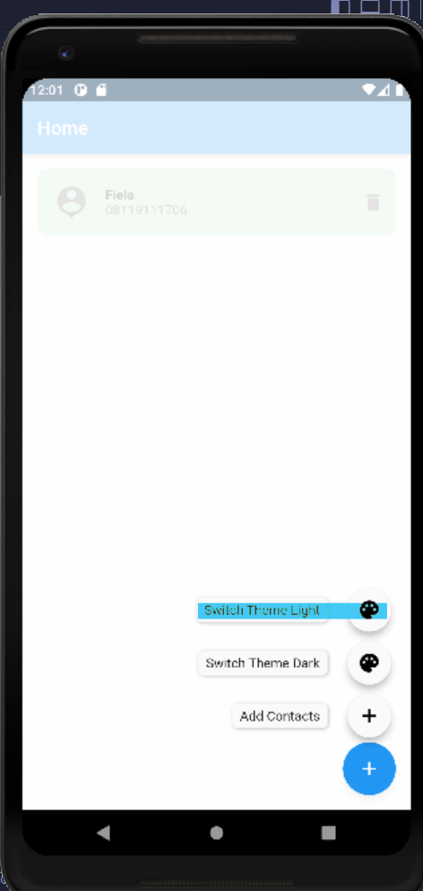
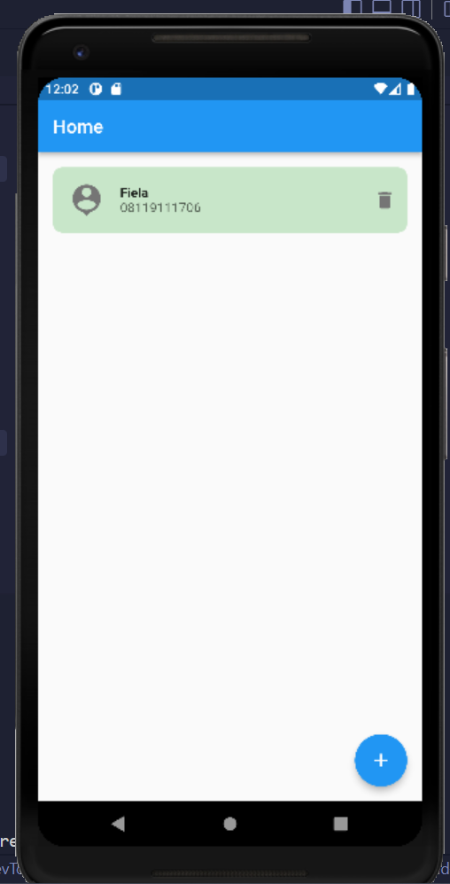
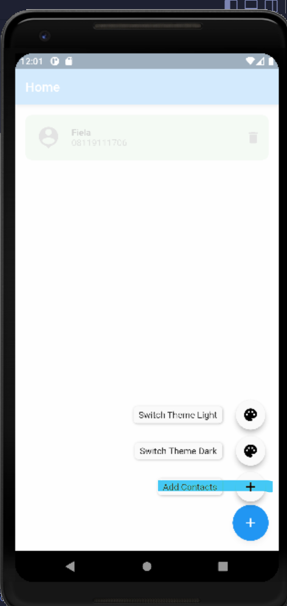
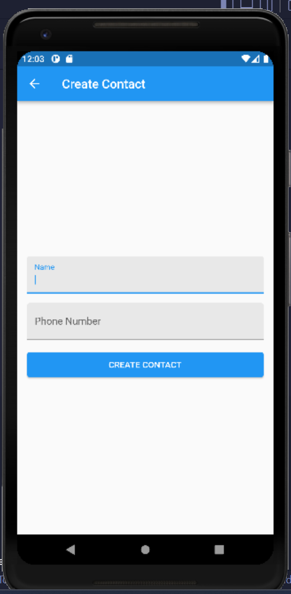
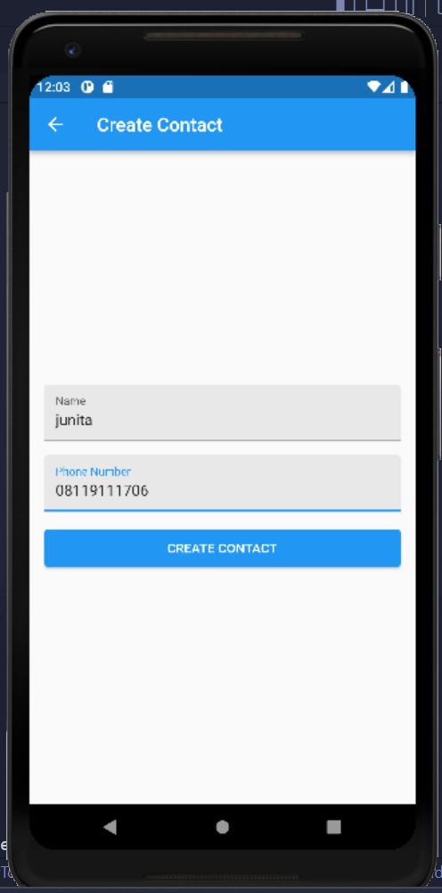
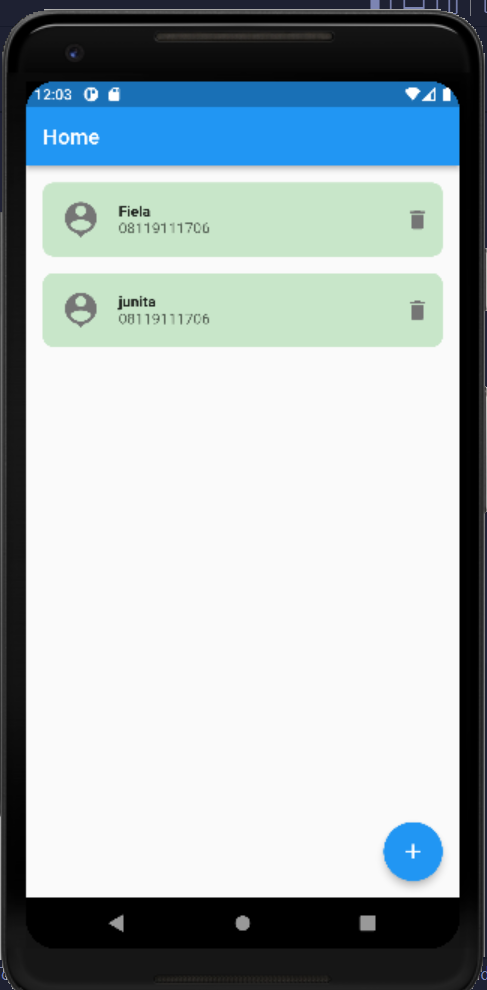
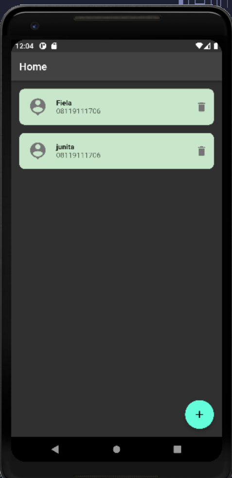
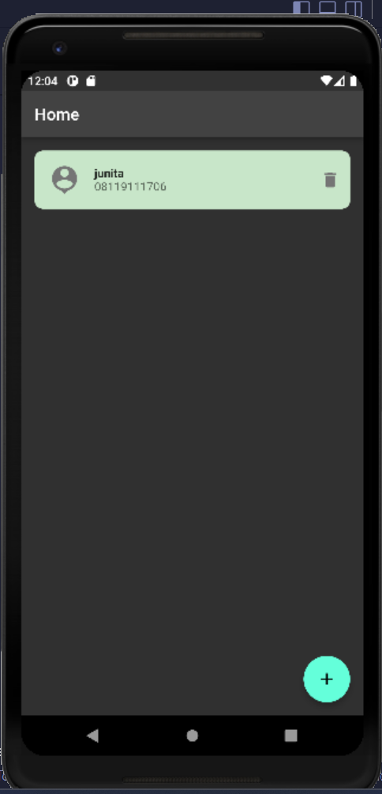