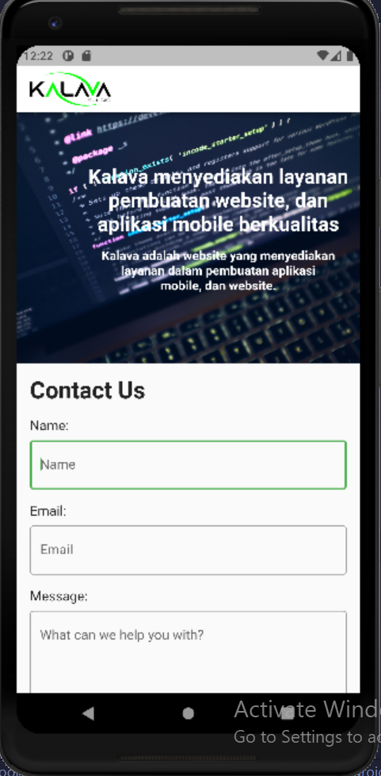
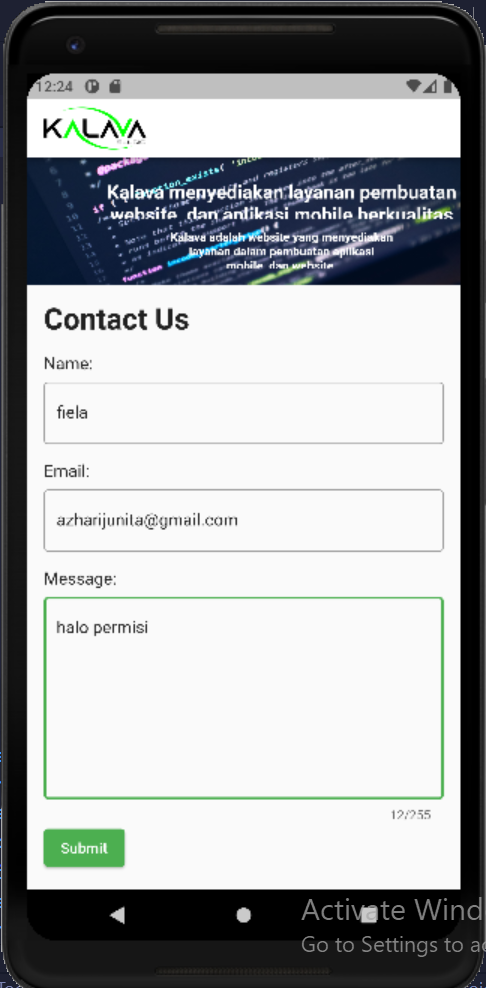

# Flutter Weekly 1
Nomor Urut: 1_011FLB_40

Nama: Fiela Junita Azhari

## Task

### Input
#### models (m_user.dart)
    // ignore_for_file: public_member_api_docs, sort_constructors_first
    class User {
    String name;
    String email;
    String message;
    User({
        required this.name,
        required this.email,
        required this.message,
    });
    }

#### pages (home_page.dart)
    import 'package:email_validator/email_validator.dart';
    import 'package:flutter/material.dart';
    import 'package:provider/provider.dart';
    import 'package:weekly1/models/m_user.dart';
    import 'package:weekly1/pages/home/home_view_model.dart';

    class HomePage extends StatefulWidget {
    const HomePage({super.key});

    @override
    State<HomePage> createState() => _HomePageState();
    }

    class _HomePageState extends State<HomePage> {
    final formKey = GlobalKey<FormState>();
    final TextEditingController _nameController = TextEditingController();
    final TextEditingController _emailController = TextEditingController();
    final TextEditingController _messageController = TextEditingController();

    void showUserDialog(User user) {
        showDialog(
        context: context,
        builder: (context) {
            return AlertDialog(
            content: SizedBox(
                height: 100,
                width: 100,
                child: ListView(
                children: [
                    Text('Name: ${user.name}'),
                    Text('Email: ${user.email}'),
                    Text('Message: ${user.message}'),
                ],
                ),
            ),
            );
        },
        );
    }

    @override
    Widget build(BuildContext context) {
        return Scaffold(
        appBar: AppBar(
            backgroundColor: Colors.white,
            centerTitle: false,
            title: Image.asset(
            'assets/images/kalava250.png',
            height: 40,
            ),
        ),
        body: Form(
            key: formKey,
            child: CustomScrollView(
            slivers: [
                SliverAppBar(
                expandedHeight: 300,
                // title: const Text('Wellcome to our page\n we are here to make '),
                flexibleSpace: FlexibleSpaceBar(
                    title: Column(
                    mainAxisAlignment: MainAxisAlignment.center,
                    children: <Widget>[
                        Flexible(
                        flex: 3,
                        child: Container(),
                        ),
                        const Flexible(
                        flex: 3,
                        child: Text(
                            "Kalava menyediakan layanan pembuatan website, dan aplikasi mobile berkualitas",
                            textAlign: TextAlign.center,
                            style: TextStyle(
                                fontSize: 16, fontWeight: FontWeight.bold),
                        ),
                        ),
                        const SizedBox(
                        height: 10,
                        ),
                        const Flexible(
                        flex: 3,
                        child: Text(
                            'Kalava adalah website yang menyediakan\nlayanan dalam pembuatan aplikasi \nmobile, dan website.',
                            textAlign: TextAlign.center,
                            style: TextStyle(
                                fontSize: 10, fontWeight: FontWeight.bold)),
                        ),
                    ],
                    ),
                    background: Image.asset(
                    'assets/images/wellcome.jpg',
                    fit: BoxFit.cover,
                    ),
                ),
                ),
                SliverToBoxAdapter(
                child: buildContactUs(),
                ),
            ],
            ),
        ),
        );
    }

    Widget buildContactUs() {
        return Padding(
        padding: const EdgeInsets.all(16.0),
        child: Column(
            crossAxisAlignment: CrossAxisAlignment.start,
            children: [
            const Text(
                'Contact Us',
                style: TextStyle(fontSize: 28, fontWeight: FontWeight.w600),
            ),
            const SizedBox(
                height: 16,
            ),
            const Text(
                'Name: ',
                style: TextStyle(fontSize: 16),
            ),
            const SizedBox(
                height: 8,
            ),
            TextFormField(
                controller: _nameController,
                decoration: const InputDecoration(
                hintText: 'Name',
                border: OutlineInputBorder(),
                ),
                validator: (name) {
                if (name!.isEmpty) {
                    return 'Add Name Properly';
                }
                return null;
                },
            ),
            const SizedBox(
                height: 16,
            ),
            const Text(
                'Email: ',
                style: TextStyle(fontSize: 16),
            ),
            const SizedBox(
                height: 8,
            ),
            TextFormField(
                controller: _emailController,
                decoration: const InputDecoration(
                hintText: 'Email',
                border: OutlineInputBorder(),
                ),
                validator: (email) {
                if (email != null && !EmailValidator.validate(email)) {
                    return 'Enter a valid email';
                }
                return null;
                },
            ),
            const SizedBox(
                height: 16,
            ),
            const Text(
                'Message: ',
                style: TextStyle(fontSize: 16),
            ),
            const SizedBox(
                height: 8,
            ),
            TextFormField(
                controller: _messageController,
                maxLines: 8,
                maxLength: 255,
                decoration: const InputDecoration(
                hintText: 'What can we help you with?',
                border: OutlineInputBorder(),
                ),
                validator: (message) {
                if (message!.isEmpty) {
                    return 'Enter a message';
                }
                return null;
                },
            ),
            ElevatedButton(
                onPressed: () {
                final isValidForm = formKey.currentState!.validate();
                if (isValidForm) {
                    User user = User(
                        name: _nameController.text,
                        email: _emailController.text,
                        message: _messageController.text);
                    showUserDialog(user);
                    Provider.of<HomeViewModel>(context, listen: false)
                        .addUser(user);
                }
                },
                child: const Text('Submit'),
            ),
            ],
        ),
        );
    }
    }

#### pages (home_view_model.dart)
    import 'package:flutter/material.dart';
    import 'package:weekly1/models/m_user.dart';

    class HomeViewModel extends ChangeNotifier {
    final List<User> _users = [];
    List<User> get users => _users;

    addUser(User user) {
        _users.add(user);
        notifyListeners();
    }
    }

#### image.dart
    class Listimage {
    final images;
    Listimage({required this.images});
    }

    List imageApp = [
    {
        "images":
            "https://img.freepik.com/premium-vector/welcome-sign-letters-with-confetti-background-celebration-greeting-holiday-illustration-banner-confetti-decoration_41737-257.jpg?w=2000",
    },
    ];

#### main.dart
    import 'package:flutter/material.dart';
    import 'package:provider/provider.dart';
    import 'package:weekly1/pages/home/home_page.dart';
    import 'package:weekly1/pages/home/home_view_model.dart';

    void main() {
    runApp(const MyApp());
    }

    class MyApp extends StatelessWidget {
    const MyApp({Key? key}) : super(key: key);

    // This widget is the root of your application.
    @override
    Widget build(BuildContext context) {
        return MultiProvider(
        providers: [
            ChangeNotifierProvider(
            create: (context) => HomeViewModel(),
            ),
        ],
        child: MaterialApp(
            debugShowCheckedModeBanner: false,
            title: 'Weekly Task 1',
            theme: ThemeData(
                primarySwatch: Colors.green,
            ),
            home: const HomePage()),
        );
    }
    }

#### assets

### Output

