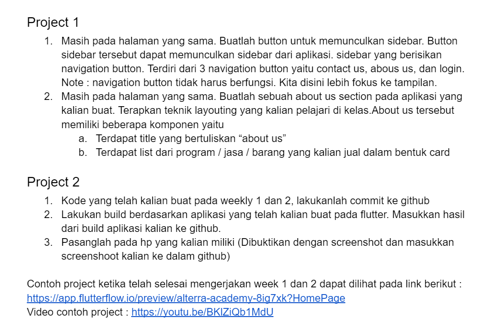

# Flutter Weekly 2
Nomor Urut: 1_011FLB_40

Nama: Fiela Junita Azhari

## Task

### Input
#### main.dart
    import 'package:flutter/material.dart';
    import 'package:task/image.dart';

    void main() {
    runApp(const MyApp());
    }

    class MyApp extends StatelessWidget {
    const MyApp({super.key});

    @override
    Widget build(BuildContext context) {
        return MaterialApp(
        home: Scaffold(
            appBar: AppBar(
            title: Text("FielaApp"),
            ),
            body: GridView.builder(
            gridDelegate:
                SliverGridDelegateWithFixedCrossAxisCount(crossAxisCount: 1),
            itemCount: imageApp.length,
            physics: ScrollPhysics(), // hapus kalau tidak perlu pakai scroll
            itemBuilder: (context, index) => Padding(
                padding: EdgeInsets.all(0.5),
                child: IconButton(
                onPressed: () {
                    Navigator.push(
                    context,
                    MaterialPageRoute(
                        builder: (context) => MyNewPage(
                        halaman: imageApp[index],
                        ),
                    ),
                    );
                },
                icon: Image.network(imageApp[index]["images"]),
                ),
            ),
            ),
        ),
        );
    }
    }

    class MyNewPage extends StatefulWidget {
    MyNewPage({this.halaman});
    final halaman;

    @override
    State<MyNewPage> createState() => _MyNewPageState();
    }

    class _MyNewPageState extends State<MyNewPage> {
    @override
    Widget build(BuildContext context) {
        return MaterialApp(
        home: Scaffold(
            appBar: AppBar(
            title: Text("NewPage"),
            ),
            body: Image.network(
            widget.halaman["images"],
            height: double.maxFinite,
            width: double.maxFinite,
            fit: BoxFit.cover,
            ),
        ),
        );
    }
    }

#### image.dart
    class Listimage {
    final images;
    Listimage({required this.images});
    }

    List imageApp = [
    {
        "images":
            "https://img.freepik.com/premium-vector/welcome-sign-letters-with-confetti-background-celebration-greeting-holiday-illustration-banner-confetti-decoration_41737-257.jpg?w=2000",
    },
    ];

### Output

#### Maaf pak, saya belum selesai mengerjakan tugasnya