# Flutter Weekly 3
Nomor Urut: 1_011FLB_40

Nama: Fiela Junita Azhari

## Task
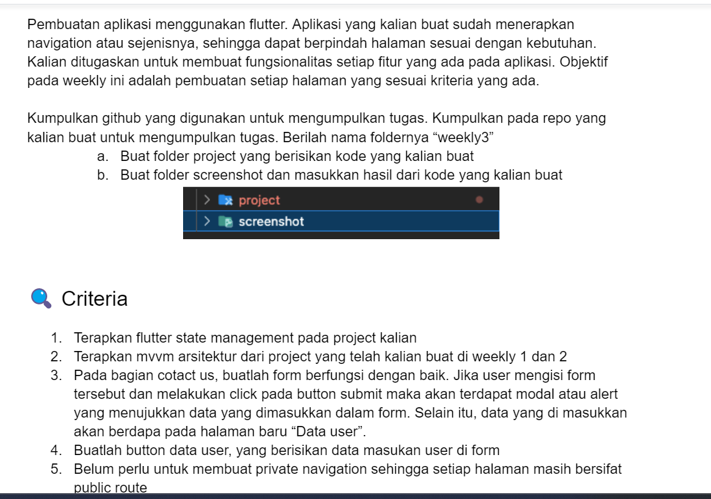
### Input
#### components (contact_item.dart)
    // ignore_for_file: public_member_api_docs, sort_constructors_first
    import 'package:flutter/material.dart';
    import 'package:provider/provider.dart';

    import '../pages/home/home_view_model.dart';

    class ContactItem extends StatelessWidget {
    int index;
    ContactItem({
        Key? key,
        required this.index,
    }) : super(key: key);

    @override
    Widget build(BuildContext context) {
        final prov = Provider.of<HomeViewModel>(context).users[index];
        return Container(
        height: 100,
        decoration: BoxDecoration(
            color: Colors.green[100],
            borderRadius: BorderRadius.circular(10),
        ),
        child: Padding(
            padding: const EdgeInsets.only(left: 16),
            child: ListView(
            children: [
                const SizedBox(
                height: 12,
                ),
                Center(
                child: Row(
                    children: [
                    Expanded(
                        child: Column(
                        mainAxisAlignment: MainAxisAlignment.center,
                        crossAxisAlignment: CrossAxisAlignment.start,
                        children: [
                            Text(
                            'Name: ${prov.name}',
                            style: const TextStyle(
                                fontSize: 14, fontWeight: FontWeight.w600),
                            ),
                            Text(
                            'Email: ${prov.email}',
                            style: TextStyle(
                                fontSize: 14,
                                color: Colors.black.withOpacity(0.6)),
                            ),
                            Text(
                            'Message: ${prov.message}',
                            style: TextStyle(
                                // overflow: TextOverflow.ellipsis,
                                fontSize: 14,
                                color: Colors.black.withOpacity(0.6)),
                            ),
                        ],
                        ),
                    ),
                    IconButton(
                        padding: EdgeInsets.zero,
                        onPressed: () {
                        Provider.of<HomeViewModel>(context, listen: false)
                            .deleteUser(
                            index,
                        );
                        },
                        icon: Icon(
                        Icons.delete,
                        color: Colors.grey[600],
                        ),
                    )
                    ],
                ),
                ),
            ],
            ),
        ),
        );
    }
    }

#### components (drawer.dart)
    import 'package:flutter/material.dart';
    import 'package:faker/faker.dart';
    import '../gen/assets.gen.dart';

    class Navbar extends StatelessWidget {
    const Navbar({super.key});

    @override
    Widget build(BuildContext context) {
        return Drawer(
        child: ListView(
            padding: EdgeInsets.zero,
            children: [
            UserAccountsDrawerHeader(
                accountName: Text(faker.person.name()),
                accountEmail: Text(faker.internet.email()),
                currentAccountPicture: CircleAvatar(
                child: ClipOval(
                    child: Image.asset(
                    Assets.images.profile.path,
                    fit: BoxFit.cover,
                    width: 90,
                    height: 90,
                    ),
                ),
                ),
                decoration: BoxDecoration(
                color: Colors.blue,
                image: DecorationImage(
                    fit: BoxFit.cover,
                    image: AssetImage(Assets.images.drawerBackground.path),
                ),
                ),
            ),
            ListTile(
                leading: const Icon(Icons.contact_support),
                title: const Text('Contact Us'),
                onTap: () {},
            ),
            ListTile(
                leading: const Icon(Icons.info),
                title: const Text('About Us'),
                onTap: () {},
            ),
            const Divider(),
            ListTile(
                leading: const Icon(Icons.login),
                title: const Text('Log in'),
                onTap: () {},
            ),
            ],
        ),
        );
    }
    }

#### components (list_card.dart)
    // ignore_for_file: public_member_api_docs, sort_constructors_first
    import 'package:flutter/material.dart';
    import 'package:intl/intl.dart';

    class ListCard extends StatelessWidget {
    String images;
    String course;
    String desc;
    int price;
    ListCard({
        Key? key,
        required this.images,
        required this.course,
        required this.desc,
        required this.price,
    }) : super(key: key);

    @override
    Widget build(BuildContext context) {
        return Padding(
        padding: const EdgeInsets.fromLTRB(16, 0, 16, 0),
        child: Card(
            shape: RoundedRectangleBorder(
            side: const BorderSide(color: Colors.white70, width: 1),
            borderRadius: BorderRadius.circular(12),
            ),
            child: Padding(
            padding: const EdgeInsets.all(10),
            child: Row(
                children: [
                ClipRRect(
                    borderRadius: BorderRadius.circular(12),
                    child: SizedBox(
                    height: 60,
                    width: 60,
                    child: Image.asset(
                        images,
                        fit: BoxFit.cover,
                    ),
                    ),
                ),
                const SizedBox(
                    width: 10,
                ),
                Expanded(
                    child: Column(
                    mainAxisAlignment: MainAxisAlignment.spaceBetween,
                    crossAxisAlignment: CrossAxisAlignment.start,
                    children: [
                        Text(
                        course,
                        style: const TextStyle(fontWeight: FontWeight.bold),
                        ),
                        Row(
                        children: [
                            SizedBox(
                            width: 200,
                            child: Text(
                                desc,
                                style: const TextStyle(fontSize: 10),
                            ),
                            ),
                        ],
                        ),
                        const SizedBox(
                        height: 2,
                        ),
                        Text(
                        NumberFormat.currency(
                                locale: 'id', symbol: 'Rp', decimalDigits: 0)
                            .format(price),
                        style: const TextStyle(
                            fontWeight: FontWeight.bold, fontSize: 10),
                        ),
                    ],
                    ),
                ),
                Column(
                    mainAxisAlignment: MainAxisAlignment.spaceBetween,
                    children: [
                    const SizedBox(
                        height: 30,
                        width: 30,
                    ),
                    Container(
                        decoration: BoxDecoration(
                        color: Colors.green,
                        borderRadius: BorderRadius.circular(8),
                        ),
                        height: 30,
                        width: 30,
                        child: IconButton(
                        iconSize: 14,
                        onPressed: () {},
                        icon: const Icon(
                            Icons.arrow_forward,
                        ),
                        color: Colors.white,
                        ),
                    ),
                    ],
                )
                ],
            ),
            ),
        ),
        );
    }
    }

#### gen (assets.gen.dart)
    /// GENERATED CODE - DO NOT MODIFY BY HAND
    /// *****************************************************
    ///  FlutterGen
    /// *****************************************************

    // coverage:ignore-file
    // ignore_for_file: type=lint
    // ignore_for_file: directives_ordering,unnecessary_import

    import 'package:flutter/widgets.dart';

    class $AssetsImagesGen {
    const $AssetsImagesGen();

    /// File path: assets/images/course_flutter.png
    AssetGenImage get courseFlutter =>
        const AssetGenImage('assets/images/course_flutter.png');

    /// File path: assets/images/course_website.jpg
    AssetGenImage get courseWebsite =>
        const AssetGenImage('assets/images/course_website.jpg');

    /// File path: assets/images/drawer_background.jpeg
    AssetGenImage get drawerBackground =>
        const AssetGenImage('assets/images/drawer_background.jpeg');

    /// File path: assets/images/kalava250.png
    AssetGenImage get kalava250 =>
        const AssetGenImage('assets/images/kalava250.png');

    /// File path: assets/images/profile.png
    AssetGenImage get profile => const AssetGenImage('assets/images/profile.png');

    /// File path: assets/images/wellcome.jpg
    AssetGenImage get wellcome =>
        const AssetGenImage('assets/images/wellcome.jpg');
    }

    class Assets {
    Assets._();

    static const $AssetsImagesGen images = $AssetsImagesGen();
    }

    class AssetGenImage {
    const AssetGenImage(this._assetName);

    final String _assetName;

    Image image({
        Key? key,
        AssetBundle? bundle,
        ImageFrameBuilder? frameBuilder,
        ImageErrorWidgetBuilder? errorBuilder,
        String? semanticLabel,
        bool excludeFromSemantics = false,
        double? scale,
        double? width,
        double? height,
        Color? color,
        Animation<double>? opacity,
        BlendMode? colorBlendMode,
        BoxFit? fit,
        AlignmentGeometry alignment = Alignment.center,
        ImageRepeat repeat = ImageRepeat.noRepeat,
        Rect? centerSlice,
        bool matchTextDirection = false,
        bool gaplessPlayback = false,
        bool isAntiAlias = false,
        String? package,
        FilterQuality filterQuality = FilterQuality.low,
        int? cacheWidth,
        int? cacheHeight,
    }) {
        return Image.asset(
        _assetName,
        key: key,
        bundle: bundle,
        frameBuilder: frameBuilder,
        errorBuilder: errorBuilder,
        semanticLabel: semanticLabel,
        excludeFromSemantics: excludeFromSemantics,
        scale: scale,
        width: width,
        height: height,
        color: color,
        opacity: opacity,
        colorBlendMode: colorBlendMode,
        fit: fit,
        alignment: alignment,
        repeat: repeat,
        centerSlice: centerSlice,
        matchTextDirection: matchTextDirection,
        gaplessPlayback: gaplessPlayback,
        isAntiAlias: isAntiAlias,
        package: package,
        filterQuality: filterQuality,
        cacheWidth: cacheWidth,
        cacheHeight: cacheHeight,
        );
    }

    String get path => _assetName;

    String get keyName => _assetName;
    }

#### models (m_user.dart)
    // ignore_for_file: public_member_api_docs, sort_constructors_first
    class User {
    String name;
    String email;
    String message;
    User({
        required this.name,
        required this.email,
        required this.message,
    });
    }

#### pages-empty (empty_page.dart)
    import 'package:flutter/material.dart';

    class EmptyPage extends StatelessWidget {
    const EmptyPage({super.key});

    @override
    Widget build(BuildContext context) {
        return Center(
        child: Column(
            mainAxisAlignment: MainAxisAlignment.center,
            children: const [
            Icon(Icons.people),
            Text('Data is empty'),
            ],
        ),
        );
    }
    }

#### pages-home (home_page.dart)
    import 'package:email_validator/email_validator.dart';
    import 'package:flutter/material.dart';
    import 'package:provider/provider.dart';
    import 'package:weekly1/components/drawer.dart';
    import 'package:weekly1/components/list_card.dart';
    import 'package:weekly1/gen/assets.gen.dart';
    import 'package:weekly1/models/m_user.dart';
    import 'package:weekly1/pages/home/home_view_model.dart';
    import 'package:weekly1/pages/user/user_page.dart';

    class HomePage extends StatefulWidget {
    const HomePage({super.key});

    @override
    State<HomePage> createState() => _HomePageState();
    }

    class _HomePageState extends State<HomePage> {
    final formKey = GlobalKey<FormState>();
    final TextEditingController _nameController = TextEditingController();
    final TextEditingController _emailController = TextEditingController();
    final TextEditingController _messageController = TextEditingController();

    void showUserDialog(User user) {
        showDialog(
        context: context,
        builder: (context) {
            return AlertDialog(
            content: SizedBox(
                height: 100,
                width: 100,
                child: ListView(
                children: [
                    Text('Name: ${user.name}'),
                    Text('Email: ${user.email}'),
                    Text('Message: ${user.message}'),
                ],
                ),
            ),
            );
        },
        );
    }

    @override
    Widget build(BuildContext context) {
        return Scaffold(
        drawer: const Drawer(child: Navbar()),
        appBar: AppBar(
            backgroundColor: Colors.white,
            centerTitle: false,
            title: Image.asset(
            Assets.images.kalava250.path,
            height: 40,
            ),
            iconTheme: const IconThemeData(color: Colors.green),
        ),
        body: Form(
            key: formKey,
            child: CustomScrollView(
            slivers: [
                SliverAppBar(
                automaticallyImplyLeading: false,
                expandedHeight: 300,
                flexibleSpace: FlexibleSpaceBar(
                    centerTitle: true,
                    title: Column(
                    crossAxisAlignment: CrossAxisAlignment.center,
                    mainAxisAlignment: MainAxisAlignment.center,
                    children: <Widget>[
                        Flexible(
                        flex: 3,
                        child: Container(),
                        ),
                        const Flexible(
                        flex: 3,
                        child: Text(
                            "Kalava menyediakan layanan pembuatan website, dan aplikasi mobile berkualitas",
                            textAlign: TextAlign.center,
                            style: TextStyle(
                                fontSize: 16, fontWeight: FontWeight.bold),
                        ),
                        ),
                        const SizedBox(
                        height: 10,
                        ),
                        const Flexible(
                        flex: 3,
                        child: Text(
                            'Kalava adalah website yang menyediakan\nlayanan dalam pembuatan aplikasi \nmobile, dan website.',
                            textAlign: TextAlign.center,
                            style: TextStyle(
                                fontSize: 10, fontWeight: FontWeight.bold)),
                        ),
                    ],
                    ),
                    background: Image.asset(
                    Assets.images.wellcome.path,
                    fit: BoxFit.cover,
                    ),
                ),
                ),
                SliverToBoxAdapter(
                child: buildContactUs(),
                ),
                SliverToBoxAdapter(
                child: Padding(
                    padding: const EdgeInsets.only(bottom: 16),
                    child: Column(
                    children: const [
                        Text(
                        'About Us',
                        style:
                            TextStyle(fontSize: 28, fontWeight: FontWeight.w600),
                        ),
                        Text(
                        'Kalava Package List',
                        style:
                            TextStyle(fontSize: 20, fontWeight: FontWeight.w600),
                        ),
                    ],
                    ),
                ),
                ),
                SliverList(
                delegate: SliverChildListDelegate(
                    [
                    ListCard(
                        images: Assets.images.courseWebsite.path,
                        course: 'Pembuatan website',
                        desc:
                            'Menggunakan MERN (MongoDB, Express JS, React JS, dan Node JS',
                        price: 1500000,
                    ),
                    ListCard(
                        price: 750000,
                        images: Assets.images.courseFlutter.path,
                        course: 'Pembuatan Aplikasi Mobile',
                        desc: 'Menggunakan Flutter, dan Firebase',
                    ),
                    ],
                ),
                ),
            ],
            ),
        ),
        );
    }

    Widget buildContactUs() {
        return Padding(
        padding: const EdgeInsets.all(16.0),
        child: Column(
            crossAxisAlignment: CrossAxisAlignment.start,
            children: [
            const Text(
                'Contact Us',
                style: TextStyle(fontSize: 28, fontWeight: FontWeight.w600),
            ),
            const SizedBox(
                height: 16,
            ),
            const Text(
                'Name: ',
                style: TextStyle(fontSize: 16),
            ),
            const SizedBox(
                height: 8,
            ),
            TextFormField(
                controller: _nameController,
                decoration: const InputDecoration(
                hintText: 'Name',
                border: OutlineInputBorder(),
                ),
                validator: (name) {
                if (name!.isEmpty) {
                    return 'Add Name Properly';
                }
                return null;
                },
            ),
            const SizedBox(
                height: 16,
            ),
            const Text(
                'Email: ',
                style: TextStyle(fontSize: 16),
            ),
            const SizedBox(
                height: 8,
            ),
            TextFormField(
                controller: _emailController,
                decoration: const InputDecoration(
                hintText: 'Email',
                border: OutlineInputBorder(),
                ),
                validator: (email) {
                if (email != null && !EmailValidator.validate(email)) {
                    return 'Enter a valid email';
                }
                return null;
                },
            ),
            const SizedBox(
                height: 16,
            ),
            const Text(
                'Message: ',
                style: TextStyle(fontSize: 16),
            ),
            const SizedBox(
                height: 8,
            ),
            TextFormField(
                controller: _messageController,
                maxLines: 8,
                maxLength: 255,
                decoration: const InputDecoration(
                hintText: 'What can we help you with?',
                border: OutlineInputBorder(),
                ),
                validator: (message) {
                if (message!.isEmpty) {
                    return 'Enter a message';
                }
                return null;
                },
            ),
            Row(
                children: [
                Expanded(
                    flex: 1,
                    child: ElevatedButton(
                    onPressed: () {
                        final isValidForm = formKey.currentState!.validate();
                        if (isValidForm) {
                        User user = User(
                            name: _nameController.text,
                            email: _emailController.text,
                            message: _messageController.text);
                        showUserDialog(user);
                        Provider.of<HomeViewModel>(context, listen: false)
                            .addUser(user);
                        }
                    },
                    child: const Text('Submit'),
                    ),
                ),
                const SizedBox(
                    width: 10,
                ),
                Expanded(
                    flex: 1,
                    child: ElevatedButton(
                    onPressed: () {
                        Navigator.of(context).push(
                        MaterialPageRoute(
                            builder: (context) => const UserPage(),
                        ),
                        );
                    },
                    child: const Text('Data User'),
                    ),
                ),
                ],
            ),
            ],
        ),
        );
    }
    }

#### pages-home (home_view_model.dart)
    import 'package:flutter/material.dart';
    import 'package:weekly1/models/m_user.dart';

    class HomeViewModel extends ChangeNotifier {
    final List<User> _users = [];
    List<User> get users => _users;

    addUser(User user) {
        _users.add(user);
        notifyListeners();
    }

    deleteUser(int index) {
        _users.removeAt(index);
        notifyListeners();
    }
    }

#### user (user_page.dart)
    import 'package:flutter/material.dart';
    import 'package:provider/provider.dart';
    import 'package:weekly1/components/contact_item.dart';
    import 'package:weekly1/pages/empty/empty_page.dart';
    import 'package:weekly1/pages/home/home_view_model.dart';

    class UserPage extends StatelessWidget {
    const UserPage({super.key});

    @override
    Widget build(BuildContext context) {
        final prov = Provider.of<HomeViewModel>(context);
        return Scaffold(
        appBar: AppBar(
            title: const Text('Data User'),
        ),
        body: Consumer<HomeViewModel>(
            builder: (context, value, child) {
            if (value.users.isEmpty) {
                return const EmptyPage();
            }
            return Padding(
                padding: const EdgeInsets.all(16.0),
                child: ListView.separated(
                itemCount: prov.users.length,
                itemBuilder: (context, index) {
                    final user = prov.users[index];
                    return ContactItem(index: index);
                },
                separatorBuilder: (context, index) {
                    return const SizedBox(
                    height: 16,
                    );
                },
                ),
            );
            },
        ),
        );
    }
    }

#### main.dart
    import 'package:flutter/material.dart';
    import 'package:provider/provider.dart';
    import 'package:weekly1/pages/home/home_page.dart';
    import 'package:weekly1/pages/home/home_view_model.dart';

    void main() {
    runApp(const MyApp());
    }

    class MyApp extends StatelessWidget {
    const MyApp({Key? key}) : super(key: key);

    // This widget is the root of your application.
    @override
    Widget build(BuildContext context) {
        return MultiProvider(
        providers: [
            ChangeNotifierProvider(
            create: (context) => HomeViewModel(),
            ),
        ],
        child: MaterialApp(
            debugShowCheckedModeBanner: false,
            title: 'Weekly Task 1',
            theme: ThemeData(
                primarySwatch: Colors.green,
            ),
            home: const HomePage()),
        );
    }
    }

### Assets
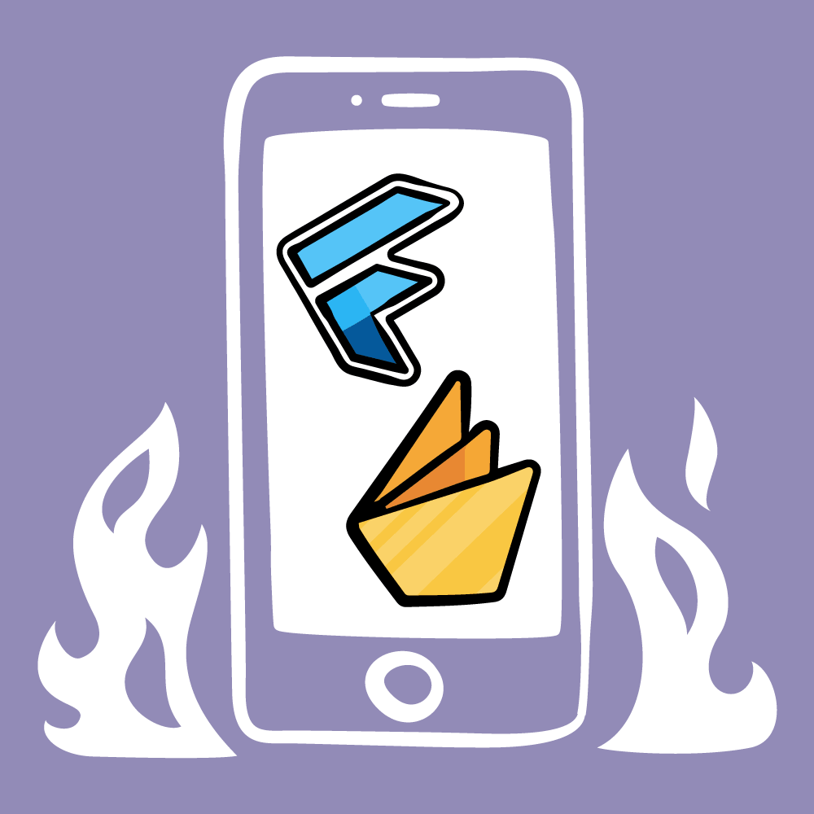

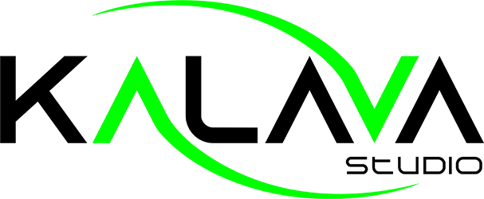
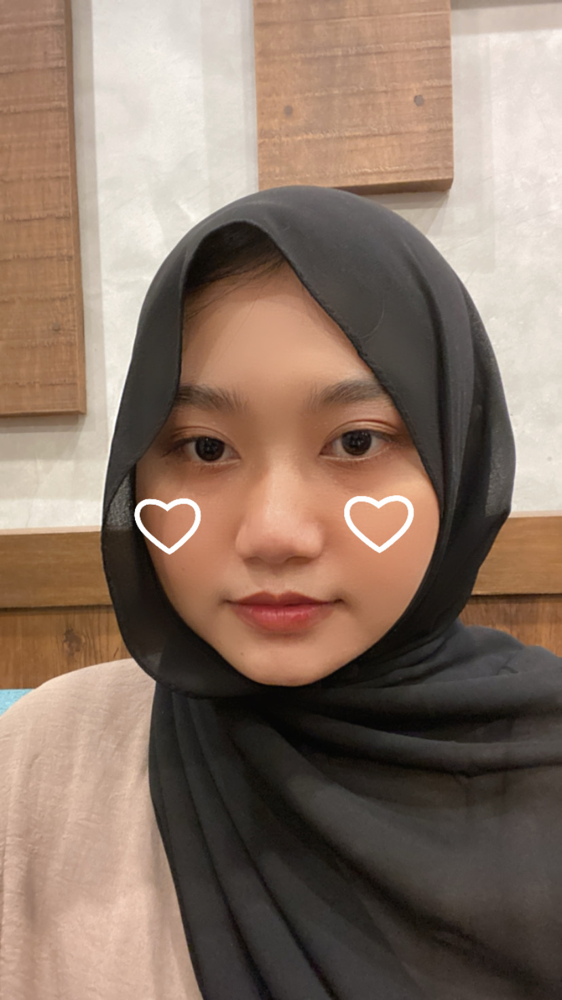

### Output
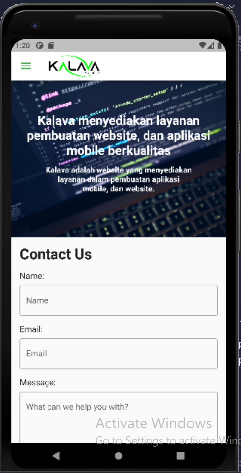
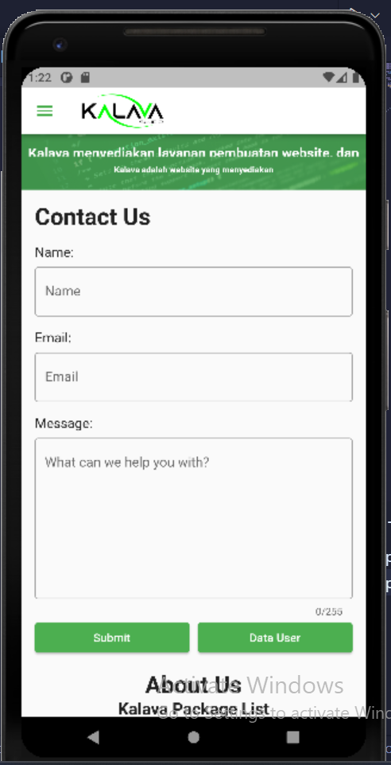
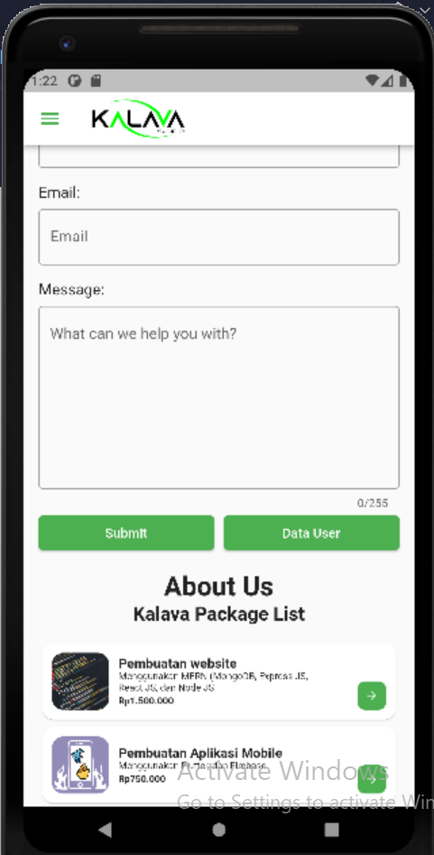
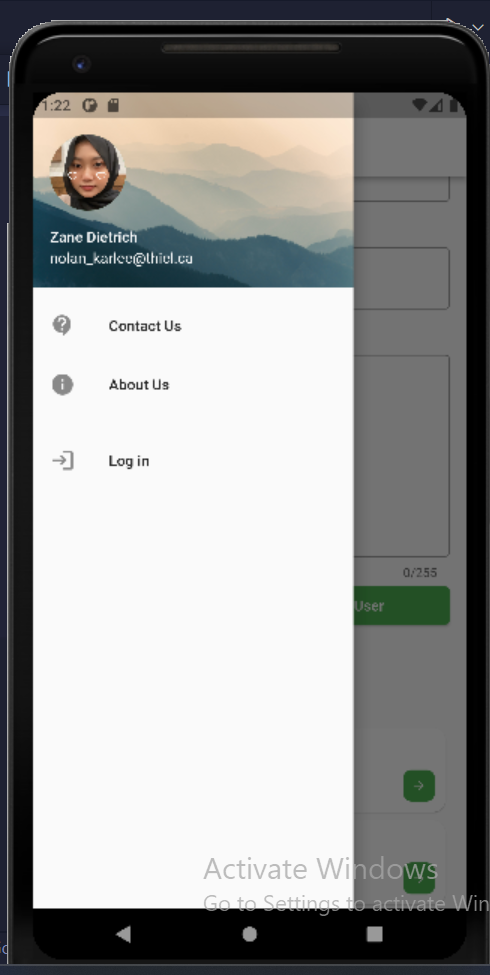
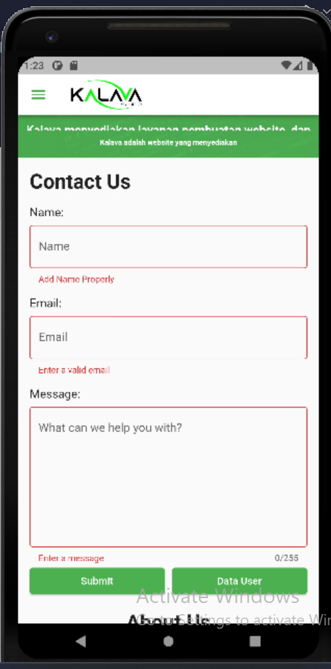
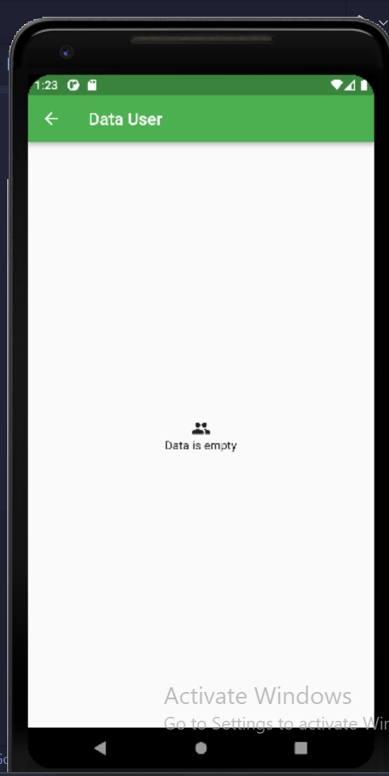
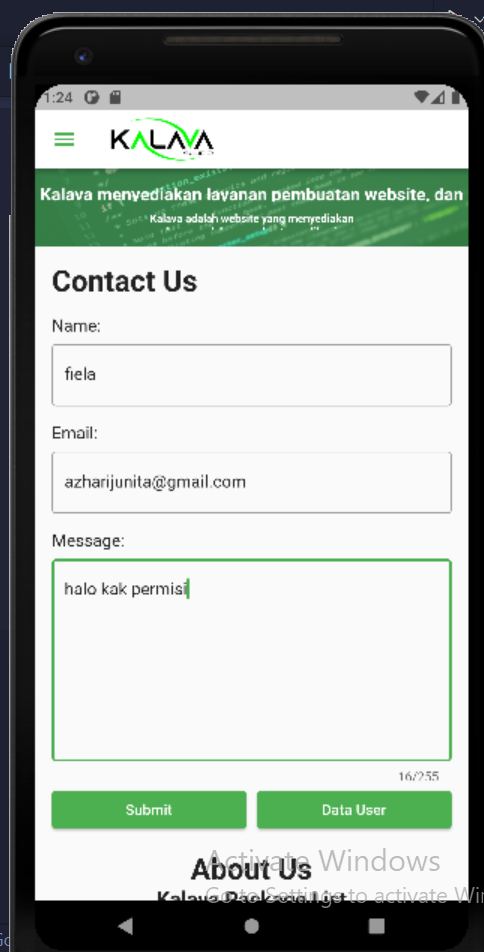
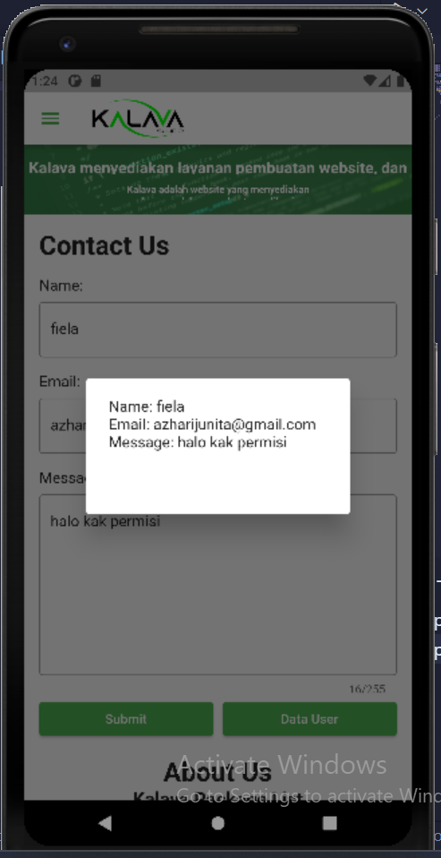
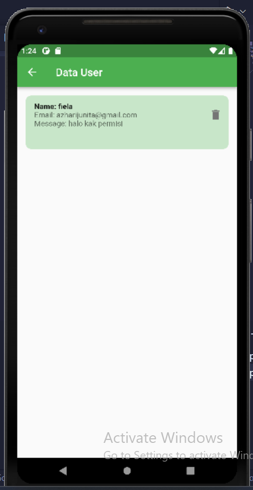
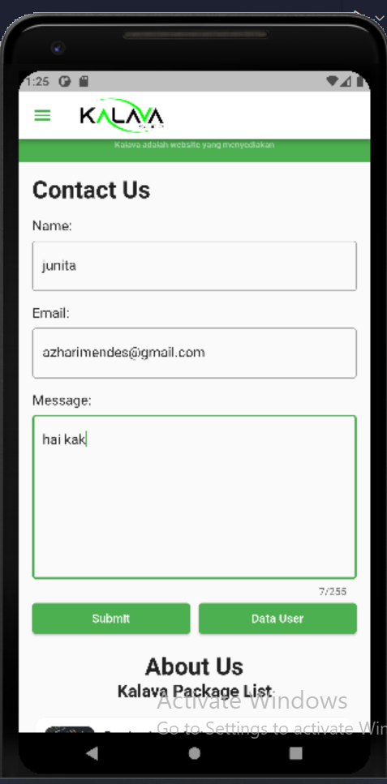
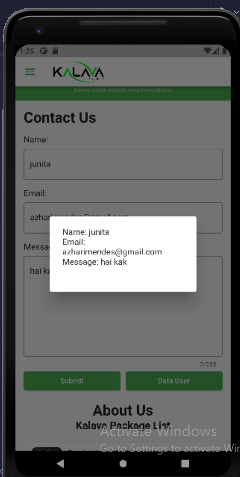
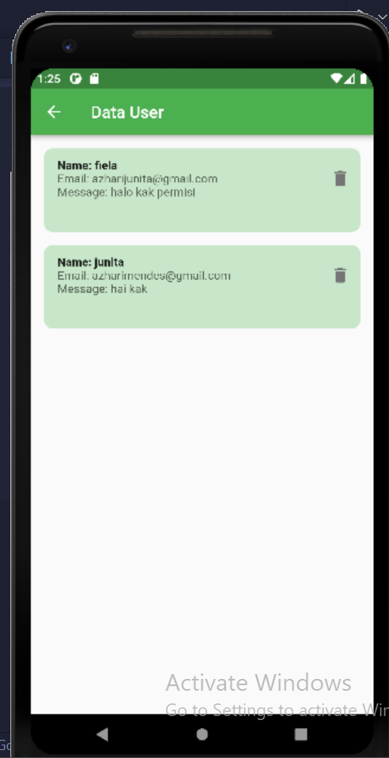

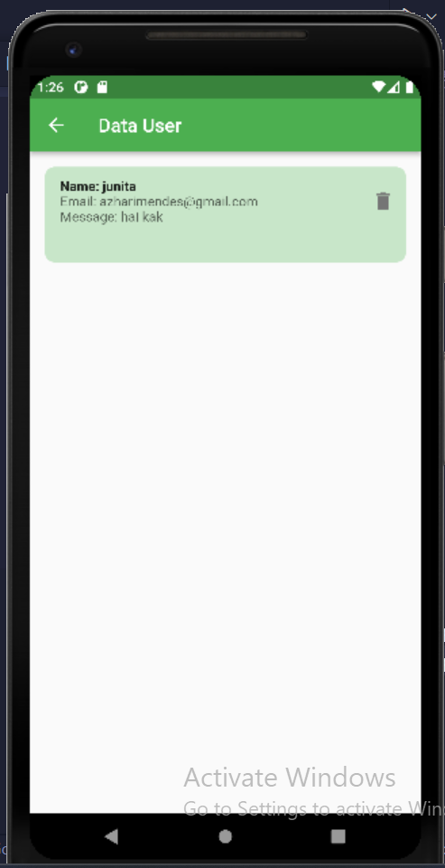